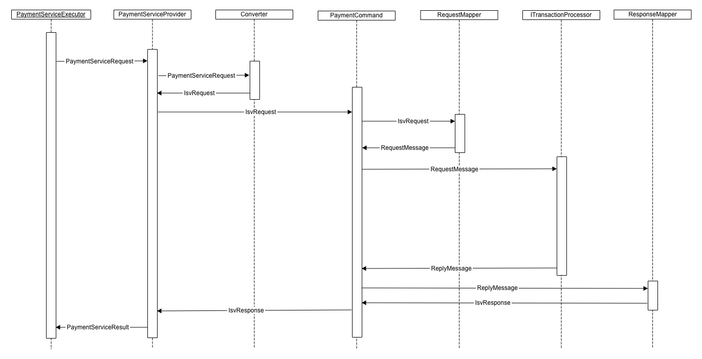

# Payment API <!-- omit in toc -->

## CJL - Core Java Library <!-- omit in toc -->

**Version 24.1.0**
February 2024

## Contents <!-- omit in toc -->

<!-- TOC -->
- [Introduction](#introduction)
  - [Packaging](#packaging)
- [Installation and Upgrade](#installation-and-upgrade)
  - [Instructions](#instructions)
- [Payment services](#payment-services)
  - [Credit Card](#credit-card)
    - [Description](#description)
    - [Implementation details](#implementation-details)
    - [Configuration](#configuration)
  - [Token Management Service](#token-management-service)
    - [Description](#description-1)
    - [Implementation details](#implementation-details-1)
    - [Configuration](#configuration-1)
  - [Visa Checkout](#visa-checkout)
    - [Description](#description-2)
    - [Implementation details](#implementation-details-2)
    - [Configuration](#configuration-2)
  - [AliPay](#alipay)
    - [Description](#description-3)
    - [Implementation details](#implementation-details-3)
    - [Configuration](#configuration-3)
    - [Applicability and limitations](#applicability-and-limitations)
  - [PayPal](#paypal)
    - [Description](#description-4)
    - [Implementation details](#implementation-details-4)
    - [Configuration](#configuration-4)
  - [Apple Pay](#apple-pay)
    - [Description](#description-5)
    - [Implementation details](#implementation-details-5)
    - [Configuration](#configuration-5)
    - [Description](#description-6)
    - [Implementation details](#implementation-details-6)
  - [Klarna](#klarna)
    - [Description](#description-7)
    - [Implementation details](#implementation-details-7)
    - [Configuration](#configuration-6)
    - [Applicability and limitations](#applicability-and-limitations-1)
  - [iDEAL](#ideal)
    - [Description](#description-8)
    - [Implementation details](#implementation-details-8)
    - [Configuration](#configuration-7)
    - [Applicability and limitations](#applicability-and-limitations-2)
  - [Sofort](#sofort)
    - [Description](#description-9)
    - [Implementation details](#implementation-details-9)
    - [Configuration](#configuration-8)
    - [Applicability and limitations](#applicability-and-limitations-3)
  - [Bancontact](#bancontact)
    - [Description](#description-10)
    - [Implementation details](#implementation-details-10)
    - [Configuration](#configuration-9)
    - [Applicability and limitations](#applicability-and-limitations-4)
  - [WeChat Pay](#wechat-pay)
    - [Description](#description-11)
    - [Implementation details](#implementation-details-11)
    - [Configuration](#configuration-10)
- [Business services](#business-services)
  - [Fraud Management](#fraud-management)
    - [Description](#description-12)
    - [Implementation details](#implementation-details-12)
  - [Verification Services](#verification-services)
    - [Description](#description-13)
    - [Implementation details](#implementation-details-13)
  - [Payer Authentication](#payer-authentication)
    - [Description](#description-14)
    - [Implementation details](#implementation-details-14)
    - [Configuration](#configuration-11)
    - [3DS 2.x Helper services](#3ds-2x-helper-services)
  - [REST API Integration](#rest-api-integration)
    - [Description](#description-15)
    - [Java SDK](#java-sdk)
    - [HTTP Client Configuration](#http-client-configuration)
    - [Authentication](#authentication)
    - [Implementation Details](#implementation-details-15)
  - [Reporting](#reporting)
    - [Description](#description-16)
    - [Implementation details](#implementation-details-16)
  - [Tax calculation](#tax-calculation)
    - [Description](#description-17)
    - [Implementation details](#implementation-details-17)
  - [Transaction Status Check](#transaction-status-check)
    - [Description](#description-18)
    - [Implementation details](#implementation-details-18)
    - [Implementation details](#implementation-details-19)
    - [Merchant configuration](#merchant-configuration)
  - [Logging and Filtering](#logging-and-filtering)
    - [Description](#description-19)
    - [Implementation details](#implementation-details-20)
  - [Validation](#validation)
    - [Description](#description-20)
    - [Implementation details](#implementation-details-21)
    - [Applicability and limitations](#applicability-and-limitations-5)
  - [Resilience](#resilience)
    - [Description](#description-21)
    - [Implementation details](#implementation-details-22)
- [Customization](#customization)
- [Testing](#testing)
  - [Testing approach](#testing-approach)
    - [Testing framework](#testing-framework)
    - [Test Structure](#test-structure)
    - [Test example](#test-example)
    - [How to run tests](#how-to-run-tests)
- [Support](#support)

<!-- /TOC -->

## Recent Revisions to This Document

| Release | Changes |
| --- | --- |
| April 2018    | Initial version |
| November 2018 | Added Token Management Service documentation |
| June 2019     | Added documentation for: <br>- New Update Session operation for Klarna, <br>- 3DS 2.x Helper services |
| July 2019     | - Introduced an enhancement of configurable mappers, in order to convert request / response between API low level objects and CJL <br>- Adjusted Request converters to use new approach for creating requests |
| January 2020  | - Added integration support for REST API using Java Client SDK, Migrated Reporting and Transaction Search from Servlet to REST APIs |
| February 2020 | - Added support for Google Pay operations |
| March 2020    | - Added WeChat Pay |
| May 2020      | - Repackaging with ISV package |
| March 2021    | - Upgraded Cybersource Transaction Web Service to version 175 <br> - Added cardTypeSelectionIndicator field to  support Credit Mutuel-CIC transactions <br> - Upgraded cybersource-rest-client-java to version 0.0.30 |
| February 2024 | - Upgraded cybersource-rest-client-java to version 0.0.58 and okhttp to 4.12.0 |

## About This Guide

### Audience and Purpose

This document is written for merchants who want to use Core Java API for payment and Value added Business services. This document provides an overview for integrating ISV services into an generic ecommerce platform.

### Conventions

#### Note, Important, and Warning Statements

>  A Note contains helpful suggestions or references to material not contained in the document.

>  An Important statement contains information essential to successfully completing a task or learning a concept.

>  A Warning contains information or instructions, which, if not heeded, can result in a security risk, irreversible loss of data, or significant cost in time or revenue or both.

#### Text and Command Conventions

| **Convention** | **Usage** |
| --- | --- |
| **Bold** | Field and service names in text; for example: Include the **card_accountNumber** field. Items that you are instructed to act upon; for example: **Click Save** |
| Screen text | XML elements. Code examples and samples. Text that you enter in an API environment; for example:Set the ccAuthService_run field to true. |

### Related Documents

#### Documents

- [Business Center Help](https://developer.cybersource.com/library/documentation/dev_guides/Business_Center/html/index.html)
- Secure Acceptance Checkout API Integration Guide ([HTML](https://developer.cybersource.com/library/documentation/dev_guides/Secure_Acceptance_Checkout_API/html/index.html))
- Secure Acceptance Hosted Checkout Integration Guide ([HTML](https://developer.cybersource.com/library/documentation/dev_guides/Secure_Acceptance_Hosted_Checkout/html/index.html))
- Visa Checkout Using the Simple Order API ([HTML](http://apps.cybersource.com/library/documentation/dev_guides/VCO_SO_API/html/) |[PDF](http://apps.cybersource.com/library/documentation/dev_guides/VCO_SO_API/Visa_Checkout_SO_API.pdf) )
- Credit Card Services Using the Simple Order API ([PDF](http://apps.cybersource.com/library/documentation/dev_guides/CC_Svcs_SO_API/Credit_Cards_SO_API.pdf) )
- Flex Microform Implementation Guide ( [HTML](https://developer.cybersource.com/api/developer-guides/dita-flex/SAFlexibleToken/FlexMicroform.html))
- Level II and Level III Processing Using the Simple Order API ([HTML](http://apps.cybersource.com/library/documentation/dev_guides/Level_2_3_SO_API/html) |[PDF](http://apps.cybersource.com/library/documentation/dev_guides/Level_2_3_SO_API/Level_II_III_SO_API.pdf) )
- PayPal Express Checkout Using Alternative Payments and the Simple Order API ([PDF](https://apps.cybersource.com/library/documentation/dev_guides/AltPay_PayPal_Express_SO/AltPay_PayPal_Express_SO_API.pdf)) ([HTML](https://apps.cybersource.com/library/documentation/dev_guides/AltPay_PayPal_Express_SO/html))
- Online Bank Transfers Using the Simple Order API ([HTML](http://apps.cybersource.com/library/documentation/dev_guides/OnlineBankTransfers_SO_API/html) |[PDF](http://apps.cybersource.com/library/documentation/dev_guides/OnlineBankTransfers_SO_API/OnlineBankTransfers_SO_API.pdf) )
- Authorizations with Payment Network Tokens Using the Simple Order API  ([HTML](https://developer.cybersource.com/library/documentation/dev_guides/Authorizations_PNT_SO_API/html/index.html) |[PDF](https://developer.cybersource.com/library/documentation/dev_guides/Authorizations_PNT_SO_API/Authorizations_PNT_SO_API.pdf))
- Tax Calculation Service for the Simple Order API ( [HTML](http://apps.cybersource.com/library/documentation/dev_guides/Tax_SO_API/html) | [PDF](http://apps.cybersource.com/library/documentation/dev_guides/Tax_SO_API/Tax_SO_API.pdf))
- Reporting Developer Guides ( [HTML](https://developer.cybersource.com/api/developer-guides/dita-reporting-rest-api-dev-guide-102718/reporting_api.html))
- Payer Authentication Using the Simple Order API ( [HTML](http://apps.cybersource.com/library/documentation/dev_guides/Payer_Authentication_SO_API/html/) | [PDF](http://apps.cybersource.com/library/documentation/dev_guides/Payer_Authentication_SO_API/Payer_Authentication_SO_API.pdf) )
- Verification Services Using the Simple Order API ( [HTML](http://apps.cybersource.com/library/documentation/dev_guides/Verification_Svcs_SO_API/html/) | [PDF](http://apps.cybersource.com/library/documentation/dev_guides/Verification_Svcs_SO_API/Verification_Svcs_SO_API.pdf) )
- REST API Reference ( [HTML](https://developer.cybersource.com/api-reference-assets/index.html) )

#### Technical documentation

[http://www.cybersource.com/support_center/support_documentation](http://www.cybersource.com/support_center/support_documentation)

#### Customer Support

For support information about any services, visit the Support Center:

[http://www.cybersource.com/support](http://www.cybersource.com/support/)

# Introduction

Core Java Library (CJL) encapsulates the integration layer for payment services, providing basic abstractions for a payment request execution through the payment API.

CJL defines the following key components:

**Payment service request** - an upper level container, that contains information necessary for executing payment operation.

**Payment service result** - an upper level container, that contains the result of payment operation execution.

**Payment service executor** - an entry point to payment service request processing, which dispatchers the execution to payment service provider based on payment operation requested.

**Payment service provider** - encapsulates the processing of payment service request specific to payment operation.

**Converter** - a component that transforms payment service request into an operation specific object consumed by command.

**Command** - a component responsible to call payment services and deal with request/response translation.

**Request/Response mapper** - a component which performs the translation from payment operation specific objects to a low level request / response transport objects used to call payment services.

The following diagram outlines basic CJL components involved into a payment service request execution:


The main entry point for a payment service request execution is defined by payment service executor:

```text
isv.cjl.payment.service.executor.PaymentServiceExecutor
// with default implementation
isv.cjl.payment.service.executor.DefaultPaymentServiceExecutor
```

An executor consumes a payment service request which encapsulates payment type (i.e. Credit Card, PayPal etc.) and operation (i.e. authorization, capture etc.) along with payment data (currency, amount, billing information etc.):

```text
isv.cjl.payment.service.executor.request.PaymentServiceRequest
```

A payment service request could be created through request builder component, grouped within following packages:

```text
isv.cjl.payment.service.executor.request.builder.alterantive
isv.cjl.payment.service.executor.request.builder.creditcard
isv.cjl.payment.service.executor.request.builder.fraud
isv.cjl.payment.service.executor.request.builder.paypal
isv.cjl.payment.service.executor.request.builder.verification
isv.cjl.payment.service.executor.request.builder.visacheckout
```

Builders are provided to simplify the creation and setup of a payment service request. For instance, a Credit Card capture service request could be instantiated through the following component:

```text
isv.cjl..payment.service.executor.request.builder.creditcard.CaptureRequestBuilder
```

The following diagram describes payment service request execution flow:



A payment service request encapsulates payment type and operation fields that are used for routing of the request to an appropriate provider:

```text
isv.cjl..payment.service.provider.PaymentServiceProvider
```

Provider component performs conversion between two request data structures:

```text
isv.cjl.payment.service.executor.request.PaymentServiceRequest
// to
isv.cjl.payment.service.request.Request
```

Aforementioned conversion logic is encapsulated through the following interface:

```text
isv.cjl.payment.data.Converter
```

There is a set sample request converter, grouped within the following package:

```text
isv.cjl.sample.payment.request.converter
```

Sample converter components convert a minimal set of required request data and are used just to run CJL integration tests. This layer is due to be extended for when a larger set of data is required.

A request is executed through a command component as defined by:

```text
isv.cjl.payment.service.command.PaymentCommand
// with default implementation
isv.cjl.payment.service.command.DefaultPaymentCommand
```

Along with bidirectional low-level mapping defined by [Orika](https://github.com/orika-mapper/orika)mappers:

```text
ma.glasnost.orika.MapperFacade
// using implementation as follows:
isv.cjl.payment.data.mapper.RequestDeclarativeDataMapperisv.cjl.payment.data.mapper.ResponseDeclarativeDataMapper
```

The integration with the payment provider is based on [SOAP toolkit](http://apps.cybersource.com/library/documentation/dev_guides/SOAP_Toolkits/SOAP_toolkits.pdf) which uses SOAP protocol and secure authentication to accessing payment services.

[Google Guice](https://github.com/google/guice)is used as a dependency injection framework. The bindings for CJL components are defined in dedicated package and grouped by modules:

```text
// common wiring: configuration, logging, providers, mappers etc.isv.cjl.module.common
// request convertersisv.cjl.module.converter
// complementary wiring utility codeisv.cjl.module.util
```

## Packaging

The CJL is packaged as a ZIP archive which includes a library JAR along with transitive dependencies. The list of JARs is provided in pom.xml file supplied in the zip.

There is a number of proprietary and open source libraries being used.

# Installation and Upgrade

The CJL and transitive dependencies are provided in a form of JAR files which should be added to Java build / run classpath on target environment.

>  The CJL comes with transitive dependencies which may include libraries (JARs) that already exist on target environment but with different versions. Please make sure to resolve version conflicts by including versions on which CJL depends to Java classpath.

>  To start using CJL a merchant account should be created and corresponding service profiles should be configured on the payment provider side. For details, please refer to [Merchant configuration](#_gk8dlkpdwt65) section.

## Instructions

CJL comes with a set of proprietary packages in the distribution zip file.

```isv-payment-reports:isv.cjl.payment.reports```

The reporting API client, specific to WSDL version used by the payment provider for reporting services

```sv-payment-schemas:isv.cjl.payment.schemas```

Webservice client, specific for the version of WSDL that us being used by the payment provider

Also there is an extensive list of open source libraries that are being used as a compile time and test time.

The list of JARs is provided in pom.xml file supplied in the zip. You do not need the test dependencies as they are not required for a production release of the library.

```text
// compile dependencies
compile 'com.sun.xml.bind:jaxb-core:2.2.11'
compile 'com.sun.xml.ws:policy:2.4'
compile 'org.jvnet.staxex:stax-ex:1.7.8'
compile 'com.netflix.archaius:archaius-core:0.7.4'
compile 'com.netflix.hystrix:hystrix-core:1.5.12'
compile 'com.netflix.hystrix:hystrix-servo-metrics-publisher:1.5.12'
compile 'com.google.code.gson:gson:2.10.1'
compile 'com.google.inject:guice:4.1.0'
compile 'ma.glasnost.orika:orika-core:1.4.6'
compile 'org.apache.commons:commons-lang3:3.7'
compile 'org.apache.commons:commons-collections4:4.1'
compile 'org.apache.httpcomponents:httpclient:4.5.3'
compile 'io.qala.datagen:qala-datagen:1.9.2'
compile 'commons-beanutils:commons-beanutils:1.9.3'
compile 'commons-io:commons-io:2.6'
compile 'cglib:cglib-nodep:3.1'
compile 'joda-time:joda-time:2.9.9'
compile 'com.squareup.okhttp3:okhttp:4.12.0'
compile 'com.cybersource:cybersource-rest-client-java:0.0.58'

// tests related deps
testCompile 'org.spockframework:spock-core:1.1-groovy-2.4'
testCompile 'com.anotherchrisberry:spock-retry:0.6.1'
testCompile 'org.spockframework:spock-guice:1.1-groovy-2.4'
testCompile 'org.slf4j:slf4j-api:1.7.25'
testCompile 'org.slf4j:slf4j-log4j12:1.7.25'
```

In order to use the main core library in a java project you would need to add the library with all necessary dependencies to the project classpath. The best way to do it would be to use one of the standard dependency management mechanisms (gradle, ivy, maven).

In order to host the library in your Artifactory repository (maven repo, Nexus, etc) you could use the maven command-line to upload the supplied jar.

```bash
 mvn deploy:deploy-file -DpomFile=pom.xml -Dfile=cybs-api.jar -Durl=https://nexus.domain.com/content/repositories/public -DrepositoryId=my-public
```

- my-public repository in this case needs to be defined in .m2/settings.xml maven configuration file to contain the credentials for repository access.

# Payment services

## Credit Card

### Description

Credit Card payments can be processed through CJL across the globe and multiple channels with scalability and security. CJL supports an extensive list of payment cards and offers a wide choice of gateways and acquiring banks, all through one connection. For more details, please refer to [Credit Card Services Using the Simple Order API](http://apps.cybersource.com/library/documentation/dev_guides/CC_Svcs_SO_API/Credit_Cards_SO_API.pdf) integration guide.

CJL supports the following Credit Card payment operations:

- Authorization
- Authorization Reversal
- Capture
- Payment Token Create
- Payment Token Delete
- Refund (follow-on and standalone)
- Void

CJL enables the integration with [Secure Acceptance Web/Mobile](http://apps.cybersource.com/library/documentation/dev_guides/Secure_Acceptance_WM/Secure_Acceptance_WM.pdf) and [Flex Microform](https://developer.cybersource.com/api/developer-guides/dita-flex/SAFlexibleToken/FlexMicroform.html) solutions hosted by the PSP for accepting Credit Card payments securely.

### Implementation details

Each Credit Card payment operation is based on a common CJL abstraction that encapsulates all required data:

```text
isv.cjl.payment.service.executor.request.PaymentServiceRequest
```

In order to simplify creation and setup of a payment service request, a dedicated set of request builder components is provided for each payment operation:

| **Payment Operation** | **Request builder implementation\*** |
| --- | --- |
| Authorization | AuthorizationRequestBuilder |
| Authorization(Secure Acceptance) | isv.cjl.payment.sa.SecureAcceptanceRequestBuilder |
| Authorization Reversal | AuthorizationReversalRequestBuilder |
| Capture | CaptureRequestBuilder |
| Payment Token Create | PaymentTokenCreateRequestBuilder |
| Payment Token Delete | PaymentTokenDeleteRequestBuilder |
| Refund (follow-on) | RefundFollowOnRequestBuilder |
| Refund (stand alone) | RefundStandaloneRequestBuilder |
| Void | VoidRequestBuilder |

\* Payment service request builders are defined within the following package:

```text
isv.cjl.payment.service.executor.request.builder.creditcard
```

For [Secure Acceptance Web/Mobile](http://apps.cybersource.com/library/documentation/dev_guides/Secure_Acceptance_WM/Secure_Acceptance_WM.pdf) solution a helper service is provided by CJL to generate and to validate Secure Acceptance form digest:

```text
isv.cjl.payment.security.service.SAService
// default implementation
isv.cjl.payment.security.service.DefaultSAService
```

For [Flex Microform](https://developer.cybersource.com/api/developer-guides/dita-flex/SAFlexibleToken/FlexMicroform.html) solution a service is provided to create and verify a transaction specific public key:

```text
isv.cjl.payment.service.flex.FlexService
// default implementation
isv.cjl.payment.security.service.DefaultFlexService
```

The public key is used on a the client side to initiate the Microform Flex API and to validate a token passed back through the cardholder's browser. The wirings are defined through the following [Google Guice](https://github.com/google/guice) module:

```text
isv.cjl.module.common.FlexMicroformModule
```

The payment service request is executed through an instance of PaymentServiceExecutor, which dispatches the request to an instance of PaymentServiceProvider component defined through the following [Google Guice](https://github.com/google/guice) module:

```text
isv.cjl.module.common.ProviderModule
```

The following table outlines Credit Card payment service provider components corresponding to each payment operation including CJL transaction type and object graph identifier:

| **Payment operation** | **Transaction Type\*** | **Object Graph Identifier** |
| --- | --- | --- |
| Refund (follow-on) | REFUND_FOLLOW_ON | creditCardRefundFollowOn |
| Capture | CAPTURE | creditCardCapture |
| Payment Token Create | CREATE_SUBSCRIPTION | creditCardTokenCreate |
| Payment Token Delete | DELETE_SUBSCRIPTION | creditCardTokenDelete |
| Authorization Reversal | AUTHORIZATION_REVERSAL | creditCardAuthorizationReversal |
| Refund (standalone) | REFUND_STANDALONE | creditCardRefundStandalone |
| Authorization | AUTHORIZATION | creditCardAuthorization |
| Void | VOID | creditCardVoid |

\* Defined in isv.cjl.payment.enums.PaymentTransactionType

>  Credit Card Secure Acceptance payment service providers corresponds to the following identifier: "creditCardSaAuthorization"

The conversion of payment service request to transport level object is based on the common interface:

```text
isv.cjl.payment.data.Converter
```

The bindings for Credit Card conversion layer are defined through dedicated [Google Guice](https://github.com/google/guice) module:

```text
isv.cjl.module.converter.CreditCardRequestConverterModule
```

The example of implementation is defined within the following package:

```text
isv.cjl.sample.payment.request.converter.creditcard
```

>  The implementation of conversion layer in CJL is provided just to run integration tests and includes only a minimal set of data. A corresponding request converter component should be overridden accordingly by the implementation.

The following table defines sample implementation and corresponding object graph identifier for each payment operation:

| **Payment Operation** | **Object Graph Identifier** | **Sample converter implementation** |
| --- | --- | --- |
| Capture | CAPTURE | CaptureRequestConverter |
| Payment Token Delete | TOKEN_DELETE | PaymentTokenDeleteRequestConverter |
| Payment Token Create | TOKEN_CREATE
| PaymentTokenCreateRequestConverter |
| Authorization Reversal | AUTHORIZATION_REVERSAL
| AuthorizationReversalRequestConverter |
| Refund (standalone) | REFUND_STANDALONE | RefundStandaloneRequestConverter |
| Authorization | AUTHORIZATION | AuthorizationRequestConverter |
| Authorization (Secure Acceptance) | SA_AUTHORIZATION | SaAuthorizationRequestConverter |
| Void | VOID | VoidRequestConverter |
| Refund (follow-on) | REFUND_FOLLOW_ON | RefundFollowOnRequestConverter |

\* Defined in isv.cjl.module.util.RequestConverterConstants.CreditCard

>  For request converters object graph identifiers there are corresponding constants defined in isv.cjl.module.util.RequestConverterConstants class. It is encouraged to reference these constants rather than string literals in your code.

The execution of transport layer request produced by conversion layer is executed through the following PaymentCommand implementation:

```text
isv.cjl.payment.service.command.DefaultPaymentCommand
```

The mappings to/from payment service request/response are defined in the following [Google Guice](https://github.com/google/guice) module:

```text
isv.cjl.module.common.MapperModule
```

The following table outlines commands mappers corresponding to each payment operation:

| **Transaction Type** | **Request Mapper Identifier** | **Response Mapper Identifier** |
| --- | --- | --- |
| CAPTURE | creditCardCaptureRequestMapper | creditCardCaptureResponseMapper |
| DELETE_SUBSCRIPTION | creditCardTokenDeleteRequestMapper | creditCardTokenDeleteResponseMapper |
| CREATE_SUBSCRIPTION | creditCardTokenCreateRequestMapper | creditCardTokenCreateResponseMapper |
| AUTHORIZATION_REVERSAL | creditCardAuthorizationReversalRequestMapper | creditCardAuthorizationReversalResponseMapper |
| REFUND_STANDALONE | creditCardRefundStandaloneRequestMapper | creditCardRefundStandaloneResponseMapper |
| AUTHORIZATION | creditCardAuthorizationRequestMapper | creditCardAuthorizationResponseMapper |
| VOID | creditCardVoidRequestMapper | creditCardVoidResponseMapper |
| REFUND_FOLLOW_ON | creditCardRefundFollowOnRequestMapper | creditCardRefundFollowOnResponseMapper |

### Configuration

Each operation command is configured using default [Hystrix](https://github.com/Netflix/Hystrix) timeouts as follows:

```text
# credit card hystrix command configuration
hystrix.command.creditCardAuthorizationCommand.execution.isolation.thread.timeoutInMilliseconds=10000
hystrix.command.creditCardCaptureCommand.execution.isolation.thread.timeoutInMilliseconds=10000
hystrix.command.creditCardTokenCreateCommand.execution.isolation.thread.timeoutInMilliseconds=10000
hystrix.command.creditCardTokenDeleteCommand.execution.isolation.thread.timeoutInMilliseconds=10000
hystrix.command.creditCardAuthorizationReversalCommand.execution.isolation.thread.timeoutInMilliseconds=10000
hystrix.command.creditCardRefundStandaloneCommand.execution.isolation.thread.timeoutInMilliseconds=10000
hystrix.command.creditCardRefundFollowOnCommand.execution.isolation.thread.timeoutInMilliseconds=10000
hystrix.command.creditCardVoidCommand.execution.isolation.thread.timeoutInMilliseconds=10000
```

## Token Management Service

### Description

Token Management Service (TMS) could be used in order to tokenize, securely store and manage the following data:

- Payment card PAN and expiration date.
- Customer data.
- Electronic echeck data.

The following token types could be managed through CJL:

- Customer - includes details of a payment card or electronic check, billing/shipping address and merchant-defined data.
- Payment Instrument Identifier - is assigned to tokenized card PAN for a credit card transaction.

For each token type, CJL supports the following operations: create, update, retrieve and delete.

### Implementation details

Each Token Management Service operation is based on common CJL abstraction that encapsulates all required data:

```text
isv.cjl.payment.service.executor.request.PaymentServiceRequest
```

In order to simplify creation and setup of a Token Management Service request, a dedicated set of request builder components is provided:

| **Payment Operation** | **Request builder implementation\*** |
| --- | --- |
| Create | CreateTokenRequestBuilder |
| Update | UpdateTokenRequestBuilder |
| Retrieve | RetrieveTokenRequestBuilder |
| Delete | DeleteTokenRequestBuilder |

\* Token Management Service request builders are defined within the following package:

```text
isv.cjl.payment.service.executor.request.builder.tms
```

The Token Management Service request is executed through an instance of PaymentServiceExecutor, which dispatches the request to an instance of PaymentServiceProvider component defined through the following [Google Guice](https://github.com/google/guice) module:

```text
isv.cjl.module.common.ProviderModule
```

The following table outlines Token Management Service provider components corresponding to each payment operation including CJL transaction type and object graph identifier:

| **Payment operation** | **Transaction Type\*** | **Object Graph Identifier** |
| --- | --- | --- |
| Create | CREATE_TOKEN | createToken |
| Update | UPDATE_TOKEN | updateToken |
| Retrieve | RETRIEVE_TOKEN | retrieveToken |
| Delete | DELETE_TOKEN | deleteToken |

\* Defined in isv.cjl.payment.enums.PaymentTransactionType

The conversion of Token Management Service request to transport level object is based on the common interface:

```text
isv.cjl.payment.data.Converter
```

The bindings for Token Management Service conversion layer are defined through dedicated [Google Guice](https://github.com/google/guice) module:

```text
isv.cjl.module.converter.TmsRequestConverterModule
```

The example of implementation is defined within the following package:

```text
isv.cjl.sample.payment.request.converter.tms
```

>  The implementation of conversion layer in CJL is provided just to run integration tests and includes only a minimal set of data. A corresponding request converter component should be overridden accordingly by the implementation.

The following table defines sample implementation and corresponding object graph identifier for each Token Management Service operation converter:

| **Payment Operation** | **Object Graph Identifier\*** | **Sample converter Implementation** |
| --- | --- | --- |
| Create | CREATE_TOKEN | CreateTokenRequestConverter |
| Update | UPDATE_TOKEN | UpdateTokenRequestConverter |
| Retrieve | RETRIEVE_TOKEN | RetrieveTokenRequestConverter |
| Delete | DELETE | DeleteTokenRequestConverter |

\* Defined in isv.cjl.module.util.RequestConverterConstants.Tms

>  For request converters object graph identifiers there are corresponding constants defined in isv.cjl.module.util.RequestConverterConstants class. It is encouraged to reference these constants rather than string literals in your code.

The execution of transport layer request produced by conversion layer is executed through the following PaymentCommand implementation:

```text
isv.cjl.payment.service.command.DefaultPaymentCommand
```

The mappings to/from payment service request/response are defined in the following [Google Guice](https://github.com/google/guice) module:

```text
isv.cjl.module.common.MapperModule
```

The following table outlines commands mappers corresponding to each payment operation:

| **Transaction Type** | **Request Mapper Identifier** | **Response Mapper Identifier** |
| --- | --- | --- |
| CREATE | createTokenRequestMapper | createTokenResponseMapper |
| UPDATE | updateTokenRequestMapper | updateTokenResponseMapper |
| Retrieve | retrieveTokenRequestMapper | retrieveTokenResponseMapper |
| DELETE | deleteTokenRequestMapper | deleteTokenResponseMapper |

### Configuration

Each operation command is configured using default [Hystrix](https://github.com/Netflix/Hystrix) timeouts as follows:

```text
 # tms
hystrix.command.createTokenCommand.execution.isolation.thread.timeoutInMilliseconds=10000
hystrix.command.updateTokenCommand.execution.isolation.thread.timeoutInMilliseconds=10000
hystrix.command.retrieveTokenCommand.execution.isolation.thread.timeoutInMilliseconds=10000
hystrix.command.deleteTokenCommand.execution.isolation.thread.timeoutInMilliseconds=10000
```

## Visa Checkout

### Description

Visa Checkout is a digital payment service that simplifies your online shopping experience with a single account and lets you speed through checkout with just a username and password - no need to fill out shipping and payment details every time. For more details, please refer to [Visa Checkout](http://apps.cybersource.com/library/documentation/dev_guides/VCO_SO_API/Visa_Checkout_SO_API.pdf)[Using the Simple Order API](http://apps.cybersource.com/library/documentation/dev_guides/VCO_SO_API/Visa_Checkout_SO_API.pdf) implementation guide.

CJL supports the following Visa Checkout payment operations:

- Authorization
- Authorization Reversal
- Capture
- Enrollment
- Get
- Refund
- Validate
- Void

### Implementation details

Each Visa Checkout payment operation is based on a common CJL abstraction that encapsulates all required data:

```text
isv.cjl.payment.service.executor.request.PaymentServiceRequest
```

In order to simplify creation and setup of a payment service request, a dedicated set of request builder components is provided for each payment operation:

| **Payment Operation** | **Request builder implementation\*** |
| --- | --- |
| Authorization | AuthorizationRequestBuilder |
| Authorization Reversal | AuthorizationReversalRequestBuilder |
| Capture | CaptureRequestBuilder |
| Get | GetRequestBuilder |
| Refund | RefundRequestBuilder |
| Void | VoidRequestBuilder |

\* Payment service request builders are defined within the following package:

```text
isv.cjl.payment.service.executor.request.builder.visacheckout
```

The payment service request is executed through an instance of PaymentServiceExecutor, which dispatches the request to an instance of PaymentServiceProvider component defined through the following [Google Guice](https://github.com/google/guice) module:

```text
isv.cjl.module.common.ProviderModule
```

The following table outlines Visa Checkout payment service provider components corresponding to each payment operation including CJL transaction type and object graph identifier:

| **Payment operation** | **Transaction Type\*** | **Object Graph Identifier** |
| --- | --- | --- |
| Get | GET | visaCheckoutGet |
| Authorization | AUTHORIZATION | visaCheckoutAuthorization |
| Capture | CAPTURE | visaCheckoutCapture |
| Refund | REFUND | visaCheckoutRefund |
| Void | VOID | visaCheckoutVoid |
| Authorization Reversal | AUTHORIZATION_REVERSAL | visaCheckoutAuthorizationReversal |

\* Defined in isv.cjl.payment.enums.PaymentTransactionType

The conversion of payment service request to transport level object is based on the common interface:

```text
isv.cjl.payment.data.Converter
```

The bindings for Visa Checkout conversion layer are defined through dedicated [Google Guice](https://github.com/google/guice) module:

```text
isv.cjl.module.converter.VisaCheckoutRequestConverterModule
```

The example of implementation is defined within the following package:

```text
isv.cjl.sample.payment.request.converter.visacheckout
```

>  The implementation of conversion layer in CJL is provided just to run integration tests and includes only a minimal set of data. A corresponding request converter component should be overridden accordingly by the implementation.

The following table defines sample implementation and corresponding object graph identifier for each payment operation:

| **Payment Operation** | **Object Graph Identifier\*** | **Sample converter Implementation** |
| --- | --- | --- |
| Get | GET | GetRequestConverter |
| Authorization | AUTHORIZATION | AuthorizationRequestConverter |
| Capture | CAPTURE | CaptureRequestConverter |
| Refund | REFUND | RefundRequestConverter |
| Void | VOID | VoidRequestConverter |
| Authorization reversal | AUTHORIZATION_REVERSAL | AuthorizationReversalRequestConverter |

\* Defined in isv.cjl.module.util.RequestConverterConstants.VisaCheckout

>  For request converters object graph identifiers there are corresponding constants defined in isv.cjl.module.util.RequestConverterConstants class. It is encouraged to reference these constants rather than string literals in your code.

The execution of transport layer request produced by conversion layer is executed through the following PaymentCommand implementation:

```text
isv.cjl.payment.service.command.DefaultPaymentCommand
```

The mappings to/from payment service request/response are defined in the following [Google Guice](https://github.com/google/guice) module:

```text
isv.cjl.module.common.MapperModule
```

The following table outlines commands mappers corresponding to each payment operation:

| **Transaction Type** | **Request Mapper Identifier** | **Response Mapper Identifier** |
| --- | --- | --- |
| GET | visaCheckoutGetRequestMapper | visaCheckoutGetResponseMapper |
| AUTHORIZATION | visaCheckoutAuthorizationRequestMapper | visaCheckoutAuthorizationResponseMapper |
| CAPTURE | visaCheckoutCaptureRequestMapper | visaCheckoutCaptureResponseMapper |
| REFUND | visaCheckoutRefundRequestMapper | visaCheckoutRefundResponseMapper |
| VOID | visaCheckoutVoidRequestMapper | visaCheckoutVoidResponseMapper |
| AUTHORIZATION_REVERSAL | visaCheckoutAuthorizationReversalRequestMapper | visaCheckoutAuthorizationReversalResponseMapper |

### Configuration

Each operation command is configured using default [Hystrix](https://github.com/Netflix/Hystrix) timeouts as follows:

```text
# visa checkout hystrix command configuration
hystrix.command.visaCheckoutGetCommand.execution.isolation.thread.timeoutInMilliseconds=10000
hystrix.command.visaCheckoutAuthorizationCommand.execution.isolation.thread.timeoutInMilliseconds=10000
hystrix.command.visaCheckoutCaptureCommand.execution.isolation.thread.timeoutInMilliseconds=10000
hystrix.command.visaCheckoutVoidCommand.execution.isolation.thread.timeoutInMilliseconds=10000
hystrix.command.visaCheckoutRefundCommand.execution.isolation.thread.timeoutInMilliseconds=10000
hystrix.command.visaCheckoutAuthorizationReversalCommand.execution.isolation.thread.timeoutInMilliseconds=10000
```

## AliPay

### Description

The AliPay real-time international payment solution enables merchants to trade in Asia. Customers who are registered AliPay account holders can select AliPay as their payment method on the merchant web site. For more details, please refer to [AliPay International Services Using the Simple Order API](http://apps.cybersource.com/library/documentation/dev_guides/AliPayInt/AliPay_Int_SO_API.pdf) integration guide.

CJL supports the following AliPay payment operations:

- Initiate Payment
- Check Status
- Refund

### Implementation details

The implementation of AliPay payment service is based on common components shared across all alternative payment methods in CJL.

Each AliPay payment operation is based on a common CJL abstraction that encapsulates all required data:

```text
isv.cjl.payment.service.executor.request.PaymentServiceRequest
```

In order to simplify creation and setup of a payment service request, a dedicated set of request builder components is provided for each payment operation:

| **Payment Operation** | **Request builder implementation\*** |
| --- | --- |
| Initiate Payment | InitiateRequestBuilder |
| Check Status | CheckStatusRequestBuilder |
| Refund | RefundRequestBuilder |

\* Payment service request builders are defined within the following package:

```text
isv.cjl.payment.service.executor.request.builder.alternative
```

The payment service request is executed through an instance of PaymentServiceExecutor, which dispatches the request to an instance of PaymentServiceProvider component defined through [Google Guice](https://github.com/google/guice) module:

```text
isv.cjl.module.common.ProviderModule
```

The following table outlines AliPay payment service provider components corresponding to each payment operation including CJL transaction type and object graph identifier:

| **Payment operation** | **Transaction Type\*** | **Object Graph Identifier** |
| --- | --- | --- |
| Initiate Payment | INITIATE | alternativePaymentInitiate |
| Check Status | CHECK_STATUS | alternativePaymentCheckStatus
 |
| Refund | REFUND | alternativePaymentRefund |

\* Defined in isv.cjl.payment.enums.PaymentTransactionType

The conversion of payment service request to transport level object is based on the common interface:

```text
isv.cjl.payment.data.Converter
```

The bindings for alternative payments conversion layer are defined through dedicated [Google Guice](https://github.com/google/guice) module:

```text
isv.cjl.module.converter.AlternativePaymentRequestConverterModule
```

The example of implementation is defined within the following package:

```text
isv.cjl.sample.payment.request.converter.alternative
```

>  The implementation of conversion layer in CJL is provided just to run integration tests and includes only a minimal set of data. A corresponding request converter component should be overridden accordingly by the implementation.

The following table defines sample implementation and corresponding object graph identifier for each payment operation:

| **Payment Operation** | **Object Graph Identifier\*** | **Sample converter Implementation** |
| --- | --- | --- |
| Initiate Payment | INITIATE | InitiateRequestConverter |
| Check status | CHECK_STATUS | CheckStatusRequestConverter |
| Refund | REFUND | RefundRequestConverter |

\* Defined in isv.cjl.module.util.RequestConverterConstants.AlternativePayment

>  For request converters object graph identifiers there are corresponding constants defined in isv.cjl.module.util.RequestConverterConstants class. It is encouraged to reference these constants rather than string literals in your code.

The execution of transport layer request produced by conversion layer is executed through the following PaymentCommand implementation:

```text
isv.cjl.payment.service.command.DefaultPaymentCommand
```

The mappings to/from payment service request/response are defined in the following [Google Guice](https://github.com/google/guice) module:

```text
isv.cjl.module.common.MapperModule
```

The following table outlines commands mappers corresponding to each payment operation:

| **Transaction Type** | **Request Mapper Identifier** | **Response Mapper Identifier** |
| --- | --- | --- |
| INITIATE | alternativePaymentInitiateRequestMapper | alternativePaymentInitiateResponseMapper |
| CHECK_STATUS | alternativePaymentCheckStatusRequestMapper | alternativePaymentCheckStatusResponseMapper |
| REFUND | alternativePaymentRefundRequestMapper | alternativePaymentRefundResponseMapper |

### Configuration

Each operation command is configured using default [Hystrix](https://github.com/Netflix/Hystrix) timeouts as follows:

```text
 # alternative hystrix commands configuration
hystrix.command.alternativePaymentInitiateCommand.execution.isolation.thread.timeoutInMilliseconds=10000
hystrix.command.alternativePaymentCheckStatusCommand.execution.isolation.thread.timeoutInMilliseconds=10000
hystrix.command.alternativePaymentRefundCommand.execution.isolation.thread.timeoutInMilliseconds=10000
```

The AliPay default settings for [Transaction Status Check](#_s98osoa2zpwr) service are:

```text
 # AliPay web paymentisv.payment.alternativePayment.checkStatus.APY.INITIATE.frequency=3600,14400,43200
isv.payment.alternativePayment.checkStatus.APY.INITIATE.transitionMap=COMPLETED->APPROVED,ABANDONED->REJECTED,PENDING->PENDING,REJECTED->REJECTED# AliPay mobile paymentisv.payment.alternativePayment.checkStatus.AYM.INITIATE.frequency=3600,14400,43200
isv.payment.alternativePayment.checkStatus.AYM.INITIATE.transitionMap=COMPLETED->APPROVED,ABANDONED->REJECTED,PENDING->PENDING,REJECTED->REJECTED
```

### Applicability and limitations

There is no AliPay test environment. Please refer to [AliPay International Services Using the Simple Order API](http://apps.cybersource.com/library/documentation/dev_guides/AliPayInt/AliPay_Int_SO_API.pdf) integration guide, section "Testing AliPay Services" for details about how to set up payment page simulator.

## PayPal

### Description

PayPal operates worldwide online payments system that supports online money transfers and serves as an electronic alternative to traditional paper methods like checks and money orders. For more details, please refer to "PayPal Express Checkout Using Alternative Payment Services" and "Simple Order API" integration guide.

CJL supports the following PayPal payment operations:

- Authorization
- Authorization Reversal
- Billing Agreement
- Cancel Order
- Capture
- Check Status
- Create Billing Agreement Session
- Create Session
- Order Setup
- Refund
- Sale

### Implementation details

Each PayPal payment operation is based on a common CJL abstraction that encapsulates all required data:

```text
isv.cjl.payment.service.executor.request.PaymentServiceRequest
```

In order to simplify creation and setup of a payment service request, a dedicated set of request builder components is provided for each payment operation:

| **Payment Operation** | **Request builder implementation\*** |
| --- | --- |
| Authorization | AuthorizationRequestBuilder |
| Authorization Reversal | AuthorizationReversalRequestBuilder |
| Billing Agreement | BillingAgreementRequestBuilder |
| Cancel Order | CancelOrderRequestBuilder |
| Capture | CaptureRequestBuilder |
| Check Status | CheckStatusRequestBuilder |
| Create Billing Agreement Session | CreateBillingAgreementSessionRequestBuilder |
| Create Session | CreateSessionRequestBuilder |
| Order Setup | OrderSetupRequestBuilder |
| Refund | RefundRequestBuilder |
| Sale | SaleRequestBuilder |

\* Payment service request builders are defined within the following package:

```text
isv.cjl.payment.service.executor.request.builder.paypal
```

The payment service request is executed through an instance of PaymentServiceExecutor, which dispatches the request to an instance of PaymentServiceProvider component defined through the following [Google Guice](https://github.com/google/guice) module:

```text
isv.cjl.module.common.ProviderModule
```

The following table outlines PayPal payment service provider components corresponding to each payment operation including CJL transaction type and object graph identifier:

| **Payment Operation** | **Transaction Type\*** | **Object Graph Identifier** |
| --- | --- | --- |
| Create Session | CREATE_SESSION | payPalCreateSession |
| Create Billing Agreement Session | CREATE_BILLING_AGREEMENT_SESSION | payPalCreateBillingAgreementSession |
| Check Status | CHECK_STATUS | payPalCheckStatus |
| Authorization | AUTHORIZATION | payPalAuthorization |
| Authorization Reversal | AUTHORIZATION_REVERSAL | payPalAuthorizationReversal |
| Order Setup | ORDER_SETUP | payPalOrderSetup |
| Capture | CAPTURE | payPalCapture |
| Sale | SALE | payPalSale |
| Refund | REFUND | payPalRefund |
| Cancel Order | CANCEL_ORDER | payPalCancelOrder |
| Billing Agreement | BILLING_AGREEMENT | payPalBillingAgreement |

\* Defined in isv.cjl.payment.enums.PaymentTransactionType

The conversion of payment service request to transport level object is based on the common interface:

```text
isv.cjl.payment.data.Converter
```

The bindings for PayPal conversion layer are defined through dedicated [Google Guice](https://github.com/google/guice) module:

```text
isv.cjl.module.converter.PayPalRequestConverterModule
```

The example of implementation is defined within the following package:

```text
isv.cjl.sample.payment.request.converter.paypal
```

>  The implementation of conversion layer in CJL is provided just to run integration tests and includes only a minimal set of data. A corresponding request converter component should be overridden accordingly by the implementation.

The following table defines sample implementation and corresponding object graph identifier for each payment operation:

| **Payment Operation** | **Object Graph Identifier\*** | **Sample converter implementation** |
| --- | --- | --- |
| Create Session | CREATE_SESSION | CreateSessionRequestConverter |
| Create Billing Agreement Session | CREATE_BILLING_AGREEMENT_SESSION | CreateBillingAgreementSessionRequestConverter |
| Check Status | CHECK_STATUS | CheckStatusRequestConverter |
| Authorization | AUTHORIZATION | AuthorizationRequestConverter |
| Authorization Reversal | AUTHORIZATION_REVERSAL | AuthorizationReversalRequestConverter |
| Order Setup | ORDER_SETUP | OrderSetupRequestConverter |
| Capture | CAPTURE | CaptureRequestConverter |
| Sale | SALE | SaleRequestConverter |
| Refund | REFUND | RefundRequestConverter |
| Cancel Order | CANCEL_ORDER | CancelOrderRequestConverter |
| Billing Agreement | BILLING_AGREEMENT | BillingAgreementRequestConverter |

\* Defined in isv.cjl.module.util.RequestConverterConstants.PayPal

>  For request converters object graph identifiers there are corresponding constants defined in isv.cjl.module.util.RequestConverterConstants class. It is encouraged to reference these constants rather than string literals in your code.

The execution of transport layer request produced by conversion layer is executed through the following PaymentCommand implementation:

```text
isv.cjl.payment.service.command.DefaultPaymentCommand
```

The mappings to/from payment service request/response are defined in the following [Google Guice](https://github.com/google/guice) module:

```text
isv.cjl.module.common.MapperModule
```

The following table outlines commands mappers corresponding to each payment operation:

| **Transaction Type** | **Request Mapper Identifier** | **Response Mapper Identifier** |
| --- | --- | --- |
| CREATE_SESSION | payPalCreateSessionRequestMapper | payPalCreateSessionResponseMapper |
| CREATE_BILLING_AGREEMENT_SESSION | payPalCreateBillingAgreementSessionRequestMapper | payPalCreateBillingAgreementSessionResponseMapper |
| CHECK_STATUS | payPalCheckStatusRequestMapper | payPalCheckStatusResponseMapper |
| AUTHORIZATION | payPalAuthorizationRequestMapper | payPalAuthorizationResponseMapper |
| AUTHORIZATION_REVERSAL | payPalAuthorizationReversalRequestMapper | payPalAuthorizationReversalResponseMapper |
| ORDER_SETUP | payPalOrderSetupRequestMapper | payPalOrderSetupResponseMapper |
| CAPTURE | payPalCaptureRequestMapper | payPalCaptureResponseMapper |
| SALE | payPalSaleRequestMapper | payPalSaleResponseMapper |
| REFUND | payPalRefundRequestMapper | payPalRefundResponseMapper |
| CANCEL_ORDER | payPalCancelOrderRequestMapper | payPalCancelOrderResponseMapper |
| BILLING_AGREEMENT | payPalBillingAgreementRequestMapper | payPalBillingAgreementResponseMapper |

### Configuration

Each operation command is configured using default [Hystrix](https://github.com/Netflix/Hystrix) timeouts as follows:

```text
# PayPal hystrix command configuration
hystrix.command.payPalSetCommand.execution.isolation.thread.timeoutInMilliseconds=30000
hystrix.command.payPalGetCommand.execution.isolation.thread.timeoutInMilliseconds=30000
hystrix.command.payPalRefundCommand.execution.isolation.thread.timeoutInMilliseconds=30000
hystrix.command.payPalAuthorizationCommand.execution.isolation.thread.timeoutInMilliseconds=30000
hystrix.command.payPalCaptureCommand.execution.isolation.thread.timeoutInMilliseconds=30000
hystrix.command.payPalAuthorizationReversalCommand.execution.isolation.thread.timeoutInMilliseconds=30000
hystrix.command.payPalOrderSetupReversalCommand.execution.isolation.thread.timeoutInMilliseconds=30000
hystrix.command.payPalOrderSetupCommand.execution.isolation.thread.timeoutInMilliseconds=30000
```

## Apple Pay

### Description

Apple Pay is a mobile payment and digital wallet service by Apple Inc. that allows users to make payments in person, in iOS apps, and on the web. It is supported on the iPhone, Apple Watch, iPad and Mac.

For more details, please refer to [Apple Pay using the simple order API](http://apps.cybersource.com/library/documentation/dev_guides/apple_payments/SO_API/html/wwhelp/wwhimpl/js/html/wwhelp.htm#href=coverSO.html)

CJL supports the following Apple Pay payment operations:

- Create Session
- Authorization
- Authorization Reversal
- Payment Token Decryption
- Capture
- Sale
- Refund

### Implementation details

Each Apple Pay payment operation is based on a common CJL abstraction that encapsulates all required data:

```text
isv.cjl.payment.service.executor.request.PaymentServiceRequest
```

In order to simplify creation and setup of a payment service request, a dedicated set of request builder components is provided for each payment operation\*\*:

| **Payment Operation** | **Request builder implementation\*** |
| --- | --- |
| Create Session | CreateSessionRequestBuilder |
| Authorization | AuthorizationRequestBuilder |
| Authorization Reversal | AuthorizationReversalRequestBuilder |
| Capture | CaptureRequestBuilder |
| Refund | RefundFollowOnRequestBuilder |
| Sale | SaleRequestBuilder |

\* Payment service request builders are defined within the following package:

```text
isv.cjl.payment.service.executor.request.builder.applepay
```

\*\* Payment Token Decryption is done calling decrypt method from ApplePayDecryptionService:

```text
isv.cjl.payment.service.applepay.ApplePayDecryptionService
```

The payment service request is executed through an instance of PaymentServiceExecutor, which dispatches the request to an instance of PaymentServiceProvider component defined through the following [Google Guice](https://github.com/google/guice) module:

```text
isv.cjl.module.common.ProviderModule
```

The following table outlines Apple Pay payment service provider components corresponding to each payment operation including CJL transaction type and object graph identifier:

| **Payment Operation** | **Transaction Type\*** | **Object Graph Identifier** |
| --- | --- | --- |
| Create Session | CREATE_SESSION | applePayCreateSession |
| Authorization | AUTHORIZATION | applePayAuthorization |
| Authorization Reversal | AUTHORIZATION_REVERSAL | applePayAuthorizationReversal |
| Capture | CAPTURE | applePayCapture |
| Sale | SALE | applePaySale |
| Refund | REFUND_FOLLOW_ON | applePayRefundFollowOn |

\* Defined in isv.cjl.payment.enums.PaymentTransactionType

The conversion of payment service request to transport level object is based on the common interface:

```text
isv.cjl.payment.data.Converter
```

The bindings for Apple Pay conversion layer are defined through dedicated [Google Guice](https://github.com/google/guice) module:

```text
isv.cjl.module.converter.ApplePayRequestConverterModule
```

The example of implementation is defined within the following package:

```text
isv.cjl.sample.payment.request.converter.applepay
```

>  The implementation of conversion layer in CJL is provided just to run integration tests and includes only a minimal set of data. A corresponding request converter component should be overridden accordingly by the implementation.

The following table defines sample implementation and corresponding object graph identifier for each payment operation:

| **Payment Operation** | **Object Graph Identifier\*** | **Sample converter implementation** |
| --- | --- | --- |
| Create Session | CREATE_SESSION | CreateSessionRequestConverter |
| Authorization | AUTHORIZATION | AuthorizationRequestConverter |
| Authorization Reversal | AUTHORIZATION_REVERSAL | AuthorizationReversalRequestConverter |
| Capture | CAPTURE | CaptureRequestConverter |
| Sale | SALE | SaleRequestConverter |
| Refund | REFUND_FOLLOW_ON | RefundFollowOnRequestConverter |

\* Defined in isv.cjl.module.util.RequestConverterConstants.ApplePay

>  For request converters object graph identifiers there are corresponding constants defined in isv.cjl.module.util.RequestConverterConstants class. It is encouraged to reference these constants rather than string literals in your code.

The execution of transport layer request produced by conversion layer is executed through the following PaymentCommand implementation:

```text
isv.cjl.payment.service.command.DefaultPaymentCommand
```

The mappings to/from payment service request/response are defined in the following [Google Guice](https://github.com/google/guice) module:

```text
isv.cjl.module.common.MapperModule
```

The following table outlines commands mappers corresponding to each payment operation:

| **Transaction Type** | **Request Mapper Identifier** | **Response Mapper Identifier** |
| --- | --- | --- |
| CREATE_SESSION | applePayCreateSessionRequestMapper | applePayCreateSessionResponseMapper |
| AUTHORIZATION | applePayAuthorizationRequestMapper | applePayAuthorizationResponseMapper |
| AUTHORIZATION_REVERSAL | applePayAuthorizationReversalRequestMapper | applePayAuthorizationReversalResponseMapper |
| CAPTURE | applePayCaptureRequestMapper | applePayCaptureResponseMapper |
| SALE | applePaySaleRequestMapper | applePaySaleResponseMapper |
| REFUND | applePayRefundRequestMapper | applePayRefundResponseMapper |

### Configuration

Each operation command is configured using default [Hystrix](https://github.com/Netflix/Hystrix) timeouts as follows:

```text
// Apple Pay hystrix command configuration
hystrix.command.<object graph identifier>Command.execution.isolation.thread.timeoutInMilliseconds=30000
```

Where ```<object graph identifier>``` takes values from payment operation/transaction type table above (eg. hystrix.command.applePayCreateSessionCommand.execution.isolation.thread.timeoutInMilliseconds=30000)

There are also some additional configuration values:

```text
// ApplePay customer configs
isv.payment.customer.applepay.merchant.identifier=merchant.com.tacitknowledge.cybsxt
isv.payment.customer.applepay.keystore.location=applepay/keystores/applePayMerchDecryption.jks
isv.payment.customer.applepay.keystore.password=123456
isv.payment.customer.applepay.payment.privatekey.alias=tk merch decrypt
isv.payment.customer.applepay.payment.privatekey.password=123456
isv.payment.customer.applepay.payment.expiration.time=-1
isv.payment.applePay.supported.ssl.protocols=TLSv1.2
isv.payment.applepay.initiative=web
isv.payment.applePay.merch.decryption.leafOID=1.2.840.113635.100.6.29
isv.payment.applePay.merch.decryption.intermediateOID=1.2.840.113635.100.6.2.14
```

>  Configurations prefixed with isv.payment.customer. **must**** be overridden** in your implementation, whilst isv.payment.applePay. configs can remain as they are unless Apple Pay does changes in the future

| **Configuration property** | **Description** |
| --- | --- |
| isv.payment.customer.applepay.merchant.identifier | Your Apple Pay merchant ID, see "Configuring Apple Pay" section below |
| isv.payment.customer.applepay.keystore.location | This is the relative path to a JKS keystore containing your Apple Pay Merchant Identity certificate and private key (if using decryption) or Apple Pay Merchant Identity and Payment Processing certificates and private keys (if using merchant decryption). See "Configuring Apple Pay" section below |
| isv.payment.customer.applepay.keystore.password | Password for the referenced keystore above |
| isv.payment.customer.applepay.payment.privatekey.alias | **Required only if using merchant decryption,** alias given to Payment Processing private key |
| isv.payment.customer.applepay.payment.privatekey.password | **Required only if using merchant decryption,** password assigned to Payment Processing private key |
| isv.payment.customer.applepay.payment.expiration.time | **Required only if using merchant decryption,** amount of time in milliseconds that can pass before considering a payment token expired. Payment token won't expire if value <= 0 |
| isv.payment.applePay.supported.ssl.protocols | Supported SSL protocols when requesting Apple Pay session. See [Setting up your server for Apple Pay](https://developer.apple.com/documentation/apple_pay_on_the_web/setting_up_your_server) Pay for more information |
| isv.payment.applepay.initiative | Value for parameter "initiative" in [Requesting Apple Pay Payment Session](https://developer.apple.com/documentation/apple_pay_on_the_web/apple_pay_js_api/requesting_an_apple_pay_payment_session) |
| isv.payment.applePay.merch.decryption.leafOID | **Required only if using merchant decryption,** custom leaf OID. See [Payment Token Format](https://developer.apple.com/library/archive/documentation/PassKit/Reference/PaymentTokenJSON/PaymentTokenJSON.html) |
| isv.payment.applePay.merch.decryption.intermediateOID | **Required only if using merchant decryption,** custom intermediate OID. See [Payment Token Format](https://developer.apple.com/library/archive/documentation/PassKit/Reference/PaymentTokenJSON/PaymentTokenJSON.html) |

Configuring Apple Pay

>  You need an Apple developer account in order to proceed with the following steps

>  You may need to install [Java Cryptography Extension](https://www.oracle.com/technetwork/java/javase/downloads/jce8-download-2133166.html) if having issues executing Payment Token Decryption operation

Go to [Apple Pay Merchant Page](https://developer.apple.com/account/ios/identifier/merchant) and add a new merchant. (This ID will be the value for config property isv.payment.customer.applepay.merchant.identifier)

Edit your new merchant and add your domain(s). Note that subdomains of your registered domain won't work. (Your registered domain will be "initiativeContext" parameter in CreateSessionRequestBuilder)

Create an Apple Pay Merchant Identity Certificate following the instructions in the page. Once created, download and open it in order to install it on your system.

Now we need to create an Apple Pay Processing Certificate, this step will be different depending on your implementation choice.

#### Option 1 - Cybersource decryption (recommended) <!-- omit in toc -->

- Go to cybersource business center > Account management > Digital payment solutions > Apple pay

- Generate a new CSR following the instructions, download your new CSR form Cybersource and then upload it into your Apple Pay merchant

- Now we need to create a JKS keystore containing your merchant identity certificate. On mac, this can be achieved following these steps:

1 - Go to keychain, then select your certificate and key, then right click and select "Export 2 items..." (using .p12 format)


2 - Now we need to convert from .p12 to keystore. Using terminal:

```bash
 keytool -importkeystore -deststorepass <new keystore password> -destkeystore <keystoreName> -srckeystore <your exported .p12 file> -srcstoretype PKCS12
```

If keytool is not on your classpath, you can find it at $JAVA_HOME/bin/keytool

The resulting keystore should be added on the project classpath and used to fill configuration properties isv.payment.customer.applepay.keystore.location and isv.payment.customer.applepay.keystore.password

#### Option 2 - Merchant decryption <!-- omit in toc -->

Create an Apple Pay Processing Certificate following the instructions in the page, then download and install it on your system. Take note of the value given to "Common Name field" since this will be used for configuration isv.payment.customer.applepay.payment.privatekey.alias

Now we need to create a JKS keystore containing your identity and payment certificates/private keys + Apple CA certificates.

Open keychain and select all 4 items, then right click and select "Export 4 items" (using .p12 format)


Now we need to convert from .p12 to keystore. Using terminal:

```bash
 keytool -importkeystore -deststorepass <new keystore password> -destkeystore <keystoreName> -srckeystore <your exported .p12 file> -srcstoretype PKCS12
```

If keytool is not on your classpath, you can find it at $JAVA_HOME/bin/keytool

Now we need to include Apple Root CA - G3 Root Certificate and Application Integration - G3 Certificate. You can download them from [Apple certificates](https://www.apple.com/certificateauthority/).

Once downloaded, add them into the keystore using the following command (make sure alias is unique for each certificate):

```bash
 keytool -import -trustcacerts -alias <alias> -file <location of .cer file> -keystore <keystoreName> -storepass <store password>
```

Verify your generated keystore contains 4 entries:

```bash
 keytool -list -keystore <keystoreName>
```

The resulting keystore should be added on the project classpath and used to fill the following configuration properties:

```text
isv.payment.customer.applepay.keystore.location
isv.payment.customer.applepay.keystore.password
isv.payment.customer.applepay.payment.privatekey.alias
isv.payment.customer.applepay.payment.privatekey.password
```

Google Pay

### Description

Google Pay is a simple, secure in-app mobile and Web payment solution. You can choose CJL to process Google Pay transactions through all e-commerce channels.

For more details, please refer to [Google Pay using the simple order API](http://apps.cybersource.com/library/documentation/dev_guides/Google_Pay_SO_API/Google_Pay_SO_API.pdf)

CJL supports the following Google Pay payment operations:

- Authorization
- Authorization Reversal
- Capture
- Sale
- Refund

### Implementation details

Each Google Pay payment operation is based on a common CJL abstraction that encapsulates all required data:

```text
isv.cjl.payment.service.executor.request.PaymentServiceRequest
```

In order to simplify creation and setup of a payment service request, a dedicated set of request builder components is provided for each payment operation:

| **Payment Operation** | **Request builder implementation\*** |
| --- | --- |
| Authorization | AuthorizationRequestBuilder |
| Authorization Reversal | AuthorizationReversalRequestBuilder |
| Capture | CaptureRequestBuilder |
| Refund | RefundFollowOnRequestBuilder |
| Sale | SaleRequestBuilder |

\* Payment service request builders are defined within the following package:

```text
isv.cjl.payment.service.executor.request.builder.googlepay
```

The payment service request is executed through an instance of PaymentServiceExecutor, which dispatches the request to an instance of PaymentServiceProvider component defined through the following [Google Guice](https://github.com/google/guice) module:

```text
isv.cjl.module.common.ProviderModule
```

The following table outlines Google Pay payment service provider components corresponding to each payment operation including CJL transaction type and object graph identifier:

| **Payment Operation** | **Transaction Type*** | **Object Graph Identifier** |
| --- | --- | --- |
| Authorization | AUTHORIZATION | googlePayAuthorization |
| Authorization Reversal | AUTHORIZATION_REVERSAL | googlePayAuthorizationReversal |
| Capture | CAPTURE | googlePayCapture |
| Sale | SALE | googlePaySale |
| Refund | REFUND_FOLLOW_ON | googlePayRefundFollowOn |

\* Defined in isv.cjl.payment.enums.PaymentTransactionType

The conversion of payment service request to transport level object is based on the common interface:

```text
isv.cjl.payment.data.Converter
```

The bindings for Google Pay conversion layer are defined through dedicated [Google Guice](https://github.com/google/guice) module:

```text
isv.cjl.module.converter.GooglePayRequestConverterModule
```

The example of implementation is defined within the following package:

```text
isv.cjl.sample.payment.request.converter.googlepay
```

>  The implementation of the conversion layer in CJL is provided just to run integration tests and includes only a minimal set of data. A corresponding request converter component should be overridden accordingly by the implementation.

The following table defines sample implementation and corresponding object graph identifier for each payment operation:

| **Payment Operation** | **Object Graph Identifier\*** | **Sample converter implementation** |
| --- | --- | --- |
| Authorization | AUTHORIZATION | AuthorizationRequestConverter |
| Authorization Reversal | AUTHORIZATION_REVERSAL | AuthorizationReversalRequestConverter |
| Capture | CAPTURE | CaptureRequestConverter |
| Sale | SALE | SaleRequestConverter |
| Refund | REFUND_FOLLOW_ON | RefundFollowOnRequestConverter |

\* Defined in isv.cjl.module.util.RequestConverterConstants.GooglePay

>  For request converters object graph identifiers there are corresponding constants defined in isv.cjl.module.util.RequestConverterConstants class. It is encouraged to reference these constants rather than string literals in your code.

The execution of transport layer request produced by conversion layer is executed through the following PaymentCommand implementation:

```text
isv.cjl.payment.service.command.DefaultPaymentCommand
```

The mappings to/from payment service request/response are defined in the following JSON file:

```text
 transaction-config.json
```

The following table outlines commands mappers corresponding to each payment operation (note that some operation reuse credit card mappers since Google Pay is just a mean to transmit credit card data):

| **Transaction Type** | **Service** |
| --- | --- |
| AUTHORIZATION | GOOGLE_PAY_AUTHORIZATION |
| AUTHORIZATION_REVERSAL | CREDIT_CARD_AUTHORIZATION_REVERSAL |
| CAPTURE | CREDIT_CARD_CAPTURE |
| SALE | GOOGLE_PAY_SALE |
| REFUND | CREDIT_CARD_REFUND_FOLLOW_ON |

## Klarna

### Description

Klarna payments is an in-line, real-time financing solution for online storefronts, debt collection, credit payments and more. For more details, please refer to [Klarna Services Using the Simple Order API](http://apps.cybersource.com/library/documentation/dev_guides/Klarna_SO_API/Klarna_SO.pdf) integration guide.

CJL supports the following Klarna payment operations:

- Create Session
- Update Session
- Authorization
- Authorization Reversal
- Capture
- Refund
- Check Status

### Implementation details

The implementation of Klarna payment service uses common components shared across all alternative payment methods in CJL.

Each Klarna payment operation is based on a common CJL abstraction that encapsulates all required data:

```text
isv.cjl.payment.service.executor.request.PaymentServiceRequest
```

In order to simplify creation and setup of a payment service request, a dedicated set of request builder components is provided for each payment operation:

| **Payment Operation** | **Request builder implementation\*** |
| --- | --- |
| Create Session | CreateSessionRequestBuilder |
| Update Session | UpdateSessionRequestBuilder |
| Authorization | AuthorizationRequestBuilder |
| Authorization Reversal | AuthorizationReversalRequestBuilder |
| Capture | CaptureRequestBuilder |
| Refund | RefundRequestBuilder |
| Check Status | CheckStatusRequestBuilder |

\* Common to alternative payments request builders are defined within the following package:

```text
isv.cjl.payment.service.executor.request.builder.alternative
```

The payment service request is executed through an instance of PaymentServiceExecutor, which dispatches the request to an instance of PaymentServiceProvider component defined through the following [Google Guice](https://github.com/google/guice) module:

```text
isv.cjl.module.common.ProviderModule
```

The following table outlines Klarna payment service provider components corresponding to each payment operation including CJL transaction type and object graph identifier:

| **Payment operation** | **Transaction Type\*** | **Object Graph Identifier** |
| --- | --- | --- |
| Create Session | CREATE_SESSION | alternativePaymentCreateSession |
| Update Session | UPDATE_SESSION | alternativePaymentUpdateSession |
| Authorization | AUTHORIZATION | klarnaAuthorization |
| Authorization reversal | AUTHORIZATION_REVERSAL | klarnaAuthorizationReversal |
| Capture | CAPTURE | klarnaCapture |
| Check Status | CHECK_STATUS | alternativePaymentCheckStatus |
| Refund | REFUND | alternativePaymentRefund |

\* Defined in isv.cjl.payment.enums.PaymentTransactionType

The conversion of payment service request to transport level object is based on the common interface:

```text
isv.cjl.payment.data.Converter
```

The bindings for alternative payments conversion layer are defined through dedicated [Google Guice](https://github.com/google/guice) module:

```text
isv.cjl.module.converter.KlarnaRequestConverterModule
```

The example of implementation is defined within the following package:

```text
isv.cjl.sample.payment.request.converter.alternative
```

>  The implementation of conversion layer in CJL is provided just to run integration tests and includes only a minimal set of data. A corresponding request converter component should be overridden accordingly by the implementation.

The following table defines sample implementation and corresponding object graph identifier for each payment operation:

| **Payment Operation** | **Object Graph Identifier** | **Sample converter Implementation** |
| --- | --- | --- |
| Create Session | CREATE_SESSION\* | CreateSessionRequestConverter |
| Update Session | UPDATE_SESSION\* | UpdateSessionRequestConverter |
| Authorization | AUTHORIZATION\*\* | AuthorizationRequestConverter |
| Authorization reversal | AUTHORIZATION_REVERSAL\*\* | AuthorizationReversalRequestConverter |
| Capture | CAPTURE\*\* | CaptureRequestConverter |
| Check status | CHECK_STATUS\* | CheckStatusRequestConverter |
| Refund | REFUND\* | RefundRequestConverter |

\* Defined in isv.cjl.module.util.RequestConverterConstants.AlternativePayment

\*\* Defined in isv.cjl.module.util.RequestConverterConstants.Klarna

>  For request converters object graph identifiers there are corresponding constants defined in isv.cjl.module.util.RequestConverterConstants class. It is encouraged to reference these constants rather than string literals in your code.

The execution of transport layer request produced by conversion layer is executed through the following PaymentCommand implementation:

```text
isv.cjl.payment.service.command.DefaultPaymentCommand
```

The mappings to/from payment service request/response are defined in the following [Google Guice](https://github.com/google/guice) module:

```text
isv.cjl.module.common.MapperModule
```

The following table outlines commands mappers corresponding to each payment operation:

| **Transaction Type** | **Request Mapper Identifier** | **Response Mapper Identifier** |
| --- | --- | --- |
| CREATE_SESSION | alternativePaymentCreateSessionRequestMapper | alternativePaymentCreateSessionResponseMapper |
| UPDATE_SESSION | alternativePaymentUpdateSessionRequestMapper | alternativePaymentUpdateSessionResponseMapper |
| AUTHORIZATION | klarnaAuthorizationRequestMapper | klarnaAuthorizationResponseMapper |
| AUTHORIZATION_REVERSAL | klarnaAuthorizationReversalRequestMapper | klarnaAuthorizationReversalResponseMapper |
| CAPTURE | klarnaCaptureRequestMapper | klarnaCaptureResponseMapper |
| CHECK_STATUS | alternativePaymentCheckStatusRequestMapper | alternativePaymentCheckStatusResponseMapper |
| REFUND | alternativePaymentRefundRequestMapper | alternativePaymentRefundResponseMapper |

### Configuration

Each operation command is configured using default [Hystrix](https://github.com/Netflix/Hystrix) timeouts as follows:

```text
 # Klarna hystrix command configuration
hystrix.command.klarnaAuthorizationCommand.execution.isolation.thread.timeoutInMilliseconds=10000
hystrix.command.alternativePaymentCaptureCommand.execution.isolation.thread.timeoutInMilliseconds=10000
hystrix.command.klarnaAuthorizationReversalCommand.execution.isolation.thread.timeoutInMilliseconds=10000
```

The Klarna default settings for [Transaction Status Check](#_s98osoa2zpwr) service are:

```text
isv.payment.alternativePayment.checkStatus.KLI.AUTHORIZATION.frequency=3600,7200,10800,14400,18000,21600
isv.payment.alternativePayment.checkStatus.KLI.AUTHORIZATION.transitionMap=PENDING->PENDING,FAILED->REJECTED,ABANDONED->REJECTED,AUTHORIZED->APPROVED
```

### Applicability and limitations

Klarna integration imposes a limitation that a merchant ID is serving one billing country and currency. Please configure multiple MIDs and implement a MIDs selection mechanism if you're processing transactions in multiple currencies and multiple billing areas.

## iDEAL

### Description

iDEAL payment method enables consumers to pay online through their own bank. In addition to webshops, other organisations that are not part of the e-commerce market also offer iDEAL. iDEAL is increasingly used to pay energy bills, make donations to charities, buy mobile credits, pay local taxes, traffic fines.

For more details, please refer to [Online Bank Transfers Using the Simple Order API](http://apps.cybersource.com/library/documentation/dev_guides/OnlineBankTransfers_SO_API/OnlineBankTransfers_SO_API.pdf) guide, "Processing iDEAL Transactions" section.

CJL supports the following iDEAL payment operations:

- Sale
- Check Status
- Refund
- Options

### Implementation details

The implementation of iDEAL payment service is based on common components shared across all alternative payment methods in CJL.

Each iDEAL payment operation is based on a common CJL abstraction that encapsulates all required data:

```text
isv.cjl.payment.service.executor.request.PaymentServiceRequest
```

In order to simplify creation and setup of a payment service request, a dedicated set of request builder components is provided for each payment operation:

| **Payment Operation** | **Request builder implementation\*** |
| --- | --- |
| Sale | SaleRequestBuilder |
| Check Status | CheckStatusRequestBuilder |
| Refund | RefundRequestBuilder |
| Options | OptionsRequestBuilder |

\* Payment service request builders are defined within the following package:

```text
isv.cjl.payment.service.executor.request.builder.alternative
```

The payment service request is executed through an instance of PaymentServiceExecutor, which dispatches the request to an instance of PaymentServiceProvider component defined through the following [Google Guice](https://github.com/google/guice) module:

```text
isv.cjl.module.common.ProviderModule
```

The following table outlines iDEAL payment service provider components corresponding to each payment operation including CJL transaction type and object graph identifier:

| **Payment operation** | **Transaction Type\*** | **Object Graph Identifier** |
| --- | --- | --- |
| Sale | SALE | alternativePaymentSale |
| Check Status | CHECK_STATUS | alternativePaymentCheckStatus |
| Refund | REFUND | alternativePaymentRefund |
| Options | OPTIONS | alternativePaymentOptions |

\* Defined in isv.cjl.payment.enums.PaymentTransactionType

The conversion of payment service request to transport level object is based on the common interface:

```text
isv.cjl.payment.data.Converter
```

The bindings for alternative payments conversion layer are defined through dedicated [Google Guice](https://github.com/google/guice) module:

```text
isv.cjl.module.converter.AlternativePaymentRequestConverterModule
```

The example of implementation is defined within the following package:

```text
isv.cjl.sample.payment.request.converter.alternative
```

>  The implementation of conversion layer in CJL is provided just to run integration tests and includes only a minimal set of data. A corresponding request converter component should be overridden accordingly by the implementation.

The following table defines sample implementation and corresponding object graph identifier for each payment operation:

| **Payment Operation** | **Object Graph Identifier\*** | **Sample converter Implementation** |
| --- | --- | --- |
| Sale | SALE | SaleRequestConverter |
| Check status | CHECK_STATUS | CheckStatusRequestConverter |
| Refund | REFUND | RefundRequestConverter |
| Options | OPTIONS | OptionsRequestConverter |

\* Defined in isv.cjl.module.util.RequestConverterConstants.AlternativePayment

>  For request converters object graph identifiers there are corresponding constants defined in isv.cjl.module.util.RequestConverterConstants class. It is encouraged to reference these constants rather than string literals in your code.

The execution of transport layer request produced by conversion layer is executed through the following PaymentCommand implementation:

```text
isv.cjl.payment.service.command.DefaultPaymentCommand
```

The mappings to/from payment service request/response are defined in the following [Google Guice](https://github.com/google/guice) module:

```text
isv.cjl.module.common.MapperModule
```

The following table outlines commands mappers corresponding to each payment operation:

| **Transaction Type** | **Request Mapper Identifier** | **Response Mapper Identifier** |
| --- | --- | --- |
| SALE | alternativePaymentSaleRequestMapper | alternativePaymentSaleResponseMapper |
| CHECK_STATUS | alternativePaymentCheckStatusRequestMapper | alternativePaymentCheckStatusResponseMapper |
| REFUND | alternativePaymentRefundRequestMapper | alternativePaymentRefundResponseMapper |
| OPTIONS | alternativePaymentOptionsRequestMapper | alternativePaymentOptionsResponseMapper |

### Configuration

Each operation command is configured using default [Hystrix](https://github.com/Netflix/Hystrix) timeouts as follows:

```text
 # alternative hystrix commands configuration
hystrix.command.alternativePaymentSaleCommand.execution.isolation.thread.timeoutInMilliseconds=10000
hystrix.command.alternativePaymentCheckStatusCommand.execution.isolation.thread.timeoutInMilliseconds=10000
hystrix.command.alternativePaymentRefundCommand.execution.isolation.thread.timeoutInMilliseconds=10000
hystrix.command.alternativePaymentOptionsCommand.execution.isolation.thread.timeoutInMilliseconds=10000
```

The iDEAL default settings for [Transaction Status Check](#_s98osoa2zpwr) service are:

```text
# iDEAL_isv.payment.alternativePayment.checkStatus.IDL.SALE.frequency=300,1200
isv.payment.alternativePayment.checkStatus.IDL.SALE.transitionMap=SETTLED->APPROVED,FAILED->REJECTED,ABANDONED->REJECTED,PENDING->PENDING
```

### Applicability and limitations

iDEAL payment service is applicable for Euro currency only, thus ensure that a corresponding currency code is provided in payment service request.

## Sofort

### Description

Sofort is a payment processor and an e-commerce payment system in many European regions that enables customers to pay for goods using direct online bank transfers from their bank accounts to your merchant account. For more details, please refer to [Online Bank Transfers Using the Simple Order API](http://apps.cybersource.com/library/documentation/dev_guides/OnlineBankTransfers_SO_API/OnlineBankTransfers_SO_API.pdf) guide, "Processing Sofort Transactions" section.

CJL supports the following Sofort payment operations:

- Sale
- Check Status
- Refund

### Implementation details

The implementation of Sofort payment service is based on common components shared across all alternative payment methods in CJL.

Each Sofort payment operation is based on a common CJL abstraction that encapsulates all required data:

```text
isv.cjl.payment.service.executor.request.PaymentServiceRequest
```

In order to simplify creation and setup of a payment service request, a dedicated set of request builder components is provided for each payment operation:

| **Payment Operation** | **Request builder implementation\*** |
| --- | --- |
| Sale | SaleRequestBuilder |
| Check Status | CheckStatusRequestBuilder |
| Refund | RefundRequestBuilder |

\* Payment service request builders are defined within the following package:

```text
isv.cjl.payment.service.executor.request.builder.alternative
```

The payment service request is executed through an instance of PaymentServiceExecutor, which dispatches the request to an instance of PaymentServiceProvider component defined through the following [Google Guice](https://github.com/google/guice) module:

```text
isv.cjl.module.common.ProviderModule
```

The following table outlines Sofort payment service provider components corresponding to each payment operation including CJL transaction type and object graph identifier:

| **Payment operation** | **Transaction Type\*** | **Object Graph Identifier** |
| --- | --- | --- |
| Sale | SALE | alternativePaymentSale |
| Check Status | CHECK_STATUS | alternativePaymentCheckStatus |
| Refund | REFUND | alternativePaymentRefund |

\* Defined in isv.cjl.payment.enums.PaymentTransactionType

The conversion of payment service request to transport level object is based on the common interface:

```text
isv.cjl.payment.data.Converter
```

The bindings for alternative payments conversion layer are defined through dedicated [Google Guice](https://github.com/google/guice) module:

```text
isv.cjl.module.converter.AlternativePaymentRequestConverterModule
```

The example of implementation is defined within the following package:

```text
isv.cjl.sample.payment.request.converter.alternative
```

>  The implementation of conversion layer in CJL is provided just to run integration tests and includes only a minimal set of data. A corresponding request converter component should be overridden accordingly by the implementation.

The following table defines sample implementation and corresponding object graph identifier for each payment operation:

| **Payment Operation** | **Object Graph Identifier\*** | **Sample converter Implementation** |
| --- | --- | --- |
| Sale | SALE | SaleRequestConverter |
| Check status | CHECK_STATUS | CheckStatusRequestConverter |
| Refund | REFUND | RefundRequestConverter |

\* Defined in isv.cjl.module.util.RequestConverterConstants.AlternativePayment

>  For request converters object graph identifiers there are corresponding constants defined in isv.cjl.module.util.RequestConverterConstants class. It is encouraged to reference these constants rather than string literals in your code.

The execution of transport layer request produced by conversion layer is executed through the following PaymentCommand implementation:

```text
isv.cjl.payment.service.command.DefaultPaymentCommand
```

The mappings to/from payment service request/response are defined in the following [Google Guice](https://github.com/google/guice) module:

```text
isv.cjl.module.common.MapperModule
```

The following table outlines commands mappers corresponding to each payment operation:

| **Transaction Type** | **Request Mapper Identifier** | **Response Mapper Identifier** |
| --- | --- | --- |
| SALE | alternativePaymentSaleRequestMapper | alternativePaymentSaleResponseMapper |
| CHECK_STATUS | alternativePaymentCheckStatusRequestMapper | alternativePaymentCheckStatusResponseMapper |
| REFUND | alternativePaymentRefundRequestMapper | alternativePaymentRefundResponseMapper |

### Configuration

Each operation command is configured using default [Hystrix](https://github.com/Netflix/Hystrix) timeouts as follows:

```text
# alternative hystrix commands configuration
hystrix.command.alternativePaymentSaleCommand.execution.isolation.thread.timeoutInMilliseconds=10000
hystrix.command.alternativePaymentCheckStatusCommand.execution.isolation.thread.timeoutInMilliseconds=10000
hystrix.command.alternativePaymentRefundCommand.execution.isolation.thread.timeoutInMilliseconds=10000
```

The Sofort default settings for [Transaction Status Check](#_s98osoa2zpwr) service are:

```text
# Sofort
# first every 15 mins for 6 hours then one time after 4 hours then each day (24 hours) within 10 days
isv.payment.alternativePayment.checkStatus.SOF.SALE.frequency=900,1800,2700,3600,4500,5400,6300,7200,8100,9000,9900,10800,11700,12600,13500,14400,15300,16200,17100,18000,18900,19800,20700,21600,36000,122400,208800,295200,381600,468000,554400,640800,727200,813600,900000
isv.payment.alternativePayment.checkStatus.SOF.SALE.transitionMap=AUTHORIZED->PENDING,PENDING->PENDING,SETTLED->APPROVED,FAILED->REJECTED,ABANDONED->REJECTED
isv.payment.alternativePayment.checkStatus.SOF.REFUND.frequency=14400,28800,43200,57600,72000,86400,100800,115200,129600,144000,158400,172800
isv.payment.alternativePayment.checkStatus.SOF.REFUND.transitionMap=PENDING->PENDING,REFUNDED->APPROVED,FAILED->REJECTED
```

### Applicability and limitations

Sofort payment service is applicable for Euro currency only, thus ensure that a corresponding currency code is provided in payment service request.

## Bancontact

### Description

Bancontact is an e-commerce payment system in Belgium that enables customers to pay for goods using direct online bank transfers from their bank accounts to your merchant account.

For more details, please refer to [Online Bank Transfers Using the Simple Order API](http://apps.cybersource.com/library/documentation/dev_guides/OnlineBankTransfers_SO_API/OnlineBankTransfers_SO_API.pdf) guide, "Processing Bancontact Transactions" section.

CJL supports the following Bancontact payment operations:

- Sale
- Check Status
- Refund

### Implementation details

The implementation of Bancontact payment service is based on common components shared across all alternative payment methods in CJL.

Each Bancontact payment operation is based on a common CJL abstraction that encapsulates all required data:

```text
isv.cjl.payment.service.executor.request.PaymentServiceRequest
```

In order to simplify creation and setup of a payment service request, a dedicated set of request builder components is provided for each payment operation:

| **Payment Operation** | **Request builder implementation\*** |
| --- | --- |
| Sale | SaleRequestBuilder |
| Check Status | CheckStatusRequestBuilder |
| Refund | RefundRequestBuilder |

\* Payment service request builders are defined within the following package:

```text
isv.cjl.payment.service.executor.request.builder.alternative
```

The payment service request is executed through an instance of PaymentServiceExecutor, which dispatches the request to an instance of PaymentServiceProvider component defined through the following [Google Guice](https://github.com/google/guice) module:

```text
isv.cjl.module.common.ProviderModule
```

The following table outlines Bancontact payment service provider components corresponding to each payment operation including CJL transaction type and object graph identifier:

| **Payment operation** | **Transaction Type\*** | **Object Graph Identifier** |
| --- | --- | --- |
| Sale | SALE | alternativePaymentSale |
| Check Status | CHECK_STATUS | alternativePaymentCheckStatus |
| Refund | REFUND | alternativePaymentRefund |

\* Defined in isv.cjl.payment.enums.PaymentTransactionType

The conversion of payment service request to transport level object is based on the common interface:

```text
isv.cjl.payment.data.Converter
```

The bindings for alternative payments conversion layer are defined through dedicated [Google Guice](https://github.com/google/guice) module:

```text
isv.cjl.module.converter.AlternativePaymentRequestConverterModule
```

The example of implementation is defined within the following package:

```text
isv.cjl.sample.payment.request.converter.alternative
```

>  The implementation of conversion layer in CJL is provided just to run integration tests and includes only a minimal set of data. A corresponding request converter component should be overridden accordingly by the implementation.

The following table defines sample implementation and corresponding object graph identifier for each payment operation:

| **Payment Operation** | **Object Graph Identifier\*** | **Sample converter Implementation** |
| --- | --- | --- |
| Sale | SALE | SaleRequestConverter |
| Check status | CHECK_STATUS | CheckStatusRequestConverter |
| Refund | REFUND | RefundRequestConverter |

\* Defined in isv.cjl.module.util.RequestConverterConstants.AlternativePayment

>  For request converters object graph identifiers there are corresponding constants defined in isv.cjl.module.util.RequestConverterConstants class. It is encouraged to reference these constants rather than string literals in your code.

The execution of transport layer request produced by conversion layer is executed through the following PaymentCommand implementation:

```text
isv.cjl.payment.service.command.DefaultPaymentCommand
```

The mappings to/from payment service request/response are defined in the following [Google Guice](https://github.com/google/guice) module:

```text
isv.cjl.module.common.MapperModule
```

The following table outlines commands mappers corresponding to each payment operation:

| **Transaction Type** | **Request Mapper Identifier** | **Response Mapper Identifier** |
| --- | --- | --- |
| SALE | alternativePaymentSaleRequestMapper | alternativePaymentSaleResponseMapper |
| CHECK_STATUS | alternativePaymentCheckStatusRequestMapper | alternativePaymentCheckStatusResponseMapper |
| REFUND | alternativePaymentRefundRequestMapper | alternativePaymentRefundResponseMapper |

### Configuration

Each operation command is configured using default [Hystrix](https://github.com/Netflix/Hystrix) timeouts as follows:

```text
# alternative hystrix commands configuration
hystrix.command.alternativePaymentSaleCommand.execution.isolation.thread.timeoutInMilliseconds=10000
hystrix.command.alternativePaymentCheckStatusCommand.execution.isolation.thread.timeoutInMilliseconds=10000
hystrix.command.alternativePaymentRefundCommand.execution.isolation.thread.timeoutInMilliseconds=10000
```

The Bancontact default settings for [Transaction Status Check](#_s98osoa2zpwr) service are:

```text
# Bancontact
isv.payment.alternativePayment.checkStatus.MCH.SALE.frequency=300,1200
isv.payment.alternativePayment.checkStatus.MCH.SALE.transitionMap=PENDING->PENDING,FAILED->REJECTED,ABANDONED->REJECTED,SETTLED->APPROVED
```

### Applicability and limitations

Bancontact payment service is applicable for Euro currency only, thus ensure that a corresponding currency code is provided in payment service request.

## WeChat Pay

### Description

WeChat Pay is a popular mobile application that Chinese customers use to purchase goods on your e-commerce website. To complete payment, the customer scans a unique QR code with their mobile phone.

CJL supports the following WeChat Pay payment operations:

- Sale
- Check Status
- Refund

### Implementation details

The implementation of WeChat Pay payment service is based on common components shared across all alternative payment methods in CJL.

Each WeChat Pay payment operation is based on a common CJL abstraction that encapsulates all required data:

```text
isv.cjl.payment.service.executor.request.PaymentServiceRequest
```

In order to simplify creation and setup of a payment service request, a dedicated set of request builder components is provided for each payment operation:

| **Payment Operation** | **Request builder implementation\*** |
| --- | --- |
| Sale | SaleRequestBuilder |
| Check Status | CheckStatusRequestBuilder |
| Refund | RefundRequestBuilder |

\* Payment service request builders are defined within the following package:

```text
isv.cjl.payment.service.executor.request.builder.alternative
```

The payment service request is executed through an instance of PaymentServiceExecutor, which dispatches the request to an instance of PaymentServiceProvider component defined through the following [Google Guice](https://github.com/google/guice) module:

```text
isv.cjl.module.common.ProviderModule
```

The following table outlines WeChat Pay payment service provider components corresponding to each payment operation including CJL transaction type and object graph identifier:

| **Payment operation** | **Transaction Type\*** | **Object Graph Identifier** |
| --- | --- | --- |
| Sale | SALE | alternativePaymentSale |
| Check Status | CHECK_STATUS | alternativePaymentCheckStatus |
| Refund | REFUND | alternativePaymentRefund |

\* Defined in isv.cjl.payment.enums.PaymentTransactionType

The conversion of payment service request to transport level object is based on the common interface:

```text
isv.cjl.payment.data.Converter
```

The bindings for alternative payments conversion layer are defined through dedicated [Google Guice](https://github.com/google/guice) module:

```text
isv.cjl.module.converter.AlternativePaymentRequestConverterModule
```

The example of implementation is defined within the following package:

```text
isv.cjl.sample.payment.request.converter.alternative
```

>  The implementation of conversion layer in CJL is provided just to run integration tests and includes only a minimal set of data. A corresponding request converter component should be overridden accordingly by the implementation.

The following table defines sample implementation and corresponding object graph identifier for each payment operation:

| **Payment Operation** | **Object Graph Identifier\*** | **Sample converter Implementation** |
| --- | --- | --- |
| Sale | SALE | SaleRequestConverter |
| Check status | CHECK_STATUS | CheckStatusRequestConverter |
| Refund | REFUND | RefundRequestConverter |

\* Defined in isv.cjl.module.util.RequestConverterConstants.AlternativePayment

>  For request converters object graph identifiers there are corresponding constants defined in isv.cjl.module.util.RequestConverterConstants class. It is encouraged to reference these constants rather than string literals in your code.

The execution of transport layer request produced by conversion layer is executed through the following PaymentCommand implementation:

```text
isv.cjl.payment.service.command.DefaultPaymentCommand
```

The mappings to/from payment service request/response are defined in the following [Google Guice](https://github.com/google/guice) module:

```text
isv.cjl.module.common.MapperModule
```

The following table outlines commands mappers corresponding to each payment operation:

| **Transaction Type** | **Request Mapper Identifier** | **Response Mapper Identifier** |
| --- | --- | --- |
| SALE | alternativePaymentSaleRequestMapper | alternativePaymentSaleResponseMapper |
| CHECK_STATUS | alternativePaymentCheckStatusRequestMapper | alternativePaymentCheckStatusResponseMapper |
| REFUND | alternativePaymentRefundRequestMapper | alternativePaymentRefundResponseMapper |

### Configuration

Each operation command is configured using default [Hystrix](https://github.com/Netflix/Hystrix) timeouts as follows:

```text
 # alternative hystrix commands configuration
hystrix.command.alternativePaymentSaleCommand.execution.isolation.thread.timeoutInMilliseconds=10000
hystrix.command.alternativePaymentCheckStatusCommand.execution.isolation.thread.timeoutInMilliseconds=10000
hystrix.command.alternativePaymentRefundCommand.execution.isolation.thread.timeoutInMilliseconds=10000
```

The WeChat Pay default settings for [Transaction Status Check](#_s98osoa2zpwr) service are:

```text
# WeChat Pay
isv.payment.alternativePayment.checkStatus.WQR.SALE.frequency=300,1200
isv.payment.alternativePayment.checkStatus.WQR.SALE.transitionMap=PENDING->PENDING,FAILED->REJECTED,ABANDONED->REJECTED,SETTLED->APPROVED
```

# Business services

## Fraud Management

### Description

Fraud management solutions allows to more accurately detect payment fraud, provide a better customer buying experience, and optimize your operations - all while improving order acceptance and reducing fraud rates.

**Note** : for fraud management operations mentioned below, only a minimal viable set of data is captured through builders, when request object is created. As per concrete customization, the SI is free to provide more data.

### Implementation details

CJL supports two fraud management operations:

- **Account takeover protection** - defends consumers and merchants from fraudulent uses of online accounts and non-payment events, while enabling merchants to streamline access for valuable returning customers. It allows to identify high risk users at account creation and login, and monitors for suspicious account changes so that you can keep your customers' accounts safe.
- **Advanced fraud screen** - a real-time fraud detection service that estimates the level of risk associated with each transaction.

Both operations are encapsulated through common payment service request:

```text
isv.cjl.payment.service.executor.request.PaymentServiceRequest
```

In order to simplify fraud management operations, a dedicated set of request builder components is provided for each payment operation:

| **Payment Operation** | **Request builder implementation\*** |
| --- | --- |
| Account Takeover Protection | AccountTakeoverProtectionRequestBuilder |
| Advanced Fraud Screen | AdvancedFraudScreenRequestBuilder |

\* Payment service request builders are defined within the following package:

```text
isv.cjl.payment.service.executor.request.builder.fraud
```

The payment service request is executed through an instance of PaymentServiceExecutor, which dispatches the request to an instance of PaymentServiceProvider component defined through [Google Guice](https://github.com/google/guice) module:

```text
isv.cjl.module.common.ProviderModule
```

The following table outlines fraud management payment service provider components corresponding to each payment operation including CJL transaction type and object graph identifier:

| **Payment operation** | **Transaction Type\*** | **Object Graph Identifier** |
| --- | --- | --- |
| Account Takeover Protection | ACCOUNT_TAKEOVER_PROTECTION | accountTakeoverProtection |
| Advanced Fraud Screen | ADVANCED_FRAUD_SCREEN | advancedFraudScreen |

\* Defined in isv.cjl.payment.enums.PaymentTransactionType

The conversion of payment service request to transport level object is based on the common interface:

```text
isv.cjl.payment.data.Converter
```

The bindings for fraud management conversion layer are defined through dedicated [Google Guice](https://github.com/google/guice) module:

```text
isv.cjl.module.converter.FraudRequestConverterModule
```

The example of implementation is defined within the following package:

```text
isv.cjl.sample.payment.request.converter.fraud
```

>  The implementation of conversion layer in CJL is provided just to run integration tests and includes only a minimal set of data. A corresponding request converter component should be overridden accordingly by the implementation.

The following table defines sample implementation and corresponding object graph identifier for each payment operation:

| **Payment Operation** | **Object Graph Identifier\*** | **Sample converter Implementation** |
| --- | --- | --- |
| Account Takeover Protection | ACCOUNT_TAKEOVER_PROTECTION | AccountTakeoverProtectionRequestConverter |
| Advanced Fraud Screen | ADVANCED_SCREEN | AdvancedFraudScreenRequestConverter |

\* Defined in isv.cjl.module.util.RequestConverterConstants.Fraud

>  For request converters object graph identifiers there are corresponding constants defined in isv.cjl.module.util.RequestConverterConstants class. It is encouraged to reference these constants rather than string literals in your code.

The execution of transport layer request produced by conversion layer is executed through the following PaymentCommand implementation:

```text
isv.cjl.payment.service.command.DefaultPaymentCommand
```

The mappings to/from payment service request/response are defined in the following [Google Guice](https://github.com/google/guice) module:

```text
isv.cjl.module.common.MapperModule
```

The following table outlines commands mappers corresponding to each payment operation:

| **Transaction Type** | **Request Mapper Identifier** | **Response Mapper Identifier** |
| --- | --- | --- |
| ACCOUNT_TAKEOVER_PROTECTION | accountTakeoverProtectionRequestMapper | accountTakeoverProtectionResponseMapper |
| ADVANCED_SCREEN | advancedFraudScreenRequestMapper | advancedFraudScreenResponseMapper |

## Verification Services

### Description

Verification Services enables online validation of delivery address provided by customer as well as checking the customer information against lists that are maintained by government agencies to support export controls.

For additional details, please refer to [Verification Services Using the Simple Order API](http://apps.cybersource.com/library/documentation/dev_guides/Verification_Svcs_SO_API/Verification_Svcs_SO_API.pdf) integration guide.

CJL supports the following Verification services:

- Delivery Address Verification
- Export Compliance

### Implementation details

The request to Verification service is based on a common CJL abstraction that encapsulates all required data:

```text
isv.cjl.payment.service.executor.request.PaymentServiceRequest
```

In order to simplify creation and setup of a service request, a dedicated set of request builder components is provided service:

| **Verification Service** | **Request builder implementation\*** |
| --- | --- |
| Delivery Address Verification | DeliveryAddressVerificationRequestBuilder |
| Export Compliance | ExportComplianceRequestBuilder |

\* Service request builders are defined within the following package:

```text
isv.cjl.payment.service.executor.request.builder.verification
```

The service request is executed through an instance of PaymentServiceExecutor, which dispatches the request to an instance of PaymentServiceProvider component defined through the following [Google Guice](https://github.com/google/guice) module:

```text
isv.cjl.module.common.ProviderModule
```

The following table outlines Verification service provider components corresponding to each service including CJL transaction type and object graph identifier:

| **Verification service** | **Transaction Type\*** | **Object Graph Identifier** |
| --- | --- | --- |
| Delivery Address Verification | DELIVERY_ADDRESS_VERIFICATION | deliveryAddressVerification |
| Export Compliance | EXPORT_COMPLIANCE | exportCompliance |

\* Defined in isv.cjl.payment.enums.PaymentTransactionType

The conversion of payment service request to transport level object is based on the common interface:

```text
isv.cjl.payment.data.Converter
```

The bindings for conversion layer are defined through dedicated [Google Guice](https://github.com/google/guice) module:

```text
isv.cjl.module.converter.VerificationRequestConverterModule
```

The example of implementation is defined within the following package:

```text
isv.cjl.sample.payment.request.converter.verification
```

>  The implementation of conversion layer in CJL is provided just to run integration tests and includes only a minimal set of data. A corresponding request converter component should be overridden accordingly by the implementation.

The following table defines sample implementation and corresponding object graph identifier for each payment operation:

| **Verification Service** | **Object Graph Identifier\*** | **Sample converter Implementation** |
| --- | --- | --- |
| Delivery Address Verification | DELIVERY_ADDRESS | DeliveryAddressVerificationRequestConverter |
| Export Compliance | EXPORT_COMPLIANCE | ExportComplianceRequestConverter |

\* Defined in isv.cjl.module.util.RequestConverterConstants.Verification

>  For request converters object graph identifiers there are corresponding constants defined in isv.cjl.module.util.RequestConverterConstants class. It is encouraged to reference these constants rather than string literals in your code.

The execution of transport layer request produced by conversion layer is executed through the following PaymentCommand implementation:

```text
isv.cjl.payment.service.command.DefaultPaymentCommand
```

The mappings to/from payment service request/response are defined in the following [Google Guice](https://github.com/google/guice) module:

```text
isv.cjl.module.common.MapperModule
```

The following table outlines commands mappers corresponding to each payment operation:

| **Transaction Type** | **Request Mapper Identifier** | **Response Mapper Identifier** |
| --- | --- | --- |
| DELIVERY_ADDRESS_VERIFICATION | deliveryAddressVerificationRequestMapper | deliveryAddressVerificationResponseMapper |
| EXPORT_COMPLIANCE | exportComplianceRequestMapper | exportComplianceResponseMapper |

## Payer Authentication

### Description

Identity protection is based on Payer Authentication services for credit card, including Visa Checkout. Payer authentication provides the following services:

- Check Enrollment: Determines whether the customer is enrolled in one of the card authentication programs.
- Validate Authentication: Ensures that the authentication that you receive from the issuing bank is valid

For more details, please refer to [Payer Authentication Using the Simple Order API](http://apps.cybersource.com/library/documentation/dev_guides/Payer_Authentication_SO_API/Payer_Authentication_SO_API.pdf)integration guide.

### Implementation details

Each Payer Authentication operation is based on a common CJL abstraction that encapsulates all required data:

```text
isv.cjl.payment.service.executor.request.PaymentServiceRequest
```

In order to simplify creation and setup of a payment service request, a dedicated set of request builder components is provided for each payment operation. These builders are defined for Credit Card and Visa Checkout payment services:

| **Payment Operation** | **Request builder implementation\*** |
| --- | --- |
| Enrollment | EnrollmentRequestBuilder |
| Validate | ValidateRequestBuilder |

\* Request builders are defined within the following package:

```text
// for Credit Card payment service
isv.cjl.payment.service.executor.request.builder.creditcard
// for Visa Checkout payment service
isv.cjl.payment.service.executor.request.builder.visacheckout
```

The payment service request is executed through an instance of PaymentServiceExecutor, which dispatches the request to an instance of PaymentServiceProvider component defined through the following [Google Guice](https://github.com/google/guice) module:

```text
isv.cjl.module.common.ProviderModule
```

The following table outlines Payer Authentication payment service provider components corresponding to each payment operation including CJL transaction type and object graph identifier:

| **Payment operation** | **Transaction Type\*** | **Object Graph Identifier** |
| --- | --- | --- |
| Enrollment | ENROLLMENT | creditCardEnrollment, visaCheckoutEnrollment |
| Validate | VALIDATE | creditCardValidate, visaCheckoutValidate |

\* Defined in isv.cjl.payment.enums.PaymentTransactionType

The conversion of payment service request to transport level object is based on the common interface:

```text
isv.cjl.payment.data.Converter
```

The bindings for Payer Authentication conversion layer are defined through dedicated [Google Guice](https://github.com/google/guice) modules:

```text
// for Credit Card payment  service
isv.cjl.module.converter.CreditCardRequestConverterModule
// for Visa Checkout payment  service
isv.cjl.module.converter.VisaCheckoutRequestConverterModule
```

The example of implementation is defined within the following packages:

```text
// for Credit Card payment  service
isv.cjl.sample.payment.request.converter.creditcard
// for Visa Checkout payment  service
isv.cjl.sample.payment.request.converter.visacheckout
```

>  The implementation of conversion layer in CJL is provided just to run integration tests and includes only a minimal set of data. A corresponding request converter component should be overridden accordingly by the implementation.

The following table defines sample implementation and corresponding object graph identifier for each payment operation:

| **Payment Operation** | **Object Graph Identifier\*** | **Sample converter implementation** |
| --- | --- | --- |
| Enrollment | ENROLLMENT | EnrollmentRequestConverter |
| Validate | VALIDATE | ValidateRequestConverter |

\* Defined in

```text
// for Credit Card payment  service
isv.cjl.module.util.RequestConverterConstants.CreditCard
// for Visa Checkout payment  service
isv.cjl.module.util.RequestConverterConstants.VisdaCheckout
```

>  For request converters object graph identifiers there are corresponding constants defined in isv.cjl.module.util.RequestConverterConstants class. It is encouraged to reference these constants rather than string literals in your code.

The execution of transport layer request produced by conversion layer is executed through the following PaymentCommand implementation:

```text
isv.cjl.payment.service.command.DefaultPaymentCommand
```

The mappings to/from payment service request/response are defined in the following [Google Guice](https://github.com/google/guice) module:

```text
isv.cjl.module.common.MapperModule
```

The following table outlines commands mappers corresponding to each payment operation:

| **Transaction Type** | **Request Mapper Identifier** | **Response Mapper Identifier** |
| --- | --- | --- |
| ENROLLMENT | creditCardEnrollmentRequestMapper,visaCheckoutEnrollmentRequestMapper | creditCardEnrollmentResponseMapper,visaCheckoutEnrollmentResponseMapper |
| VALIDATE | creditCardValidateRequestMapper,visaCheckoutValidateRequestMapper | creditCardValidateResponseMapper,visaCheckoutValidateResponseMapper |

### Configuration

Each operation command is configured using default [Hystrix](https://github.com/Netflix/Hystrix) timeouts as follows:

```text
# credit card hystrix command configuration
hystrix.command.creditCardAuthorizationCommand.execution.isolation.thread.timeoutInMilliseconds=10000
hystrix.command.creditCardCaptureCommand.execution.isolation.thread.timeoutInMilliseconds=10000
hystrix.command.creditCardTokenCreateCommand.execution.isolation.thread.timeoutInMilliseconds=10000
hystrix.command.creditCardTokenDeleteCommand.execution.isolation.thread.timeoutInMilliseconds=10000
hystrix.command.creditCardAuthorizationReversalCommand.execution.isolation.thread.timeoutInMilliseconds=10000
hystrix.command.creditCardRefundStandaloneCommand.execution.isolation.thread.timeoutInMilliseconds=10000
hystrix.command.creditCardRefundFollowOnCommand.execution.isolation.thread.timeoutInMilliseconds=10000
hystrix.command.creditCardVoidCommand.execution.isolation.thread.timeoutInMilliseconds=10000
```

### 3DS 2.x Helper services

When using 3DS 2.x, data transfer to Cardinal is done using JWT. CJL provides a utility service that can be used to create and decode Cardinal JWTs

```text
isv.cjl.payment.service.jwt.DefaultJwtService
```

This service relies in the following configuration properties, which are provided by the PSP:

```text
isv.payment.customer.3ds.jwt.api.orgUnitIdisv.payment.customer.3ds.jwt.api.id
```

DefaultJwtService receives Cardinal api key as parameter since the same Cardinal api ID can have multiple keys with different configurations.

For more details about Cardinal, please refer to their documentation [https://cardinaldocs.atlassian.net/wiki/spaces/CC/overview](https://cardinaldocs.atlassian.net/wiki/spaces/CC/overview)

When using multiple MIDs with different 3DS configurations

isv.cjl.payment.service.MerchantService#is3dsEnabled can be useful.

It relies in the configuration property

```text
isv.payment.customer.3ds.<MERCHANT_ID>.enabled
```

This property allows the values true/false and can be configured for each MID individually replacing <MERCHANT_ID> by your MID. If the configuration for certain MID is missing, then "true" is taken as default.

## REST API Integration

### Description

At the moment CJL provides most of integrations through the means of [Simple Order APIs](https://www.cybersource.com/en-us/support/technical-documentation/apis-and-integration.html) which operate over SOAP protocol. That specifically relates to all the provided [Payment Services](#_2xwr1es2a3gh) as part of the CJL.

Some of the Business Services like [Reporting](#_1luipvchq0h2) can be consumed through so called Servlets (e.g. Download, Acquiring and Query servlets). The Servlets API is considered as legacy and migration to [REST API](https://developer.cybersource.com/api-reference-assets/index.html) in this case becomes a requirement.

>  At the moment only [Reporting](#_1luipvchq0h2) business services consume REST APIs in CJL. Existing [Payment Services](#_2xwr1es2a3gh) consume [Simple Order APIs](https://www.cybersource.com/en-us/support/technical-documentation/apis-and-integration.html). Please refer to the following [API Evolution Guide](https://developer.cybersource.com/api/upgrade-guide.html) for more details about current status of existing APIs

### Java SDK

CJL consumes HTTP REST APIs using [Java SDK](https://github.com/CyberSource/cybersource-rest-client-java). The SDK provides a convenient way to perform HTTP calls and remove the burden of constructing request/response objects, configuring HTTP client and authenticate requests.

Java SDK is included in CJL as a dependency:

```text
 compile 'com.cybersource:cybersource-rest-client-java:0.0.58'
```

The dependency above brings in transitively two supporting libraries:

- OkHttp3 as HTTP client
- Authentication SDK for request authentication

Please refer to the [Installation and Upgrade](#_69eibz4m9txi) section for details on how dependencies being packaged as part of CJL distribution

### HTTP Client Configuration

OkHttp3 client is required by Java SDK and can be customized for request execution by a service integrator. CJL provides a pre-configured HTTP client which is by default used in API calls. The properties below can be used to control basic HTTP client behavior:

```text
isv.payment.api.rest.httpClient.connectionTimeout=15000
isv.payment.api.rest.httpClient.readTimeout=15000
isv.payment.api.rest.httpClient.maxConnectionsTotal=30
isv.payment.api.rest.httpClient.defaultConnectionsPerRoute=10
```

Service integrators can change the values using available configuration sources depending on existing non functional requirements (e.g. expected transaction rate and network speed)

In case a more advanced HTTP client configuration is required a custom instance of the client (OkHttpClient) can be injected for the following named dependency:

```text
isv.cjl.payment.api.restHttpClient
```

### Authentication

REST API supports two methods of authentication:

- [JSON Web Token authentication](https://developer.cybersource.com/api/developer-guides/dita-gettingstarted/authentication/createCert.html) - P12 certificate
- [HTTP Signature authentication](https://developer.cybersource.com/api/developer-guides/dita-gettingstarted/authentication/createSharedKey.html) - shared secret key

Merchant is responsible for generating required security keys in the Business Center and also choosing the preferred authentication method.

#### HTTP signature authentication <!-- omit in toc -->

In order to configure the HTTP signature authentication method provide the following configuration:

```text
isv.payment.api.rest.authenticationType=http_signatureisv.payment.api.rest.merchantKeyId=<key_id>
isv.payment.api.rest.merchantsecretKey=<secret>
```

Each property listed above can be MID specific, for a given MID properties would become the following:

```text
isv.payment.api.rest.<MERCHANT_ID>.authenticationType=http_signatureisv.payment.api.rest.<MERCHANT_ID>.merchantKeyId=<key_id>
isv.payment.api.rest.<MERCHANT_ID>.merchantsecretKey=<secret>
```

This way each merchant account can be configured with its desired authentication method and credentials.

>  Please refer to the [Configuration](#_iv2mfa3za2fw) section to learn how custom configuration properties can be supplied

#### JSON Web Token authentication <!-- omit in toc -->

The configuration below will enable the authentication method based on P12 certificate:

```text
isv.payment.api.rest.authenticationType=jwt
# JWT Parameters
isv.payment.api.rest.keyAlias=<key_alias>
isv.payment.api.rest.keyPass=<key_pass>
isv.payment.api.rest.keyFileName=<key_filename>
# P12 key path. Enter the folder path where the .p12 file is located
# Please consider using an absolute path as Java REST SDK resolves the full path using "new File(keysDirectory)"
isv.payment.api.rest.keysDirectory=<key_dir>
```

Each property above can be MID specific, e.g. key alias can be configured as:

```text
isv.payment.api.rest.<MERCHANT_ID>.keyAlias=<key_alias>
```

### Implementation Details

In order to obtain a desired API object from the Java SDK a isv.cjl.payment.api.rest.ApiClientFactory factory can be used. See below an example of how an instance of TransactionDetailsApi can be obtained and then an API call is made to get transaction details by a given request id:

```text
final TransactionDetailsApi api = apiClientFactory.getApi(merchantId, TransactionDetailsApi.class);
final TssV2TransactionsGet200Response response = api.getTransaction(requestId);
```

ApiClientFactory is responsible for configuring and instantiating an API service:

- MID parameter is supplied so that MID specific properties could be resolved
- The factory constructs API object by providing merchant configuration (e.g. authentication) as well as HTTP client

The factory and HTTP client [Guice](https://github.com/google/guice) bindings are defined within the following module:

```text
isv.cjl.module.common.RestClientModule
```

## Reporting

### Description

CJL integrates three types of reports:

- On demand conversion - report that provides conversion data on-demand.
- Daily conversion - report that's scheduled for daily execution.
- Single transaction - reports data on a given transaction.

>  All the reports listed above are requested using REST API. More details can be found under the [Reporting and Transaction Search](https://developer.cybersource.com/api/developer-guides.html) section in respective API developer guides.

### Implementation details

All three implementations are based on the same interface and invoke a HTTP client through wrapper executor:

```text
isv.cjl.payment.report.provider.HttpReportProvider// andisv.cjl.payment.hystrix.HystrixWrapperExecutor
```

Report-related [Guice](https://github.com/google/guice) bindings are defined within the following module:

```text
isv.cjl.module.common.ReportingModule
```

Each report can be requested by constructing a specific request object:

```text
isv.cjl.payment.report.request.OnDemandConversionReportRequest
isv.cjl.payment.report.request.DailyConversionReportRequest
isv.cjl.payment.report.request.SearchTransactionReportRequest
```

The constructed report request can be then submitted for execution. There is a corresponding provider component for each type of report responsible for requesting a report using REST API. A dedicated factory class encapsulates the logic to create different report requests:

```text
isv.cjl.payment.report.factory.ReportRequestFactory
```

Please see below an overview of how report request is submitted for execution:


Corresponding [Hystrix](https://github.com/Netflix/Hystrix) timeouts are defined through default configuration as follows:

```text
hystrix.command.dailyConversionReport.execution.isolation.thread.timeoutInMilliseconds=60000
hystrix.command.onDemandConversionReport.execution.isolation.thread.timeoutInMilliseconds=60000
hystrix.command.singleTransactionReport.execution.isolation.thread.timeoutInMilliseconds=60000
```

The table below maps report types to specific report request handlers and REST APIs consumed:

| **Report Type** | **Request Handler** | **REST API** |
| --- | --- | --- |
| ON_DEMAND_CONVERSIONS | OnDemandConversionRequestHandler | [Conversion Details Report API](https://developer.cybersource.com/api/developer-guides/dita-reporting-rest-api-dev-guide-102718/reporting_api/download_ondemand_detail_report.html) |
| DAILY_CONVERSIONS | DailyConversionRequestHandler | [Report Downloads API](https://developer.cybersource.com/api/developer-guides/dita-reporting-rest-api-dev-guide-102718/reporting_api/download_reports.html) |
| SINGLE_TRANSACTION_SEARCH | SearchTransactionRequestHandlerTransactionDetailsRequestHandler | [Transaction Search API](https://developer.cybersource.com/api/developer-guides/dita-txn-search-details-rest-api-dev-guide-102718/txn_search_api.html)[Transaction Details API](https://developer.cybersource.com/api/developer-guides/dita-txn-search-details-rest-api-dev-guide-102718/txn_details_api.html) |

Default report request parameters are defined through configuration as follows:

```text
isv.payment.report.singleTransaction.transactionSearch.sort=id:asc,submitTimeUtc:asc
isv.payment.report.singleTransaction.transactionSearch.searchName=MRN
isv.payment.report.singleTransaction.transactionSearch.offset=0
isv.payment.report.singleTransaction.transactionSearch.limit=100
isv.payment.report.conversion.daily.reportName=ConversionDetailReport_Daily_Classic
```

Both daily and on demand reports can be requested by calling methods from the following components:

```text
isv.cjl.payment.report.service.ReportTimeService
isv.cjl.payment.report.service.ConversionReportService
```

The purpose of the ConversionReportService is to provide a high level CJL interface to consume conversion reports. It hides the complexity of creating respective report requests for all configured merchants.

Single transaction reports are used internally by the following payment executor commands:

```text
isv.cjl.payment.service.command.ReportingAuthorizationCommand
// and
isv.cjl.payment.service.command.ReportingCaptureCommand
```

The commands above use a single transaction report in order to lookup for an existing transaction by merchant reference number. In some cases it can provide a convenient way to handle either duplicate authorizations or captures by a specific service integrator logic.

## Tax calculation

### Description

The tax calculation service provides real-time tax calculation for worldwide orders. This service enhances your ability to conduct business globally while enabling you to avoid the risk and complexity of managing online tax calculation.

For more details, please refer to [Tax Calculation Service using the Simple Order API](http://apps.cybersource.com/library/documentation/dev_guides/Tax_SO_API/Tax_SO_API.pdf) integration guide.

### Implementation details

A tax calculation operation is based on a common CJL abstraction that encapsulates all required data:

```text
isv.cjl.payment.service.executor.request.PaymentServiceRequest
```

Tax calculation request could be instantiated through the following request builder components:

```text
isv.cjl.payment.service.executor.request.builder.TaxRequestBuilder
```

Tax request conversion is encapsulated through a dedicated request converter component:

```text
isv.cjl.sample.payment.request.converter.TaxRequestConverter
```

Converter component is defined along with Credit Card request converters as follows:

```text
package isv.cjl.module.converter;
...
import static isv.cjl.module.util.ModuleUtil.CONVERTER;
import static isv.cjl.module.util.RequestConverterConstants.CreditCard.TAX;
...

public class CreditCardRequestConverterModule extends AbstractModule
{
    @Override
    protected void configure()
    {
        ...
        bind(CONVERTER).annotatedWith(named(TAX)).to(TaxRequestConverter.class);
        ...
    }
}
```

## Transaction Status Check

### Description

The Transaction Status Check service implements a common logic necessary to check the status of transaction for which pending state was returned:

- Check status polling schedule and the maximum number of attempts allowed for particular payment operation
- The transaction state to set based on payment service response returned by check status call

### Implementation details

The Transaction Status Check is exposed by the following interface:

```text
isv.cjl.payment.service.alternativepayment.AlternativePaymentCheckStatusService
// with default implementation
isv.cjl.payment.service.alternativepayment.DefaultAlternativePaymentCheckStatusService
```

Settings, such as schedule and mapping from check status result to transaction state specific payment method are defined in CJL configuration. For example, below are default settings for a PayPal payment service:

```text
# PayPal
isv.payment.alternativePayment.checkStatus.PPL.AUTHORIZATION.frequency=21600,43200,64800,86400,108000
isv.payment.alternativePayment.checkStatus.PPL.AUTHORIZATION.transitionMap=AUTHORIZED->APPROVED,FAILED->REJECTED,EXPIRED->REJECTED,PENDING->PENDING
isv.payment.alternativePayment.checkStatus.PPL.CAPTURE.frequency=21600,43200,64800,86400,108000
isv.payment.alternativePayment.checkStatus.PPL.CAPTURE.transitionMap=SETTLED->APPROVED,FAILED->REJECTED,DISPUTED->REJECTED,PENDING->PENDING
isv.payment.alternativePayment.checkStatus.PPL.REFUND.frequency=21600,43200,64800,86400,108000
isv.payment.alternativePayment.checkStatus.PPL.REFUND.transitionMap=REFUNDED->APPROVED,FAILED->REJECTED,PENDING->PENDING
isv.payment.alternativePayment.checkStatus.PPL.SALE.frequency=21600,43200,64800,86400,108000
isv.payment.alternativePayment.checkStatus.PPL.SALE.transitionMap=SETTLED->APPROVED,FAILED->REJECTED,DISPUTED->REJECTED,PENDING->PENDING

```text

### Applicability and limitations

The Transaction Status Check service is only applicable to alternative payments.

## Configuration

### Description

The basic CJL configuration abstraction is given by the following interface:

```text
isv.cjl.payment.configuration.service.ConfigurationService
```

The configuration object is resolved through the following interface:

```text
package isv.cjl.payment.configuration.resolver;
import org.apache.commons.configuration.Configuration;
public interface ConfigurationResolver{Configuration resolve();}
```

CJL provides an extension mechanism that enables:

- Using the same abstraction to access custom / platform specific configuration
- To override CJL configuration to address environment specific requirements
- To use a different method for storing the configuration

### Implementation details

The implementation is based on [Apache's Commons Configuration Library](http://commons.apache.org/configuration/) and two implementations of configuration resolver are provided by CJL:

- Default - encapsulates file-based default configuration resolver component.
- Custom - enables extension of default configuration resolver logic.

Default configuration resolver is defined by the following component:

```text
isv.cjl.payment.configuration.resolver.impl.DefaultConfigurationResolver
```

This implementation points to default configuration file:

```text
 src/main/resources/config.properties
```

Custom configuration resolver will override existing configuration provided by default configuration resolver. A custom configuration resolver could be defined as follows:

```text
package isv.cjl.application.payment.module;
 ...
 import static isv.cjl.payment.constants.PaymentConstants.ConfigurationResolvers.CUSTOM;

 public class OverrideModule extends AbstractModule
 {
 @Override
 protected void configure()
 {
 ... bind(ConfigurationResolver.class).annotatedWith(named(CUSTOM)).to(DemoConfigurationResolver.class).in(Singleton.class);
 ...
 }
 }
```

### Merchant configuration

To use the payment services, a merchant account should be created and configured respectively. Please refer to a [Business Center](https://www.cybersource.com/developers/getting_started/test_and_manage/business_center/) documentation for details about setting up merchant account and service profiles.

>  The CJL doesn't provide test merchant configuration. It is your responsibility to setup and configure the merchant account accordingly.

An abstraction over the merchant configuration is provided by CJL:

```text
isv.cjl.payment.service.MerchantService
// with default implementation
isv.cjl.payment.service.DefaultMerchantService
```

The default implementation uses ConfigurationService to lookup merchant specific configuration. The recommended approach is to define a custom configuration resolver which will read merchant configuration from custom properties (or another data source). The following configuration properties and conventions are used by DefaultMerchantService:

```text
isv.payment.customer.payment.allMerchants=<merchant-id1>,<merchant-id2>,...
# merchant credentials to use for the SOAP Toolkit API
isv.payment.customer.payment.merchant.<merchant-id1>.username=
isv.payment.customer.payment.merchant.<merchant-id1>.passwordToken=

isv.payment.customer.payment.merchant.<merchant-id1>.profiles=<profile1>,<profile2>,...

isv.payment.customer.payment.merchant.c<merchant-id1>.profile.<profile1>.profileType=
isv.payment.customer.payment.merchant.<merchant-id1>.profile.<profile1>.profileId=
isv.payment.customer.payment.merchant.<merchant-id1>.profile.<profile1>.accessKey=
isv.payment.customer.payment.merchant.<merchant-id1>.profile.<profile1>.secretKey=

isv.payment.customer.payment.type.CREDIT_CARD.merchantId=<merchant-id1>
isv.payment.customer.payment.type.PAY_PAL.merchantId=<merchant-id1>
isv.payment.customer.payment.type.ALTERNATIVE_PAYMENT.merchantId=c<merchant-id1>
isv.payment.customer.payment.type.VISA_CHECKOUT.merchantId=<merchant-id1>
isv.payment.customer.alternative.payment.method.KLI.merchantId=<merchant-id1>
isv.payment.customer.alternative.payment.method.PPL.merchantId=<merchant-id1>
```

## Logging and Filtering

### Description

CJL components uses [SLF4J](https://www.slf4j.org/index.html) as a logging facade for various logging frameworks (e.g. java.util.logging, logback, log4j) allowing to plug in the desired logging framework at deployment time.

For debug and troubleshooting purposes, CJL provides a mechanism to log messages exchanged between CJL and SOAP endpoint with masked sensitive data.

### Implementation details

The following interface defines the contract for sensitive data masking:

```text
isv.cjl.payment.logging.masker.LoggingMasker
```

And the following implementations are provided by CJL:

```text
isv.cjl.payment.logging.masker.impl.CardNumberLoggingMasker
isv.cjl.payment.logging.masker.impl.CardVerificationNumberLoggingMasker
isv.cjl.payment.logging.masker.impl.SoapLoggingMasker
```

The binding of logging components is defined through the following [Google Guice](https://github.com/google/guice) module:

```text
isv.cjl.module.common.LoggingModule
```

By default, CJL enables the following logging maskers:

```text
package isv.cjl.module.common;
...
public class LoggingModule extends AbstractModule
{
    @Override
    protected void configure()
    {
       bind(LoggingMasker.class).annotatedWith(Names.named("isv.cjl.payment.soapLoggingMasker"))
          .to(SoapLoggingMasker.class).in(Singleton.class);
    }

    @Provides
    @Named("isv.cjl.payment.tagMaskingMap")
    @Singleton
    protected Map<String, LoggingMasker> getActualMaskers()
    {
        final Map<String, LoggingMasker> actualMaskers = Maps.newHashMap();
        actualMaskers.put("accountNumber", new CardNumberLoggingMasker());
        actualMaskers.put("cvNumber", new CardVerificationNumberLoggingMasker());
        return actualMaskers;
    }
}
```

As per module example above:

- SOAP logging masker - is the component that encapsulates masking of SOAP messages by delegating to corresponding tag maskers.
- Tag maskers - encapsulate masking logic for specific SOAP message tags (namely: account number and cvn).

In order to customize/extend SOAP message logging masking logic object graph node identified though isv.cjl.payment.soapLoggingMasker should be redefined.

The logging of SOAP messages is implemented by the following component wired to transport layer:

```text
isv.cjl.payment.logging.LoggingHandler
```

To enable the logging of SOAP messages, set the logging level to DEBUG.

## Validation

### Description

CJL implements a "fail fast" approach for payment service request execution by means of:

- Domain Specific Language (DSL) to enforce setup of valid payment request object at compile time
- Data validation mechanism to check if request object contains proper data at runtime

### Implementation details

Each payment service operation in CJL has a corresponding request builder which produces the request object:

```text
isv.cjl.payment.service.request.Request
```

These builders are defined in dedicated package:

```text
isv.cjl.payment.service.request
```

To obtain an instance of builder, a factory is provided by CJL:

```text
isv.cjl.payment.service.request.RequestFactory
```

The builder enforces a creation of valid payment request object by applying a DSL at compile time. Data validation is performed at runtime, just before returning the request object from builder. If validation fails, the runtime exception IllegalArgumentException is thrown.

CJL builders are auto-generated by[FreeMaker PreProcessor](http://fmpp.sourceforge.net/) (FMPP) by taking **api-beans.json** file as an input. The sample of builder definition:

```json
{
 "shortClassName":"AuthorizationType",
 "packageName":"isv.cjl.payment.service.request",
 "properties": [
   {"name":"merchantId","type":"String","rules":"required:true, size:30"},
   {"name":"merchantReferenceCode","type":"String","rules":"required:true, size:50"},
   {"name":"ccAuthServiceRun","type":"boolean","rules":"required:true"},
   {"name":"purchaseTotalsCurrency","type":"String","rules":"required:true, size:3, pattern:[A-Z]*"},
   {"name":"merchantTransactionIdentifier","type":"String","rules":"size:15"},
   {"name":"afsServiceRun","type":"boolean"},
   {"name":"billToBuildingNumber","type":"String","rules":"size:256, pattern:[\\\\p{L}\\\\p{N}]*"},
   {"name":"billToCity","type":"String","rules":"size:50"}
   ]
}
```

Along with the type definition, there are several validation params that can be specified like:

- `required` - tells if the field is required and must value must be provided,
- `size` - maximum size of the string value
- `pattern` - regular expressions which validates if value is matching this rule
- `multivalue` - field can contain multiple values

### Applicability and limitations

Customers should handle request/response validation errors and implement any necessary user notifications or retry mechanism that is appropriate for specific scenario.

## Resilience

### Description

The resilience mechanism is provided by CJL to ensure the integration will not become a blocker point that causes a cascade effect on whole request processing pipeline.

The implementation is based on [Netflix Hystrix](https://github.com/Netflix/Hystrix) - a latency and fault tolerance library designed to isolate points of access to remote systems, services and 3rd party libraries, stop cascading failure and enable resilience in complex distributed systems where failure is inevitable.

### Implementation details

The integration with Hystrix is performed at the the point when the request is going to be submitted by wrapping a call to an instance of:

```text
isv.cjl.payment.executor.WrapperExecutor
// with Hystrix specific implementation
isv.cjl.payment.hystrix.HystrixWrapperExecutor
```

The corresponding bindings are defined through the following [Google Guice](https://github.com/google/guice) modules:

```text
// for payment services
isv.cjl.module.common.CommonModule
// for reporting services
isv.cjl.module.common.ReportingModule
```

Hystrix uses [Archaius](https://github.com/Netflix/archaius) for the default implementation of properties for configuration. Archaius is an extension of [Apache's Commons Configuration Library](http://commons.apache.org/configuration/), which is used by CJL by [Configuration](#_iv2mfa3za2fw) service.

The configuration of Hystrix components is defined in CJL configuration by means of dynamic instance properties:

```text
# default thread pool configuration, if not provided for a commandhystrix.threadpool.default.coreSize=5
# default timeout for unknown commandhystrix.command.default.execution.isolation.thread.timeoutInMilliseconds=10000
# payment operation specific configuration
hystrix.command.<payment_operation>.execution.isolation.thread.timeoutInMilliseconds=10000hystrix.threadpool.<payment_operation>.coreSize=15
```

For more details about Hystrix components configuration, please refer to [Hystrix Configuration](https://github.com/Netflix/Hystrix/wiki/Configuration) wiki page.

# Customization

Currently there are several layers which could be customized within CJL:

- Dependency injection - object graph nodes could be replaced by custom implementations (converters, commands, mappers etc.)
- Data conversion and mapping - payment service request converters operate on a minimal set of required attributes. Although request/response mappers define the full set of parameters, it is overridable as well.
- Configuration (hystrix, merchant, security etc.) - CJL provides a set of OOTB configurations which could be customized.

Below is an example of how to override an object graph node (payment service request converter):

```text
package isv.cjl.custom.payment.internal.service.creditcard.module;
import static isv.cjl.module.util.ModuleUtil.CONVERTER;...import static isv.cjl.module.util.RequestConverterConstants.CreditCard.CAPTURE;
import static com.google.inject.name.Names.named;isv.cjl.adapter.payment.internal.service.creditcard.converter.CaptureRequestConverter;import com.google.inject.AbstractModule;
public class RequestConverterModule extends AbstractModule{@Overrideprotected void configure(){...bind(CONVERTER).annotatedWith(named(CAPTURE)).to(CaptureRequestConverter.class);...}}
```

It should then override existing CJL modules in order to replace Credit Card request converter as per example above.

Another way to customize CJL is through configuration. The following configuration properties are exposed and consumed by the library:

- Security - keys, tokens algorithms etc.
- Endpoint URIs - reporting, simple order API etc.
- Hystrix - thread pool size, command timeouts etc.
- Check status (per payment operation) - call frequency, status transition map.

Below is an example of existing configuration keys and values:

```text
# Security
isv.payment.config.security.algorithm=AES

# Endpoint URIs
isv.payment.ws.endpoint.address=https://ics2wstesta.ic3.com:443/commerce/1.x/transactionProcessor

# Hystrix
hystrix.threadpool.paymentThreadPool.coreSize=5
hystrix.command.creditCardCaptureCommand.execution.isolation.thread.timeoutInMilliseconds=10000

# Check status
isv.payment.alternativePayment.checkStatus.PPL.CAPTURE.frequency=21600,43200,64800,86400,108000
isv.payment.alternativePayment.checkStatus.PPL.CAPTURE.transitionMap=SETTLED->APPROVED,FAILED->REJECTED...
```

During release 2.3.0 was introduced a new concept of declarative mapping between low level objects and CJL.

Default configuration is located in the "transaction-config.json" file, and contains a list of services with request / response field mappings and validations, that will be passed or received and transform accordingly to this schema. Sample mapping is below and self descriptive.

```json

[
  {
    "service": "PAYPAL_CAPTURE",
    "requestMapping": {
      "merchantId": "merchantID",
      "apPaymentType": "apPaymentType",
      "apCaptureServiceRun": "apCaptureService.run",
      "merchantReferenceCode": "merchantReferenceCode",
      "purchaseTotalsCurrency": "purchaseTotals.currency",
      "apCaptureServiceIsFinal": "apCaptureService.isFinal",
      "apCaptureServiceAuthRequestID": "apCaptureService.authRequestID",
      "purchaseTotalsGrandTotalAmount": "purchaseTotals.grandTotalAmount"
    },
    "customMappers": ["paymentSystemInfoMapper"],
    "responseMapping": {
      "decision": "decision",
      "requestID": "requestID",
      "reasonCode": "reasonCode",
      "requestToken": "requestToken",
      "missingField": "missingField",
      "invalidField": "invalidField",
      "merchantReferenceCode": "merchantReferenceCode",
      "apCaptureReply.amount": "amount",
      "apCaptureReply.dateTime": "apCaptureReplyDateTime",
      "apCaptureReply.reasonCode": "apCaptureReplyReasonCode",
      "apCaptureReply.paymentStatus": "paymentStatus",
      "apCaptureReply.reconciliationID": "apCaptureReplyReconciliationID",
      "apCaptureReply.processorResponse": "apCaptureReplyProcessorResponse",
      "apCaptureReply.processorTransactionID": "apCaptureReplyProcessorTransactionID",
      "apCaptureReply.processorTransactionFee": "apCaptureReplyProcessorTransactionFee"
    },
    "requestValidation": {
      "merchantId": "required:true, size:30",
      "apPaymentType": "required:true, size:3",
      "apCaptureServiceRun": "required:true",
      "purchaseTotalsGrandTotalAmount": "size:15",
      "merchantReferenceCode": "required:true, size:50",
      "apCaptureServiceAuthRequestID": "required:true, size:26",
      "purchaseTotalsCurrency": "required:true, size:3, pattern:[A-Z]*"
    }
  }
]
```

The declarative mapping functionality was done to be extended easily. At the moment service mappings are loaded from two json files and those locations are declared via configuration.

```text
isv.payment.transaction.configuration=transaction-config.json
isv.payment.customer.transaction.configuration=custom-transaction-config.json
```

At the moment there are two types of customizations which are supported: replace and merge. An example is provided below.

```json

[
  {
    "weight": 1,
    "combine": "merge",
    "service": "TMS_DELETE_TOKEN",
    "requestMapping": {
      "merchantReferenceCode": "merchantReferenceCode"
    },
    "responseMapping": {
      "merchantReferenceCode": "merchantReferenceCode"
    },
    "requestValidation": {
      "merchantReferenceCode": "required:true"
    }
  }
]
```

So in order to adjust default mappings, create a json file with changes, and put a reference on it by assigning path to the isv.payment.customer.transaction.configuration property.

>  The implementation of new payment services will be provided in new CJL releases.

# Testing

>  CJL does not have reference UI implementation itself. So it can be tested if it is included in a platform implementation or using Integration tests, which are the the tests on highest available level

## Testing approach

The integration tests are covering the E2E functionality. This means that the request created in CJL goes through a testing environment (not a stub). Then the response gets processed in CJL, and is verified as CJL object.

The tests go through the whole CJL path, from Builders to response mappers.

Tests are covering Positive and Negative scenarios. Positive scenarios are covered only in cases where no UI intervention required (e.g. Logging into Visa Checkout and confirming payment). Only negative tests are covered in cases where Customer is required to confirm payment in UI.

### Testing framework

The tests are written using Spock Framework, a testing and specification framework for Java and Groovy applications.

[http://spockframework.org/](http://spockframework.org/)

During the E2E tests multiple 3rd party applications are involved, which makes tests sometimes "flaky". To avoid the failure of the whole suite and to make particular tests more stable we use spoke retry, which reruns a failed test the specified amount of time.

[https://github.com/anotherchrisberry/spock-retry](https://github.com/anotherchrisberry/spock-retry)

To make the tests not rely on date, we use a data randomly generated with help of Qala datagen.

[https://github.com/qala-io/datagen](https://github.com/qala-io/datagen)

### Test Structure

Every integration test consists of 4 different levels according to standard Spock approach

1. **Setup** - preparation of the test and the environment
2. **Given** - preparation of the state before test is run
3. **When** - doing test actions
4. **Then** - verification that the result of the action is expected

**Test setup:**

All test preparations are done within `AbstractIntegrationSpec.` All Integration specs should extend this abstract class. Before every test following activities are done:

- **Wiring** - the application is wired using Guice using `PaymentModule`

```text
injector = Guice.createInjector(new PaymentModule())
paymentServiceExecutor = injector.getInstance(PaymentServiceExecutor.class)
reportExecutor = injector.getInstance(ReportExecutor.class)
```

- **Reading data from properties** - properties are read from `config.properties` file in test resources. Please refer to test configuration section

```text
configurationService = injector.getInstance(Key.get(ConfigurationService.class,
                       Names.named('defaultConfigurationService')))
MERCHANT_ID = configurationService.getRequiredString(
                      'isv.payment.customer.payment.type.CREDIT_CARD.merchantId')
```

- **Defining transaction creators** - the separate classes that create transactions if they are a prerequisite for a test.

```text
ccTransactionCreator = new CreditCardTransactionCreator(
                paymentServiceExecutor: paymentServiceExecutor,
                MERCHANT_ID: MERCHANT_ID)
```

Every particular test has also own setup, where the builder is defined

```text
 PaymentTokenCreateRequestBuilder builder
def setup(){builder = injector.getInstance(PaymentTokenCreateRequestBuilder.class)}
```

**Given** :

During this step the data required for a test should be prepared. There are 3 types of data used based on data origin:

- **Constants** - the data that should be the same for all tests. E.g. Credit Card Numbers

```text
public static VISA_NUMBER = '4111111111111111'
public static MASTER_CARD_NUMBER = '5555555555554444'
public static AMEX_NUMBER = '378282246310005'
public static MAESTRO_NUMBER = '50339619890917'
public static DINERS_NUMBER = '38000000000006'
public static WRONG_CARD_NUMBER = '4111111111111110'
```

- **Generated Data** - the date which should be diversificated. This data is generated by `DataGen` classes. E.g. `CardDataGen`

```text
static CardInfo createVisaCard() {
        new CardInfo(
                cardType: VISA,
                cardNumber: VISA_NUMBER,
                cv2Number: numeric(3),
                expirationMonth: integer(1, 12),
                expirationYear: EXPIRATION_YEAR
        )
    }
```

- **Transaction Creators** - creators of real transaction that should be generated as prerequisites

```text
def createSubscription(order, authTransaction) {
        def request = new PaymentTokenCreateRequestBuilder()
                .setMerchantId(MERCHANT_ID)
                .addParam('order', order)
                .addParam('transaction', authTransaction)
                .build()

        def result = paymentServiceExecutor.execute(request)
        return result.getData().paySubscriptionCreateReplySubscriptionID
    }

```text

**When** :

The test activity consists of 2 statements:

- Building the request using the specified builder

```text
def request = builder
        .setMerchantId(MERCHANT_ID)
        .addParam('order', order)
        .addParam('transaction', authTransaction)
        .build()
```

- Executing the request

```text
 def result = paymentServiceExecutor.execute(request)
```

**Then** :

Verification that result data contains expected data:

```text
 with(result.data) {decision == 'ACCEPT'reasonCode == 100}
```

### Test example

```text
class CaptureIntegrationSpec extends AbstractIntegrationSpec{

    CaptureRequestBuilder builder

    def setup(){
        builder = injector.getInstance(CaptureRequestBuilder.class)
    }

    def 'should receive accept from payment provider'() {
        given:
        def order = OrderDataGen.createOrder()
        def cardInfo = CardDataGen.createVisaCard()
        def authTransaction = ccTransactionCreator.createAuthorization(order, cardInfo)

        when:
        def request = builder
                        .setMerchantId(MERCHANT_ID)
                        .addParam('order', order)
                        .addParam('transaction', authTransaction)
                        .build()

        def result = paymentServiceExecutor.execute(request)

        then:
        with(result.data) {
            decision == 'ACCEPT'
            reasonCode == 100
            ccCaptureReplyReasonCode == 100

            order.totalPrice.equals(Double.parseDouble(amount))
            purchaseTotalsCurrency == order.currency.isocode

            merchantReferenceCode == order.guid
            requestID != null
            requestToken != null

            invalidField == []
            missingField == []
        }
    }
}

```text

### Test configurations

Test running requires the customer part of test configuration populated.

```text
# platform specific properties
isv.payment.customer.processing.level.VISA=
isv.payment.customer.processing.level.MASTERCARD_EUROCARD=

isv.payment.customer.decisionmanager.reporting.username=
isv.payment.customer.decisionmanager.reporting.password=

isv.payment.customer.product.code.default=
isv.payment.customer.product.code.shipping=
isv.payment.customer.product.code.tax.default=
isv.payment.customer.product.code.tax.shipping=
isv.payment.customer.tax.code.seller.registration=

isv.payment.customer.payment.allMerchants=
isv.payment.customer.payment.merchant.cybs_hybris_test.profiles=
isv.payment.customer.payment.merchant.cybs_hybris_test.passwordToken=
isv.payment.customer.payment.merchant.cybs_hybris_test.profile.CYBS_HYBRIS_TEST_SOP.profileType=
isv.payment.customer.payment.merchant.cybs_hybris_test.profile.CYBS_HYBRIS_TEST_SOP.profileId=
isv.payment.customer.payment.merchant.cybs_hybris_test.profile.CYBS_HYBRIS_TEST_SOP.accessKey=
isv.payment.customer.payment.merchant.cybs_hybris_test.profile.CYBS_HYBRIS_TEST_SOP.secretKey=
isv.payment.customer.payment.merchant.cybs_hybris_test.profile.CYBS_HYBRIS_TEST_HOP.profileType=
isv.payment.customer.payment.merchant.cybs_hybris_test.profile.CYBS_HYBRIS_TEST_HOP.profileId=
isv.payment.customer.payment.merchant.cybs_hybris_test.profile.CYBS_HYBRIS_TEST_HOP.accessKey=
isv.payment.customer.payment.merchant.cybs_hybris_test.profile.CYBS_HYBRIS_TEST_HOP.secretKey=
isv.payment.customer.payment.merchant.cybs_hybris_test.profile.CYBS_HYBRIS_TEST_VCO.profileType=
isv.payment.customer.payment.merchant.cybs_hybris_test.profile.CYBS_HYBRIS_TEST_VCO.accessKey=
isv.payment.customer.payment.type.CREDIT_CARD.merchantId=
isv.payment.customer.payment.type.PAY_PAL.merchantId=
isv.payment.customer.payment.type.ALTERNATIVE_PAYMENT.merchantId=
isv.payment.customer.payment.type.VISA_CHECKOUT.merchantId=
isv.payment.customer.alternative.payment.method.KLI.merchantId=
isv.payment.customer.alternative.payment.method.PPL.merchantId=
```

Test configuration file can be found here:

cybs-payment/isv-payment-api/src/test/resources/config.properties

### How to run tests

Integration tests are ignored by default from test gradle task:

```text
test {if (System.properties['test.profile'] != 'integration'){exclude 'integration'}}
```

To run integration tests from command line use following command

```bash
./gradlew test -Dtest.profile=integration
```

# Support

For a support and bug fixes, please visit Cybersource support portal: <https://support.cybersource.com/>

Cybersource Corporation HQ

P.O. Box 8999

San Francisco, CA 94128-8999

Phone: 650-432-7350

Toll Free: 1-800-530-9095

Sales: 1-888-330-2300 (for new sales only)

Customer Support: 1-800-709-7779 (for signed accounts only)

Fax: 650-286-6641

Email: sales@cybersource.com
