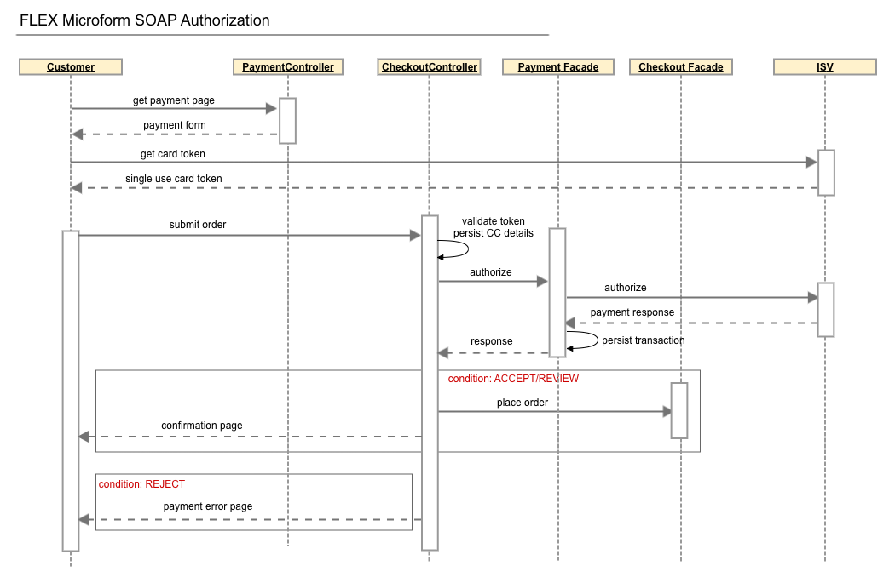
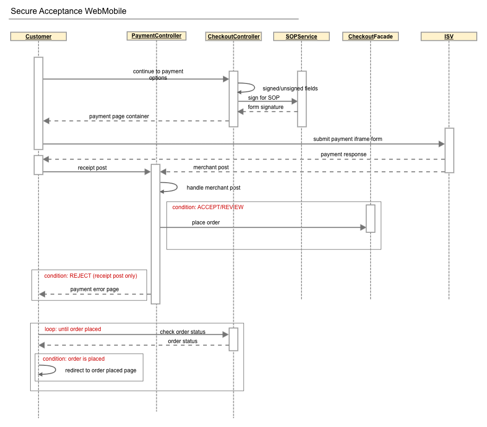
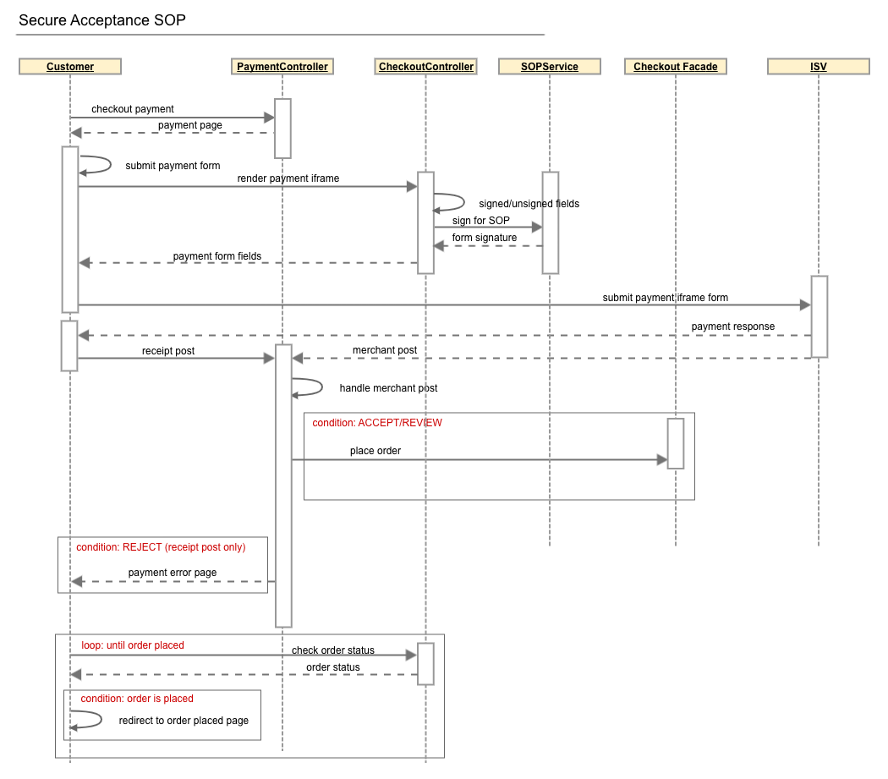
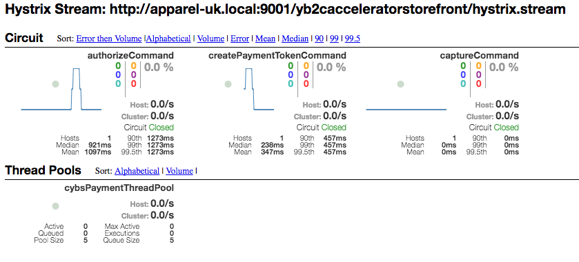
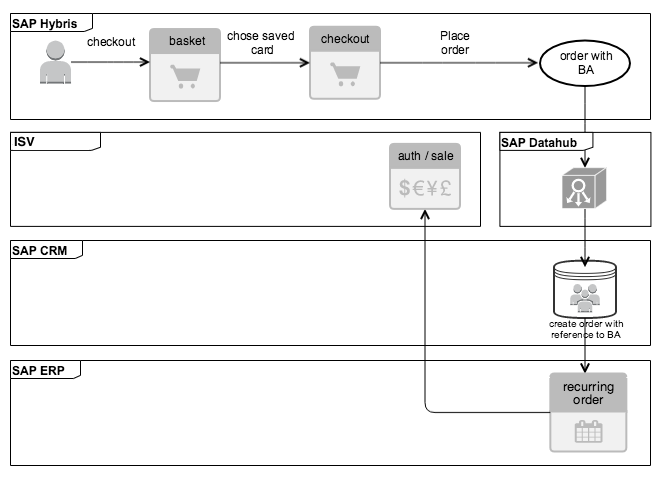
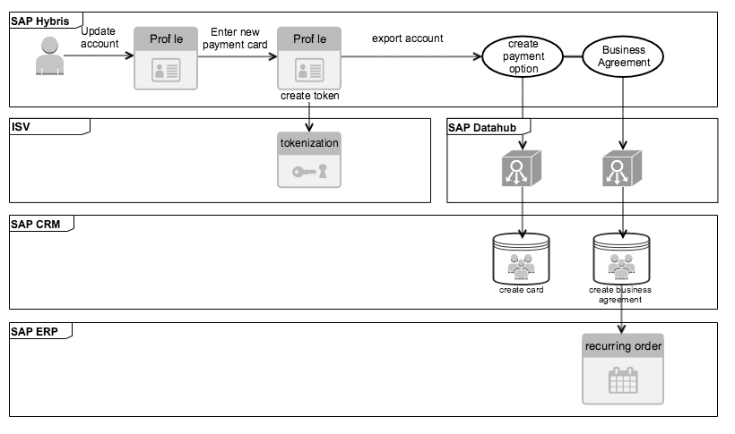

# Payment Plugin <!-- omit in toc -->

## SAP Commerce <!-- omit in toc -->

**Version 24.1.0**
February 2024

## Contents <!-- omit in toc -->
<!-- TOC -->
- [Introduction](#introduction)
- [Installation and Upgrade](#installation-and-upgrade)
  - [Requirements](#requirements)
  - [Installation steps](#installation-steps)
- [Payment services](#payment-services)
  - [Architecture](#architecture)
  - [Credit Card](#credit-card)
    - [Description](#description)
    - [Implementation details](#implementation-details)
      - [Configuration](#configuration)
      - [Operations](#operations)
      - [Data conversion](#data-conversion)
    - [Applicability and limitations](#applicability-and-limitations)
  - [Token Management Service](#token-management-service)
  - [Visa Secure Remote Commerce](#visa-secure-remote-commerce)
    - [Description](#description-1)
    - [Implementation details](#implementation-details-1)
      - [UI Integration](#ui-integration)
      - [Conversion layer](#conversion-layer)
    - [Applicability and limitations](#applicability-and-limitations-1)
  - [AliPay](#alipay)
    - [Description](#description-2)
    - [Implementation details](#implementation-details-2)
  - [PayPal](#paypal)
    - [Description](#description-3)
    - [Implementation details](#implementation-details-3)
  - [Apple Pay](#apple-pay)
    - [Description](#description-4)
    - [Implementation details](#implementation-details-4)
    - [Configuring Apple Pay](#configuring-apple-pay)
    - [Checkout experience](#checkout-experience)
  - [Google Pay](#google-pay)
    - [Description](#description-5)
    - [Implementation details](#implementation-details-5)
    - [Checkout experience](#checkout-experience-1)
  - [Klarna](#klarna)
    - [Description](#description-6)
    - [Implementation details](#implementation-details-6)
    - [Applicability and limitations](#applicability-and-limitations-2)
  - [iDEAL](#ideal)
    - [Description](#description-7)
    - [Implementation details](#implementation-details-7)
  - [Sofort](#sofort)
    - [Description](#description-8)
    - [Implementation details](#implementation-details-8)
  - [Bancontact](#bancontact)
    - [Description](#description-9)
    - [Implementation details](#implementation-details-9)
  - [WeChat](#wechat)
    - [Description](#description-10)
    - [Implementation details](#implementation-details-10)
    - [Checkout experience](#checkout-experience-2)
- [Business Services](#business-services)
  - [Fraud Management](#fraud-management)
    - [Description](#description-11)
    - [Implementation details](#implementation-details-11)
    - [Applicability and limitations](#applicability-and-limitations-3)
  - [Decision Manager](#decision-manager)
    - [Description](#description-12)
    - [Implementation details](#implementation-details-12)
  - [Verification Services](#verification-services)
    - [Description](#description-13)
    - [Implementation details](#implementation-details-13)
    - [Applicability and limitations](#applicability-and-limitations-4)
  - [Payer Authentication](#payer-authentication)
    - [Description](#description-14)
    - [Implementation details](#implementation-details-14)
    - [Applicability and limitations](#applicability-and-limitations-5)
  - [Reporting](#reporting)
    - [Description](#description-15)
    - [Implementation details](#implementation-details-15)
  - [Tax calculation](#tax-calculation)
    - [Description](#description-16)
    - [Implementation details](#implementation-details-16)
    - [Applicability and limitations](#applicability-and-limitations-6)
  - [Transaction Status Check](#transaction-status-check)
    - [Description](#description-17)
    - [Implementation details](#implementation-details-17)
    - [Applicability and limitations](#applicability-and-limitations-7)
- [Configuration](#configuration-1)
  - [Description](#description-18)
  - [Implementation details](#implementation-details-18)
- [Logging and Filtering](#logging-and-filtering)
- [Validation](#validation)
- [Resilience](#resilience)
  - [Description](#description-19)
  - [Implementation details](#implementation-details-19)
- [Reference Implementation](#reference-implementation)
  - [Business Process](#business-process)
  - [Storefront](#storefront)
    - [Device fingerprinting](#device-fingerprinting)
  - [Cron job](#cron-job)
  - [SAP Billing Integration](#sap-billing-integration)
    - [Description](#description-20)
      - [Terminology](#terminology)
    - [Implementation details](#implementation-details-20)
      - [Card Tokenization](#card-tokenization)
      - [Storefront customisations](#storefront-customisations)
      - [Billing Agreement creation](#billing-agreement-creation)
      - [DataHub integration](#datahub-integration)
      - [Fulfilment process](#fulfilment-process)
    - [Checkout process](#checkout-process)
      - [Checkout with new card](#checkout-with-new-card)
      - [Checkout with saved card](#checkout-with-saved-card)
      - [My Account Management](#my-account-management)
      - [Add a new payment card](#add-a-new-payment-card)
      - [Update payment card](#update-payment-card)
- [Testing](#testing)
  - [General Approach to testing](#general-approach-to-testing)
    - [Unit Testing](#unit-testing)
    - [Integration Testing](#integration-testing)
      - [Testing Approach](#testing-approach)
      - [Test Configuration](#test-configuration)
      - [Test Data](#test-data)
      - [Test Overview](#test-overview)
      - [Tests Running](#tests-running)
      - [Reporting](#reporting-1)
    - [Automation Testing](#automation-testing)
      - [Testing Approach](#testing-approach-1)
      - [Tools and frameworks](#tools-and-frameworks)
      - [Test Settings](#test-settings)
      - [Gmail API](#gmail-api)
      - [Test Data](#test-data-1)
      - [AdminApi](#adminapi)
      - [IsvGebSpec](#isvgebspec)
      - [Test Setup](#test-setup)
      - [Page Objects](#page-objects)
      - [Test Structure](#test-structure)
      - [How to run tests](#how-to-run-tests)
      - [Test Report](#test-report)
    - [Testing commands using Impex and Scripts](#testing-commands-using-impex-and-scripts)
      - [Impex](#impex)
      - [Groovy scripts to test a command](#groovy-scripts-to-test-a-command)
- [Support](#support)

<!-- /TOC -->

## Recent Revisions to This Document

| Release       | Release version              | Changes                      |
|---------------|------------------------------|------------------------------|
| May 2018      | 2.0.0                        | Repackaged solution              |
| November 2018 | 2.1.0                        | Added documentation for: <br>- Flex Microform <br>- Apple Pay <br>- Token Management Service  <br>The section [Reference Implementation](#_nfslfvdlftqg) updated with:  <br>- Device fingerprinting implementation details  <br>- Updated fulfillment process |
| June 2019     | 2.2.1                        | Added documentation for: <br>- New Update Session operation for Klarna <br>- Enabling 3DS 2.x |
| July 2019     | 2.3.0                        | - Introduced an enhancement of configurable mappers, in order to convert request / response between low level objects and CJL <br>- Adjusted converters to use new approach for creating requests what was introduced in CJL 2.3.0 |
| January 2020  | 2.4.0                        | - Added integration support for the REST API using Java Client SDK <br>- Migrated Reporting and Transaction Search from Servlet to REST APIs |
| March 2020    | 2.5.0                        | - Added support for Google Pay <br>- Added support for WeChat payments <br>- SAP Commerce upgrade to 19.0.5 |
| May 2020      | 3.0.0                        | - Re-packaging under ISV package |
| March 2021    | 3.0.2                        | - The payer authentication and card authorization services are requested at the same time for Flex <br>- Added support for Credit Mutuel-CIC transactions|
| March 2021    | 3.1.0                        | - SAP Commerce upgrade to 2005 |
| March 2021    | 3.2.0                        | - SAP Commerce upgrade to 2011 |
| February 2024 | 24.1.0                       | - Upgraded Cybersource REST Client SDK to version 0.0.58 |

### Audience and Purpose

This document is intended for merchants who want to use Payment and Value Added Business services. This document provides an overview for integrating ISV services into SAP Commerce ecommerce platform.

### Conventions

### Note, Important, and Warning Statements

>   A Note contains helpful suggestions or references to material not contained in the document.

 An Important statement contains information essential to successfully completing a task or learning a concept.

 A Warning contains information or instructions, which, if not heeded, can result in a security risk, irreversible loss of data, or significant cost in time or revenue or both.

### Text and Command Conventions

| **Convention** | **Usage**                                                                                          |
|----------------|----------------------------------------------------------------------------------------------------|
| `Inline Code`     | Field and service names in text; for example: Include the `card_accountNumber` field.|
|                   | Items that you are instructed to act upon; for example: `Click Save`. |
| ```Code Block```  | XML elements. |
|                   | Code examples and samples. |

### Acronyms and terminology

| **SI** | System Integrator. A person or company that specializes in integrating the SAP Commerce Payment extension |
| --- | --- |
| **CJL** | Core Java Library. A Java Library, which provides an extensible and platform agnostic integration layer over the payment provider API |
| **RI** | Reference Implementation. The implementation of SAP Commerce using the Core Java Library based on B2C and B2BB accelerators |
| **OOTB** | Out Of The Box |
| **Google Guice** | Google Guice is an open source software framework that provides support for dependency injection using annotations to configure Java objects. It is used in the CJL for wiring dependencies |
| **Converter** | A component in CJL which transforms payment service request into operation specific object. |
| **Payment service request** | An upper level object container defined in CJL, that contains information necessary for executing payment operation |
| **Payment service result** | An upper level object container defined in CJL, which contains the result of payment operation execution |
| **PSP** | Payment Service Provider |
| **Installer** | SAP Commerce OOTB installation script. |
| **Recipe** | Installation script, that manages SAP Commerce installation process, by providing an internal DSL |
| **Add-On** | An extension that overrides existing web functionality, by holding existing SAP Commerce code intact |
| **local.properties** | A file which contains property values that are used by SAP Commerce in order to override or extend functionalities |

## Related Documents

### Payment API Documentation

Ecommerce Platform plugin comes with Core Java library documentation which is the base and prerequisite for this document.

### Documents

- [Common Java Library (CJL)](CJL/CJL.md)
- [Business Center Help](https://developer.cybersource.com/library/documentation/dev_guides/Business_Center/html/index.html)
- Secure Acceptance Checkout API Integration Guide ([HTML](https://developer.cybersource.com/library/documentation/dev_guides/Secure_Acceptance_Checkout_API/html/index.html))
- Secure Acceptance Hosted Checkout Integration Guide ([HTML](https://developer.cybersource.com/library/documentation/dev_guides/Secure_Acceptance_Hosted_Checkout/html/index.html))
- Visa Secure Remote Commerce Using the Simple Order API ([HTML](https://developer.cybersource.com/library/documentation/dev_guides/Visa_SRC_SO_API/html/index.html) |[PDF](https://developer.cybersource.com/library/documentation/dev_guides/Visa_SRC_SO_API/Visa_SRC_SO_API.pdf) )
- Credit Card Services Using the Simple Order API ([PDF](http://apps.cybersource.com/library/documentation/dev_guides/CC_Svcs_SO_API/Credit_Cards_SO_API.pdf) )
- Flex Microform Implementation Guide ( [HTML](https://developer.cybersource.com/api/developer-guides/dita-flex/SAFlexibleToken/FlexMicroform.html))
- Level II and Level III Processing Using the Simple Order API ([HTML](http://apps.cybersource.com/library/documentation/dev_guides/Level_2_3_SO_API/html) |[PDF](http://apps.cybersource.com/library/documentation/dev_guides/Level_2_3_SO_API/Level_II_III_SO_API.pdf) )
- PayPal Express Checkout Using Alternative Payments and the Simple Order API ([PDF](https://apps.cybersource.com/library/documentation/dev_guides/AltPay_PayPal_Express_SO/AltPay_PayPal_Express_SO_API.pdf)) ([HTML](https://apps.cybersource.com/library/documentation/dev_guides/AltPay_PayPal_Express_SO/html))
- Online Bank Transfers Using the Simple Order API ([HTML](http://apps.cybersource.com/library/documentation/dev_guides/OnlineBankTransfers_SO_API/html) |[PDF](http://apps.cybersource.com/library/documentation/dev_guides/OnlineBankTransfers_SO_API/OnlineBankTransfers_SO_API.pdf) )
- Authorizations with Payment Network Tokens Using the Simple Order API  ([HTML](https://developer.cybersource.com/library/documentation/dev_guides/Authorizations_PNT_SO_API/html/index.html) |[PDF](https://developer.cybersource.com/library/documentation/dev_guides/Authorizations_PNT_SO_API/Authorizations_PNT_SO_API.pdf))
- Tax Calculation Service for the Simple Order API ( [HTML](http://apps.cybersource.com/library/documentation/dev_guides/Tax_SO_API/html) | [PDF](http://apps.cybersource.com/library/documentation/dev_guides/Tax_SO_API/Tax_SO_API.pdf))
- Reporting Developer Guides ( [HTML](https://developer.cybersource.com/api/developer-guides/dita-reporting-rest-api-dev-guide-102718/reporting_api.html))
- Payer Authentication Using the Simple Order API ( [HTML](http://apps.cybersource.com/library/documentation/dev_guides/Payer_Authentication_SO_API/html/) | [PDF](http://apps.cybersource.com/library/documentation/dev_guides/Payer_Authentication_SO_API/Payer_Authentication_SO_API.pdf) )
- Verification Services Using the Simple Order API ( [HTML](http://apps.cybersource.com/library/documentation/dev_guides/Verification_Svcs_SO_API/html/) | [PDF](http://apps.cybersource.com/library/documentation/dev_guides/Verification_Svcs_SO_API/Verification_Svcs_SO_API.pdf) )
- Cybersource REST API Reference ( [HTML](https://developer.cybersource.com/api-reference-assets/index.html) )

### Technical documentation

[https://www.cybersource.com/en-us/support/technical-documentation.html](https://www.cybersource.com/en-us/support/technical-documentation.html)

## Customer Support

For support information about any Cybersource service, visit the Support Center:

[http://www.cybersource.com/support](http://www.cybersource.com/support/)

# Introduction

The SAP Commerce plugin provides an integration layer between SAP Commerce platform and the payment provider API.

The plugin consists of a set of SAP Commerce platforms extensions that cover backend and frontend integration aspects.

Frontend extensions are built on top of Spring MVC (Model View Controller) framework as part of SAP Commerce Platform. It uses standard SAP Commerce B2C and B2B Accelerators which are part of SAP commerce deployed on premise or in the SAP Cloud.

More details on SAP Commerce accelerators: <https://help.sap.com/viewer/4c33bf189ab9409e84e589295c36d96e/2011/en-US/8adca7a186691014bd31f1d2d96624f5.html>

As part of reference functionality, the following features are supported:

| Feature                                     | CJL 3.0.2 | SAP B2C | SAP B2B | Description                                         |
|---------------------------------------------|-----------|---------|---------|-----------------------------------------------------|
| SA SOP                                      | Y         | Y       | Y       | Secure Acceptance Silent Order Post                 |
| Flex Microform v.0.11                       | Y         | Y       | N       | Secure field - PCI compliant                        |
| SA WM (HOP)                                 | Y         | Y       | Y       | Secure Acceptance Web Mobile (Hosted Order Page)    |
| SO Auth                                     | Y         | Y       | N       | SimpleOrder Auth - serverside auhtorization token   |
| Payer Authentication (+RBPA) "Enrollment"   | Y         | N       | N       | Payer authentication a part of Auth call via SO API |
| PayPal SO (old API)                         | Y         | N       | N       | Classical Paypal using Simple Order API             |
| PayPal AP (New API)                         | Y         | Y       | N       | New paypal using Alternative payments API           |
| Saved card token                            | Y         | Y       | N       | Saved as part of SOP and HOP checkout flow          |
| Recurring order                             | Y         | N       | Y       | B2B subscription order as part of checkout          |
| Alipay                                      | Y         | Y       | N       | Alipay Wallet integration                           |
| Visa Secure Remote Commerce                 | Y         | Y       | N       | Visa SRC Classic and Express (click to pay)         |
| Bank Transfers (iDeal, Sofort, Bankcontact) | Y         | Y       | N       | Bank payments, can be extended                      |
| Klarna                                      | Y         | Y       | N       | Latest Klarna API including GDPR updates            |
| Tax Calculation                             | Y         | N       | N       | CJL level only - Tax Calculation service            |
| Dav - (Delivery Address Verification)       | Y         | N       | N       | CJL level only. Can be extended                     |
| Tokenization (not TMS)                      | Y         | Y       | Y       | CJL level & via HOP Authorisation call in Hybris    |
| Decision Manager                            | Y         | Y       | Y       | All level, Card payments only                       |
| ATP (account takeover protection)           | Y         | N       | N       | CJL level only. Can be extended                     |
| AFS (advance fraud screen)                  | Y         | N       | N       | CJL level only. Can be extended                     |
| Device FingerPrinting                       | Y         | Y       | Y       | Part of fraud detection tooling                     |
| Level 2 and Level 3 Data Processing         | Y         | N       | N       | CJL level only. Can be extended                     |
| Reporting Services SOAP                     | N         | N       | N       | CJL level only. Can be extended                     |
| Export Compliance                           | Y         | N       | N       | CJL level only. Can be extended                     |
| ApplePay                                    | Y         | Y       | N       | Applepay wallet integration                         |
| TMS                                         | Y         | N       | N       | CJL level only. Can be extended                     |
| 3DS2.x                                      | Y         | Y       | Y       | CJL level only & Hybris                             |
| Reference Fulfilment Flow                   | Y         | Y       | Y       | Success demo flow only. Needs customization         |
| Google Pay                                  | Y         | Y       | N       | Google Pay wallet                                   |
| WeChat                                      | Y         | Y       | N       | We Chat wallet                                      |
| REST Services Support                       | Y         | Y       | Y       | New Rest API from Payment service provider          |
| Rest Reporting                              | Y         | Y       | Y       | New reporting API using new REST endpoints          |
| Configurable request builders and mapping   | Y         | Y       | Y       | Framework of customizeable request builders         |

SAP Commerce Payment Extension is based on the following package structure:


1. **isvpayment** - contains payment core functionality like: payment services, report services, cronjobs, configurations, etc.
2. **isvpaymentaddon** - overrides accelerator checkout payment functionality, like: controllers, views, filters, tags, javascripts, etc. This is the common addon, should be applied to both b2c and b2b storefronts
3. **isvb2cpaymentaddon** - this addon should be used for b2c storefront (should be applied together with isvpaymentaddon)
4. **isvb2bpaymentaddon** - this addon should be used for b2b storefront (should be applied together with isvpaymentaddon)
5. **isvpaymentsampledata** - provides sample merchant configuration data
6. **isvpaymentfulfillmentprocess** - sample implementation of order fulfillment process, using payment services.
7. **isvpaymentautomation** - contains automated test suite to verify checkout payment SOP, HOP and other functionalities
8. **b2c_acc_isv** - gradle installer recipe to setup the payment extension in b2c storefront
9. **b2c_acc_isv** - gradle installer recipe to setup the payment extension in b2b storefront

# Installation and Upgrade

This section summarises the installation process of SAP Commerce payment extension into SAP Commerce release v2011.

There are two types of installation: using step by step approach or by using a custom recipe that will manage most of the work.

All technical installation concepts in this document are initial draft provided for the approach and are subject to alterations during the delivery phase.

## Requirements

The following components are required:

1. SAP Commerce platform release v2011
2. sap-commerce-payment-plugin-24.1.0.zip
3. Java 11
4. Required Dependencies installed in maven repository

>  Please take a look at the CJL "Installation" section and check the full list of transitive dependencies for troubleshooting dependency version conflicts.

### Dependency resolution issue <!-- omit in toc -->

#### Description <!-- omit in toc -->

The following dependency at the moment cannot be retrieved using Maven dependency resolution mechanism "hybris/bin/isvpayment/lib/isv-payment-api-3.0.2.jar". Rest of dependencies can be managed by Maven as those are external and available in Maven central

Following errors will be thrown during SAP Commerce build:

```text
[artifact:mvn] [main] ERROR org.apache.maven.cli.MavenCli - Failed to execute goal on project isvpayment: Could not resolve dependencies for project isv.sap.payment:isvpayment:jar:3.0.2: Could not find artifact isv.payment.cjl:isv-payment-api:jar:3.0.2 in central.mirror (https://repo.maven.apache.org/maven2) -> [Help 1]
```

#### Solution <!-- omit in toc -->

The "isvpayment" extension comes with all the library binaries included in "hybris/bin/isvpayment/lib" so that you are able to build the extension without Maven. For that you will need to disable Maven dependency resolution for the extension (please see the documentation here <https://help.sap.com/viewer/d0224eca81e249cb821f2cdf45a82ace/2011/en-US/120f6d7b89a745018cb28b5e34318fa4.html>). 

As a quick local build solution the dependency can be installed in local maven repository and retrieved as a cached dependency as per <https://maven.apache.org/guides/mini/guide-3rd-party-jars-local.html>.

```text
$mvn install:install-file -Dfile=isv-payment-api-3.0.2.jar -DgroupId=isv.payment.cjl -DartifactId=isv-payment-api -Dversion=3.0.2 -Dpackaging=jar
```

Another quick and rather non-conventional solution would also be just removing or renaming the following file: "hybris/bin/isvpayment/external-dependencies.xml". Another option would be creating "hybris/bin/isvpayment/unmanaged-dependencies.txt" file which can be used to list those JARs (dependencies) which should be ignored by Maven. You might want to ignore "isv-payment-api-3.0.2.jar".

>  According to SAP documentation:  The ant updateMavenDependencies task deletes all *.jar files from the lib folder by default. Only libraries listed in unmanaged-dependencies.txt files are not deleted.

## Installation steps

SAP Commerce payment extension installation process is based on OOTB build approach. The approach is based on copying files in appropriate locations by adding minimal required configuration properties through local.properties file.

#### SAP Commerce recipe installation - automated (gradle) approach <!-- omit in toc -->

1. Obtain SAP Commerce Suite 2011 release package and unzip it into appropriate location

    ```text
    $unzip sap-commerce-suite-2011.zip -d sap-commerce-suite-2011
    ```

2. Copy the payment extensions to SAP Commerce release, following default folder structure

    ```text
    $unzip sap-commerce-payment-plugin.zip -d sap-commerce-suite-2011
    ```

3. Configure the merchant data

    Please update the configuration files by providing your payment merchant configuration. To do this please find the configuration template files having extension ".tpl", rename them to "\*.impex" and edit them by adding merchant details.

    ```text
    $cd sap-commerce-suite-2011/hybris/bin/isvpaymentsampledata/
    $cd /resources/isvpaymentsampledata/import
    ```

    For each payment method:

    ```text
    $mv merchant_payment_configuration.impex.tpl merchant_payment_configuration.impex
    $mv cronjobs.impex.tpl cronjobs.impex
    ```

     Please notice not all payment method provides `cronjobs.impex.tpl` thus no need to run `mv cronjobs.impex.tpl cronjobs.impex`

    Considering REST APIs are being used by Reporting functionality the following merchant specific configuration should be provided:

    ```text
    # For TEST environment use "apitest.cybersource.com"
    # For PROD environment use "api.cybersource.com"
    isv.payment.api.rest.runEnvironment=apitest.cybersource.com

    # HTTP_Signature = http_signature and JWT = jwt
    isv.payment.api.rest.authenticationType = http_signature

    # HTTP Parameters
    # The credentials below MUST be provided in case "isv.payment.api.rest.authenticationType=http_signature"
    isv.payment.api.rest.<merchant_id>.merchantKeyId = <merchantKeyId>
    isv.payment.api.rest.<merchant_id>.merchantsecretKey = <merchantsecretKey>

    # JWT Parameters
    # The credentials below MUST be provided in case "isv.payment.api.rest.authenticationType=jwt"
    isv.payment.api.rest.<merchant_id>.keyAlias = <merchant_id>
    isv.payment.api.rest.<merchant_id>.keyPass = <merchant_id>
    isv.payment.api.rest.<merchant_id>.keyFileName = <merchant_id>
    # P12 key path. Enter the folder path where the .p12 file is located.
    isv.payment.api.rest.<merchant_id>.keysDirectory = isvpayment/keys
    ```

    >  REST API credentials are required by [Reporting](#_ab1pt3jarpgv) functionality. You should consider changing the `isv.payment.api.rest.runEnvironment` property to `api.cybersource.com` on production environments.

4. SAP Commerce provides an OOTB installer tool that allows you to install, initialize and run the platform using a recipe feature. SAP Commerce payment extension package provides two recipes: they allow installation either in B2C or B2B storefronts which are generated from `yacceleratorstorefront` template; configures which extensions are required; adds minimal required properties for using the extension.

    >  You execute the recipes with the script `install.sh` (Unix/Mac) or `install.bat` (Windows), respectively.

    Installation for b2c storefront:

    ```text
    $cd sap-commerce-suite-2011/installer
    $./install.sh -r b2c_acc_isv
    $./install.sh -r b2c_acc_isv initialize
    ```

    Installation for b2b storefront:

    ```text
    $cd sap-commerce-suite-2011/installer
    $./install.sh -r b2b_acc_isv
    $./install.sh -r b2b_acc_isv initialize
    ```

    >  Both `b2c_acc_isv` and `b2b_acc_isv` recipes include an additional step which generates automatically `yb2cacceleratorstorefront` and `yb2bacceleratorstorefront` extensions respectively based on `yacceleratorstorefront` template. The step is implemented in `createStoreFrontExt` Gradle task and depends on `setup` task.

    OOTB SAP Commerce configured apparel storefronts (this is b2c storefront) to respond to dns names, which should be added into hosts file, this is more reliable than using IP addresses.

    Open hosts file for editing and add the following line:

    ```text
     127.0.0.1 apparel-de.local apparel-uk.local
    ```

    For b2b storefront (powertools) add following entry:

    ```text
     127.0.0.1 powertools.local
    ```

5. Now platform is ready to be started

    For b2c use:

    ```text
     $./install.sh -r b2c_acc_isv start
    ```

    For b2c use:

    ```text
     $./install.sh -r b2b_acc_isv start
    ```

    In order to check that SAP Commerce starts, the home page should be accessed, as a result the home screen should be displayed.

    For b2c:

    ```text
     https://apparel-uk.local:9002/yb2cacceleratorstorefront
    ```

    For b2c:

    ```text
     https://powertools.local:9002/yb2bacceleratorstorefront
    ```

#### Step by Step installation - manual approach <!-- omit in toc -->

1. Obtain SAP Commerce suite 2011 release package and unzip it into appropriate location

    ```text
     $unzip sap-commerce-suite-2011.zip -d sap-commerce-suite-2011
    ```

2. Install B2C components with accelerator storefront, that includes apparel store as sample data

    ```text
    $cd sap-commerce-suite-2011/installer
    $./install.sh -r b2c_acc
    $cd ..
    ```

    >  If you need b2b functionality use b2b_acc recipe

3. Generate a separate B2C storefront extension from `yacceleratorstorefront` template, using OOTB `extgen` tool

    ```text
    $cd hybris/bin/platform
    $. ./setantenv.sh
    $ant extgen -Dinput.template=yacceleratorstorefront -Dinput.name=yb2cacceleratorstorefront -Dinput.package=de.hybris.platform.yb2cacceleratorstorefront
    ```

    For B2B functionality use following command

    ```text
    $cd hybris/bin/platform
    $. ./setantenv.sh
    $ant extgen -Dinput.template=yacceleratorstorefront -Dinput.name=yb2bacceleratorstorefront -Dinput.package=de.hybris.platform.yb2bacceleratorstorefront
    ```

4. Copy payment extensions to SAP Commerce suite, following default folder structure

    ```text
     $unzip sap-commerce-payment-plugin.zip -d sap-commerce-suite-2011
    ```

5. In order to use payment extensions, they need to be added and configured into localextensions.xml file. This file contains all extensions, which are used by the platform on startup.

    ```text
     $vim ../../config/localextensions.xml
    ```

    For b2c functionality add following extensions at the end of `localextensions.xml` file

    ```text
    <extension name='isvpayment' />
    <extension name='isvpaymentaddon' />
    <extension name='isvb2cpaymentaddon' />
    <extension name='isvpaymentsampledata' />
    <extension name='isvfulfilmentprocess' />
    <extension name='yb2cacceleratorstorefront' />
    ```

    For b2b functionality add following extensions at the end of `localextensions.xml` file

    ```text
    <extension name='isvpayment' />
    <extension name='isvpaymentaddon' />
    <extension name='isvb2bpaymentaddon' />
    <extension name='isvpaymentsampledata' />
    <extension name='isvfulfilmentprocess' />
    <extension name='yb2bacceleratorstorefront' />
    ```

    Remove existing declared extensions from `localextensions.xml` file

    ```text
    <extension name='yacceleratorfulfilmentprocess' />
    <extension name='yacceleratorstorefront' />
    ```

6. Payment extensions are built using Java 11, containing the latest java features and fixes. Also in order to customize credentials, related to commands or reporting, merchant specific properties should be added into `local.properties` file

    ```text
    $vim ../../config/local.properties
    ```

    Add following properties at the end of property file

    ```text
    build.source=11.0
    build.target=11.0

    site.pci.strategy=FLEX

    # For TEST environment use "apitest.cybersource.com"
    # For PROD environment use "api.cybersource.com"
    isv.payment.api.rest.runEnvironment=apitest.cybersource.com

    # HTTP_Signature = http_signature and JWT = jwt
    isv.payment.api.rest.authenticationType = http_signature

    # HTTP Parameters
    # The credentials below MUST be provided in case "isv.payment.api.rest.authenticationType=http_signature"
    isv.payment.api.rest.<merchant_id>.merchantKeyId = <merchantKeyId>
    isv.payment.api.rest.<merchant_id>.merchantsecretKey = <merchantsecretKey>

    # JWT Parameters
    # The credentials below MUST be provided in case "isv.payment.api.rest.authenticationType=jwt"
    isv.payment.api.rest.<merchant_id>.keyAlias = <merchant_id>
    isv.payment.api.rest.<merchant_id>.keyPass = <merchant_id>
    isv.payment.api.rest.<merchant_id>.keyFileName = <merchant_id>
    # P12 key path. Enter the folder path where the .p12 file is located.
    isv.payment.api.rest.<merchant_id>.keysDirectory = isvpayment/keys

    ```

    >  REST API credentials are required by [Reporting](#_ab1pt3jarpgv) functionality. You should consider changing the `isv.payment.api.rest.runEnvironment` property to `api.cybersource.com` on production environments.

7. In order to keep provided accelerator storefront clean as is, but with payment functionality included, payment add-ons should be installed

    For b2c:

    ```text
     ant addoninstall -Daddonnames="isvpaymentaddon,isvb2cpaymentaddon" -DaddonStorefront.yacceleratorstorefront="yb2cacceleratorstorefront"
    ```

    For b2b:

    ```text
    ant addoninstall -Daddonnames="b2bacceleratoraddon,isvpaymentaddon,isvb2bpaymentaddon" -DaddonStorefront.yacceleratorstorefront="yb2bacceleratorstorefront"
    ```

    Where b2bacceleratoraddon is OOTB SAP Commerce addon for enabling b2b functionality, if you already installed this addon you can omit it in the previous command

8. OOTB apparel storefront is configured to respond to DNS names, which should be added into hosts file, this is more reliable than using IP addresses.

    Open hosts file for editing and add the following line

    For b2c:

    ```text
     127.0.0.1 apparel-de.local apparel-uk.local
    ```

    For b2b:

    ```text
     127.0.0.1 powertools.local
    ```

9. After all configuration steps are done, the platform is ready to be initialized and started. Initialization is done using ant command, after that platform is started by running the provided server script.

    ```text
    $ant initialize
    $./hybrisserver.sh
    ```

    In order to check that the platform has started, home page should be accessed, as a result home screen should be displayed

    For b2c use:

    ```text
    https://apparel-uk.local:9002/yb2cacceleratorstorefront
    ```

    For b2b use:

    ```text
    https://apparel-uk.local:9002/yb2bacceleratorstorefront
    ```

# Payment services

## Architecture

Core payment plugin concepts are encapsulated through Core Java Library (CJL) dependency as follows:

**Payment service executor** - an entry point to payment service request processing, which dispatches the execution to payment service provider based on payment operation requested.

**Payment service provider** - encapsulates the processing of payment service requests specific to payment operation.

**Converter** - a component that transforms payment service request into an operation specific object consumed by command.

**Command** - a component responsible to call payment services and deal with request/response translation.

**Request/Response mapper** - a component which performs the translation from payment operation specific objects to a low level request / response transport objects used to call payment services.

The following diagram outlines dependencies among key CJL abstractions:


The main entry point for a payment service request execution is defined by payment service executor:

```text
isv.cjl.payment.service.executor.PaymentServiceExecutor
//with the SAP Commerce extension implementation
isv.sap.payment.service.executor.CorePaymentServiceExecutor
```

An executor consumes a payment service request which encapsulates payment type (i.e. Credit Card, PayPal etc.) and operation (i.e. authorization, capture etc.) along with payment data (currency, amount, billing information etc.):

```text
 isv.cjl.payment.service.executor.request.PaymentServiceRequest
```

The following diagram outlines a payment service request execution sequence:


A payment service request encapsulates payment type and operation fields that are used for routing of the request to an appropriate provider:

```text
 isv.cjl.payment.service.provider.PaymentServiceProvider
```

Provider component performs conversion between two request data structures:

```text
isv.cjl.payment.service.executor.request.PaymentServiceRequest
//to
isv.cjl.payment.service.request.Request
```

Aforementioned conversion logic is encapsulated through the following CJL interface:

```text
 isv.cjl.payment.data.Converter
```

There is a set sample request converters, grouped within the following CJL package:

```text
 isv.cjl.sample.payment.request.converter
```

Sample converter components convert a minimal set of required request data and are used just to run integration tests. This layer is due to be extended for when a larger set of data is required.

## Credit Card

### Description

Credit card payment services allow to process payment cards from different brands through a single secure connection.

The implementation of Credit Card payment service in SAp Commerce plugin provides the following operations:

- Authorization
- Authorization Reversal
- Payment Token Create
- Payment Token Delete
- Capture
- Void
- Refund (follow-on and stand alone)

The following implementations are provided for **credit card authorization operation** :

- Flex Microform (enabled by default)
- Secure Acceptance Web/Mobile
- Secure Acceptance Silent Order POST

The implementation is selected dynamically based on plugin configuration. For more details, please refer to the "[Configuration](#_17o0hy9q9ihq)" section.

Additionally, SAp Commerce plugin supports credit card authorization by using Simple Order API. This enables to collect and store card sensitive data on the merchant side and then submit the authorization request. The interaction with the Simple Order API is provided by CJL whereas converters provided as a part of reference implementation. Please note, this type of integration significantly increases PCI DSS scope.

### Implementation details

#### Authorization with Flex Microform <!-- omit in toc -->

With Flex Microform, the capture of card number is fully outsourced to the payment provider, which can qualify merchants for SAQ A-based assessments. Flex Microform provides the most secure method for tokenizing card data. Sensitive data is encrypted on the customer's device before HTTPS transmission to the payment provider. This method mitigates any compromise of the HTTPS connection through a man in the middle attack.

For more details, please refer to [Flex Microform Implementation Guide](https://developer.cybersource.com/api/developer-guides/dita-flex/SAFlexibleToken/FlexMicroform.html).

The following controller is provided as part of Flex Microform implementation:

```text
isv.sap.payment.addon.b2c.controllers.pages.checkout.payment.flex.FlexMicroformController
```

The `isvpaymentaddon` provides the following components for integrating Flex Microform into UI:

- JSP tag to integrate Flex Microform SDK to page

```text
webroot/WEB-INF/tags/responsive/payment/flex/microform.tag
```

- JSP fragment to render the form with card details

```text
webroot/WEB-INF/views/responsive/pages/checkout/multi/payment/flexCardPaymentDetails.jsp
```

- Handlers, listeners and styling options for Flex Microform

```text
webroot/_ui/responsive/pages/js/checkout/multi/payment/flexCardPaymentDetails.js
```

The latter contains all the integration logic between the credit card details form and **microform.tag**.

The following diagram describes the flow and actors/components involved for Flex Microform implementation:



#### Authorization with Secure Acceptance Web/Mobile <!-- omit in toc -->

With Secure Acceptance Web/Mobile (also called HOP - Hosted Order Page) the user is redirected to a payment provider secure page to collect and to handle credit card sensitive data.

For more details, please refer to Secure Acceptance Hosted Checkout Integration Guide ([HTML](https://developer.cybersource.com/library/documentation/dev_guides/Secure_Acceptance_Hosted_Checkout/html/index.html)|[PDF](https://developer.cybersource.com/library/documentation/dev_guides/Secure_Acceptance_Hosted_Checkout/Secure_Acceptance_Hosted_Checkout.pdf)), section "Secure Acceptance Transaction Flow".

>  Please make sure to have Hosted Checkout profile created in EBC portal, refer to Secure Acceptance Hosted Checkout Integration Guide ([HTML](https://developer.cybersource.com/library/documentation/dev_guides/Secure_Acceptance_Hosted_Checkout/html/index.html)|[PDF](https://developer.cybersource.com/library/documentation/dev_guides/Secure_Acceptance_Hosted_Checkout/Secure_Acceptance_Hosted_Checkout.pdf)), section "Creating a Hosted Checkout Profile".

The following controllers are provided as part of HOP reference implementation:

```text
isv.sap.payment.addon.controllers.pages.checkout.payment.sa.HopController
isv.sap.payment.addon.controllers.pages.checkout.payment.sa.SecureAcceptanceController
isv.sap.payment.addon.controllers.pages.PaymentController
```

The following diagram describes the flow and actors/components involved for Secure Acceptance Web/Mobile implementation:



#### Authorization with Secure Acceptance Silent Order POST <!-- omit in toc -->

With Secure Acceptance Silent Order POST (SOP), the form to collect credit card details is displayed at the merchant storefront and then is submitted directly to the payment provider by using the customer browser (instead of redirecting the user to a payment provider page to collect payment information).

For more details, please refer to [Cybersource Secure Acceptance Checkout API](https://developer.cybersource.com/library/documentation/dev_guides/Secure_Acceptance_Checkout_API/Secure_Acceptance_Checkout_API.pdf) guide.

>  Please make sure to have Hosted Checkout profile created in EBC portal, refer to [Cybersource Secure Acceptance Checkout API](https://developer.cybersource.com/library/documentation/dev_guides/Secure_Acceptance_Checkout_API/Secure_Acceptance_Checkout_API.pdf), section "Create a Checkout API Profile".

The following controllers are provided as part of SOP reference implementation:

```text
isv.sap.payment.addon.controllers.pages.checkout.payment.sa.SopController
isv.sap.payment.addon.controllers.pages.checkout.payment.sa.SecureAcceptanceController
isv.sap.payment.addon.controllers.pages.PaymentController
```

The following diagram describes the flow and actors/components involved for Secure Acceptance Silent Order POST implementation:



For both, Secure Acceptance Web/Mobile and Secure Acceptance Silent Order POST the following features is provided with reference implementation:

- **Payer Authentication** - in case if credit card is enrolled in one of the Payer Authentication schemes (a.k.a 3D Secure) an additional step will be displayed as part of payment flow

- **Merchant POST** - the transaction result is handled asynchronously when the payment provider submits the result directly to the storefront controller. It is recommended to implement this functionality as a backup means of determining the transaction result. This method does not rely on the customer's browser.

- **Duplicate Authorization** - If the payment provider received the same authorization request multiple times, duplicate authorization status will be treated as a successful payment response and client redirected to order confirmation page. Subsequently, duplication transaction data will be automatically repaired as part of order fulfilment process.

#### Configuration

The implementation for credit card authorization operation can be switched dynamically by changing SAP Commerce Accelerator `site.pci.strategy` configuration property to one of the following:

- **FLEX** - to enable Flex Microform
- **HOP** - to enable Secure Acceptance Web/Mobile
- **SOP** - to enable Secure Acceptance Silent Order POST

The default value for `site.pci.strategy` is defined in `local.properties` file and is set to FLEX. To change the value at runtime, please use Admin Console (HAC). The new value will take effect when the payment type selection section will be rendered / refreshed.

The custom JSP tag **pciStrategyType** could be used to display the UI fragment specific to `site.pci.strategy`:

```xml
<isv:pciStrategyType type="FLEX">
   <jsp:include page="payment/flexCardPaymentDetails.jsp"/>
</isv:pciStrategyType>

<isv:pciStrategyType type="HOP">
   <c:url var="hopFormAction" value="/checkout/payment/sa/hop"/>
   <form:form id="hopRequestForm" name="hopRequestForm" action="${hopFormAction}"/>
</isv:pciStrategyType>

<isv:pciStrategyType type="SOP">
   <jsp:include page="payment/checkoutCardPaymentDetails.jsp"/>
   <c:url var="sopFormAction" value="/checkout/payment/sa/sop"/>
   <div id="sopIframeCbox">
       <iframe id="sopRequestIframe" src="${sopFormAction}"></iframe>
   </div>
</isv:pciStrategyType>
```

For Flex Microform, the following configuration properties are defined:

| **Configuration property** | **Description** |
| --- | --- |
| isv.payment.flex.microform.sdk.url | The URL for the Flex Microform Javascript SDK |
| isv.payment.customer.flex.microform.api.key.id  | Customer specific Flex API key ID obtained from your payment provider |
| isv.payment.customer.flex.microform.shared.secret | Shared secret for Flex API key |
| isv.payment.customer.flex.microform.api.env | Flex API environment: `SANDBOX` - to use the FLEX API test environment,  `PRODUCTION` - to use the FLEX API live environment. Additional properties can be used to change the host and URI path of the Flex API service, e.g for `SANDBOX` environment use `isv.payment.customer.flex.microform.api.SANDBOX.host` for host location (host and port) and `isv.payment.customer.flex.microform.api.SANDBOX.path` for URI path (`/flex/v1/keys`). Usually only `isv.payment.customer.flex.microform.api.env` property should be configured. |
| isv.payment.flex.card.type.selection | Possible values true/false. Indicates if the card type selection dropdown in the payment form will be enabled. This is useful when processing payments with cards that are co-branded (e.g. Carte Bancaire), so the user is able to select the card type from the list in the dropdown. |

For Secure Acceptance, the following configuration properties are defined:

| **Configuration property** | **Description** |
| --- | --- |
| isv.payment.secure.acceptance.sop.post.url | The endpoint URL for Secure Acceptance Silent Order POST (SOP) |
| isv.payment.secure.acceptance.hop.post.url | The endpoint URL for Secure Acceptance Web/Mobile (HOP) |
| isv.payment.secure.acceptance.hop.subscription.create.post.url | The endpoint URL for Secure Acceptance Web/Mobile token creation |
| secure.acceptance.{site}.transaction.type | The type of operation to authorize credit card payment for SOP method: [authorization -OR- create_payment_token]. This type of operation is configured at site level. For example: secure.acceptance.apparel-uk.transaction.type=authorizationsecure.acceptance.powertools.transaction.type=create_payment_token |

#### Operations

Each Credit Card payment operation is based on a common CJL abstraction that encapsulates all required data:

```text
 isv.cjl.payment.service.executor.request.PaymentServiceRequest
```

In order to simplify creation and setup of a payment service request, a dedicated set of request builder components defined in CJL is provided for each payment operation:

| **Payment Operation** | **Request builder implementation\*** |
| --- | --- |
| Authorization | AuthorizationRequestBuilder |
| Authorization(Secure Acceptance) | isv.cjl.payment.sa.SecureAcceptanceRequestBuilder |
| Authorization Reversal | AuthorizationReversalRequestBuilder |
| Capture | CaptureRequestBuilder |
| Payment Token Create | PaymentTokenCreateRequestBuilder |
| Payment Token Delete | PaymentTokenDeleteRequestBuilder |
| Refund (follow-on) | RefundFollowOnRequestBuilder |
| Refund (stand alone) | RefundStandaloneRequestBuilder |
| Void | VoidRequestBuilder |

\* Payment service request builders are defined within the following package:

```text
 isv.cjl.payment.service.executor.request.builder.creditcard
```

The table below summarises the credit card payment operations and the corresponding reference implementation components:

| **Payment operation** | **Default implementation component** |
| --- | --- |
| Authorization(based on token) | `isv.sap.payment.addon.b2b.facade.impl.IsvB2BAcceleratorCheckoutFacade` `isv.sap.payment.addon.facade.impl.CreditCardPaymentFacadeImpl` |
| Authorization(Secure Acceptance) | `isv.sap.payment.addon.b2c.controllers.pages.checkout.payment.flex.FlexMicroformController` `isv.sap.payment.addon.controllers.pages.checkout.payment.sa.HopController isv.sap.payment.addon.controllers.pages.checkout.payment.sa.SopController` |
| Capture | `isv.sap.payment.fulfilmentprocess.strategy.impl.takepayment.CreditCardTakePaymentStrategy` |
| Payment Token Create | Not implemented as part of RI. Can be tested through beanshell. |
| Payment Token Delete | Not implemented as part of RI. Can be tested through beanshell. |
| Authorization Reversal | Not implemented as part of RI. Can be tested through beanshell. |
| Refund (follow-on) | Not implemented as part of RI. Can be tested through beanshell. |
| Refund (stand alone) | Not implemented as part of RI. Can be tested through beanshell. |
| Void | Not implemented as part of RI. Can be tested through beanshell. |

#### Data conversion

The conversion from payment service request to a request object specific to credit card payment operation is implemented by:

| **Payment operation** | **Payment service request converter implementation\*** |
| --- | --- |
| Authorization | AuthorizationRequestConverter |
| Authorization reversal | AuthorizationReversalRequestConverter |
| Capture | CaptureRequestConverter |
| Payment Token Create | PaymentTokenCreateRequestConverter |
| Payment Token Delete | PaymentTokenDeleteRequestConverter |
| Refund (follow-on) | RefundFollowOnRequestConverter |
| Refund (stand alone) | RefundStandaloneRequestConverter |
| Void | VoidRequestConverter |

\* Java package:

```text
isv.sap.payment.service.executor.request.converter.creditcard
```

>  Each converter operates on a minimal set of required request fields. In case a larger set of data is due to be sent to the payment provider, the corresponding request converter component should be overridden accordingly.

### Applicability and limitations

Only Flex Microform, Secure Acceptance Web/Mobile and Silent Order POST are implemented as part of SAP Commerce reference implementation.

See "Payer Authentication" section from current document for payer Check Enrolment and Validation operations (a.k.a. 3D secure).

## Token Management Service

CJL implements the following Token Management Service operations:

- Create
- Update
- Retrieve
- Delete

For more details on aforementioned functionality, please check CJL documentation.

## Visa Secure Remote Commerce

### Description

Visa Secure Remote Commerce (Visa SRC) is Visas solution for e-commerce payments based upon the EMV Secure Remote Commerce (EMV SRC) standards and specifications. Visa SRC simplifies online shopping experience with a single account and lets the customer speed through checkout with just a username and password - no need to fill out shipping and payment details every time. For more details, please refer to [Visa SRC](https://developer.cybersource.com/library/documentation/dev_guides/Visa_SRC_Getting_Started/Visa_SRC_Getting_Started.pdf) and [Using the Simple Order API](https://developer.cybersource.com/library/documentation/dev_guides/Visa_SRC_SO_API/Visa_SRC_SO_API.pdf) implementation guide.

The implementation of Visa SRC payment service for SAP Commerce extension includes:

- Implementation of payment operations:
  - Get Data
  - Authorization
  - Authorization reversal
  - Capture
  - Refund
  - Void

- Integration with B2C accelerator starter store that provides two checkout flow flavours:
  - Express Checkout - the payment is performed directly from shopping cart once the order is confirmed
  - Traditional checkout - the default flow supported by b2c accelerator

### Implementation details

The following configuration properties related to Visa SRC payment service are defined in the `project.properties` file of `isvpaymentaddon` :

| **Configuration property** | **Description** |
| --- | --- |
| isv.payment.visa.checkout.sdk.url     | Visa SRC JavaScript SDK URL   |
| isv.payment.visa.checkout.image.url   | Visa SRC button image URL     |

#### UI Integration

The Visa SRC widget components for both Express and Traditional checkout share most of the UI components. The following JSP tags were created to demonstrate the integration of Visa SRC widget into the sample storefront:

```text
/isvpaymentaddon/acceleratoraddon/web/webroot/WEB-INF/tags/responsive/payment/visacheckout/vcInit.tag
/isvpaymentaddon/acceleratoraddon/web/webroot/WEB-INF/tags/responsive/payment/visacheckout/vcButton.tag
/isvpaymentaddon/acceleratoraddon/web/webroot/WEB-INF/tags/responsive/payment/visacheckout/vcLoadSDK.tag
/isvpaymentaddon/acceleratoraddon/web/webroot/WEB-INF/views/responsive/pages/checkout/multi/payment/vcCardPaymentDetails.jsp
```

Each Visa SRC payment operation is based on a common CJL abstraction that encapsulates all required data:

```text
 isv.cjl.payment.service.executor.request.PaymentServiceRequest
```

In order to simplify creation and setup of a payment service request, a dedicated set of request builder components is provided by CJL for each payment operation:

| **Payment Operation** | **Request builder implementation\*** |
| --- | --- |
| Get | GetRequestBuilder |
| Authorization | AuthorizationRequestBuilder |
| Authorization Reversal | AuthorizationReversalRequestBuilder |
| Capture | CaptureRequestBuilder |
| Refund | RefundRequestBuilder |
| Void | VoidRequestBuilder |

\* Payment service request builders are defined within the following package:

```text
 isv.cjl.payment.service.executor.request.builder.visacheckout
```

The table below summarises the credit card payment operations and the corresponding reference implementation components:

| **Payment operation** | **Default implementation component** |
| --- | --- |
| Get | `isv.sap.payment.addon.facade.impl.VisaCheckoutPaymentFacadeImpl` |
| Authorization | `isv.sap.payment.addon.facade.impl.VisaCheckoutPaymentFacadeImpl` |
| Capture | `isv.sap.payment.fulfilmentprocess.strategy.impl.takepayment.VisaCheckoutTakePaymentStrategy` |
| Authorization Reversal | Not implemented as part of reference implementation. Can be tested through beanshell. |
| Refund | Not implemented as part of reference implementation. Can be tested through beanshell. |
| Void | Not implemented as part of reference implementation. Can be tested through beanshell. |

#### Conversion layer

The conversion from payment service request to a request object specific to visa SRC payment operation is implemented by:

| **Payment operation** | Payment service request converter implementation |
| --- | --- |
| Get | GetRequestConverter |
| Authorization | AuthorizationRequestConverter |
| Authorization reversal | AuthorizationReversalRequestConverter |
| Capture | CaptureRequestConverter |
| Refund | RefundFollowOnRequestConverter |
| Void | RefundStandaloneRequestConverter |

\* Java package:

```text
isv.sap.payment.service.executor.request.converter.visacheckout
```

>  Each converter operates on a minimal set of required request fields. In case a larger set of data is due to be sent, then the corresponding request converter component should be overridden accordingly.

### Applicability and limitations

See "Payer Authentication" section from current document for payer Check Enrolment and Validation operations (a.k.a. 3D secure).

## AliPay

### Description

The AliPay real-time international payment solution enables merchants to trade in Asia. Customers who are registered AliPay account holders can select AliPay as their payment method on the merchant web site. For more details, please refer to [AliPay International Services Using the Simple Order API](http://apps.cybersource.com/library/documentation/dev_guides/AliPayInt/AliPay_Int_SO_API.pdf) integration guide.

AliPay payment service for SAP Commerce extension includes the following payment operations:

- Initiate Payment
- Check Status
- Refund

### Implementation details

The following configuration properties related to AliPay payment service are defined in the `project.properties` file of `isvpaymentaddon` :

| **Configuration property** | **Description** |
| --- | --- |
| `isv.payment.alternativepayment.alipay.merchanturl.host` | Merchant host URL |

Each AliPay payment operation is based on a common CJL abstraction that encapsulates all required data:

```text
 isv.cjl.payment.service.executor.request.PaymentServiceRequest
```

In order to simplify creation and setup of a payment service request, a dedicated set of request builder components is provided in CJL for each payment operation:

| **Payment Operation** | **Request builder implementation\*** |
| --- | --- |
| Initiate | InitiateRequestBuilder |
| Check Status | CheckStatusRequestBuilder |
| Refund | RefundRequestBuilder |

\* Common to alternative payments request builders are defined within the following package:

```text
 isv.cjl.payment.service.executor.request.builder.alternative
```

Once a payment service request is created it is executed through the payment service executor. The table below summarises the payment operations and the corresponding component implementation that create the payment service request and passes it for execution to the payment service executor:

| **Payment operation** | **Default implementation component** |
| --- | --- |
| Initiate | isv.sap.payment.addon.strategy.impl.AlipaySaleRequester |
| Check Status | See "Transaction Check Status" section |
| Refund | Not implemented as part of RI. Can be tested through beanshell. |

The conversion from payment service request to a request object specific to AliPay payment operation is implemented by:

| **Payment operation** | **Payment service request converter implementation\*** |
| --- | --- |
| Initiate | InitiateRequestConverter |
| Check Status | CheckStatusRequestConverter |
| Refund | RefundRequestConverter |

\* Java package:

```text
isv.sap.payment.service.executor.request.converter.alternative
```

## PayPal

### Description

PayPal operates worldwide online payments system that supports online money transfers and serves as an electronic alternative to traditional paper methods like checks and money orders. For more details, please refer to "PayPal Express Checkout Using Alternative Payment Services" and "Simple Order API" integration guide.

PayPal payment service for SAP Commerce extension includes the following payment operations:

- Authorization
- Authorization Reversal
- Billing Agreement
- Cancel Order
- Capture
- Check Status
- Create Billing Agreement Session
- Create Session
- Order Setup
- Refund
- Sale

Aforementioned PayPal payment operations are part of the alternative payments group.

### Implementation details

The following configuration properties related to PayPal payment service are defined in the `project.properties` file of `isvpaymentaddon` :

| **Configuration property** | **Description** |
| --- | --- |
| isv.payment.paypal.return.url | Merchant return URL |
| isv.payment.paypal.cancelReturn.url | Merchant cancel payment URL |
| isv.payment.paypal.sandbox.url | PayPal sandbox URL. Should be replaced through production URL. |

Each PayPal payment operation is based on a common CJL abstraction that encapsulates all required data:

```text
 isv.cjl.payment.service.executor.request.PaymentServiceRequest
```

In order to simplify creation and setup of a payment service request, a dedicated set of request builder components is provided in CJL for each payment operation:

| **Payment Operation** | **Request builder implementation\*** |
| --- | --- |
| Authorization | AuthorizationRequestBuilder |
| Authorization Reversal | AuthorizationReversalRequestBuilder |
| Billing Agreement | BillingAgreementRequestBuilder |
| Cancel Order | CancelOrderRequestBuilder |
| Capture | CaptureRequestBuilder |
| Check Status | CheckStatusRequestBuilder |
| Create Billing Agreement Session | CreateBillingAgreementSessionRequestBuilder |
| Create Session | CreateSessionRequestBuilder |
| Order Setup | OrderSetupRequestBuilder |
| Refund | RefundRequestBuilder |
| Sale | SaleRequestBuilder |

\* Common to alternative payments request builders are defined within the following package:

```text
 isv.cjl.payment.service.executor.request.builder.paypal
```

Once a payment service request is created it is executed through the payment service executor. The table below summarises the payment operations and the corresponding component implementation that create the payment service request and passes it for execution to the payment service executor:

| **Payment operation** | **Default implementation component** |
| --- | --- |
| Authorization | `isv.sap.payment.addon.facade.impl.PayPalPaymentFacadeImpl` |
| Check Status  | |
| Order Setup   | |
| Capture       | `isv.sap.payment.fulfilmentprocess.strategy.impl.takepayment.PayPalTakePaymentStrategy` |

Remaining PayPal payment operations could be tested through beanshell.

The conversion from payment service request to a request object specific to PayPal payment operation is implemented by:

| **Payment Operation** | **Payment service request converter implementation\*** |
| --- | --- |
| Authorization | AuthorizationRequestConverter |
| Authorization Reversal | AuthorizationReversalRequestConverter |
| Billing Agreement | BillingAgreementRequestConverter |
| Cancel Order | CancelOrderRequestConverter |
| Capture | CaptureRequestConverter |
| Check Status | CheckStatusRequestConverter |
| Create Billing Agreement Session | CreateBillingAgreementSessionRequestConverter |
| Create Session | CreateSessionRequestConverter |
| Order Setup | OrderSetupRequestConverter |
| Refund | RefundRequestConverter |
| Sale | SaleRequestConverter |

\* Java package:

```text
isv.sap.payment.service.executor.request.converter.paypal
```

## Apple Pay

### Description

Apple Pay is a mobile payment and digital wallet service by Apple Inc. that allows users to make payments in person, in iOS apps, and on the web. It is supported on the iPhone, Apple Watch, iPad and Mac.

For more details, please refer to [Apple Pay using the simple order API](https://developer.cybersource.com/library/documentation/dev_guides/apple_payments/SO_API/html/index.html)

Apple Pay payment service for SAP Commerce extension includes the following payment operations:

- Create Session
- Authorization
- Authorization Reversal
- Payment Token Decryption
- Capture
- Sale
- Refund

### Implementation details

The following configuration properties related to Apple Pay payment service are defined in the `project.properties` file of `isvpaymentaddon` :

| **Configuration property** | **Description** |
| --- | --- |
| `isv.payment.customer.applepay.decryption.type` | Indicates the type of decryption used when requesting Apple Pay payment authorization. Possible values: ISV_PAYMENT, MERCHANT, ISV_PAYMENT decryption is recommended for PCI compliance. For more information see [Apple Pay Integrations](https://developer.cybersource.com/library/documentation/dev_guides/apple_payments/SO_API/html/Topics/ch_intro.htm) |
| `isv.payment.customer.applepay.merchant.identifier` | Your Apple Pay merchant ID, see "Configuring Apple Pay" section below |
| `isv.payment.customer.applepay.<base store code>.initiative.context` | Indicates the Apple Pay domain registered for the given base store, see "Configuring Apple Pay" |
| `isv.payment.customer.applepay.keystore.location` | This is the relative path to a JKS keystore containing your Apple Pay Merchant Identity certificate and private key (if using ISV_PAYMENT decryption) or Apple Pay Merchant Identity and Payment Processing certificates and private keys (if using MERCHANT decryption). See "Configuring Apple Pay" section below |
| `isv.payment.customer.applepay.keystore.password` | Password for the referenced keystore above |
| `isv.payment.customer.applepay.payment.privatekey.alias` | **Required only if using merchant decryption,** alias given to Payment Processing private key |
| `isv.payment.customer.applepay.payment.privatekey.password` | **Required only if using merchant decryption,** password assigned to Payment Processing private key |
| `isv.payment.customer.applepay.payment.expiration.time` | **Required only if using merchant decryption,** amount of time in milliseconds that can pass before considering a payment token expired. Payment token won't expire if value <= 0 |
| `isv.payment.applePay.supported.ssl.protocols` | Supported SSL protocols when requesting Apple Pay session. See [Setting up your server for Apple Pay](https://developer.apple.com/documentation/apple_pay_on_the_web/setting_up_your_server) Pay for more information |
| `isv.payment.applepay.initiative` | Value for parameter "initiative" in [Requesting Apple Pay Payment Session](https://developer.apple.com/documentation/apple_pay_on_the_web/apple_pay_js_api/requesting_an_apple_pay_payment_session) |
| `isv.payment.applePay.merch.decryption.leafOID` | **Required only if using merchant decryption,** custom leaf OID. See [Payment Token Format](https://developer.apple.com/library/archive/documentation/PassKit/Reference/PaymentTokenJSON/PaymentTokenJSON.html) |
| `isv.payment.applePay.merch.decryption.intermediateOID` | **Required only if using merchant decryption,** custom intermediate OID. See [Payment Token Format](https://developer.apple.com/library/archive/documentation/PassKit/Reference/PaymentTokenJSON/PaymentTokenJSON.html) |

Each Apple Pay payment operation is based on a common CJL abstraction that encapsulates all required data:

```text
 isv.cjl.payment.service.executor.request.PaymentServiceRequest
```

In order to simplify creation and setup of a payment service request, a dedicated set of request builder components is provided for each payment operation\*\*:

| **Payment Operation** | **Request builder implementation\*** |
| --- | --- |
| Create Session | CreateSessionRequestBuilder |
| Authorization | AuthorizationRequestBuilder |
| Authorization Reversal | AuthorizationReversalRequestBuilder |
| Capture | CaptureRequestBuilder |
| Refund | RefundFollowOnRequestBuilder |
| Sale | SaleRequestBuilder |

\* Payment service request builders are defined within the following package:

```text
 isv.cjl.payment.service.executor.request.builder.applepay
```

\*\* Payment Token Decryption is done calling decrypt method from ApplePayDecryptionService:

```text
 isv.cjl.payment.service.applepay.ApplePayDecryptionService
```

Once a payment service request is created it is executed through the payment service executor. The table below summarises the payment operations and the corresponding component implementation that create the payment service request and passes it for execution to the payment service executor:

| **Payment operation** | **Default implementation component** |
| --- | --- |
| Create Session | Client side: `acceleratoraddon/web/webroot/_ui/responsive/common/js/isvb2cpaymentaddon.js` Server side: `isv.sap.payment.addon.facade.impl.ApplePayPaymentFacadeImpl` |
| Authorization | `isv.sap.payment.addon.facade.impl.ApplePayPaymentFacadeImpl` |
| Payment Token Decryption |
| Capture |  `isv.sap.payment.fulfilmentprocess.strategy.impl.takepayment.ApplePayTakePaymentStrategy` |
| Authorization Reversal |  `isv.sap.payment.fulfilmentprocess.strategy.impl.authorizationreversal.ApplePayAuthorizationReversalStrategy` |
| Refund |  `isv.sap.payment.fulfilmentprocess.strategy.impl.refund.ApplePayRefundStrategy` |

Sale payment operation could be tested through beanshell.

The conversion from payment service request to a request object specific to Apple Pay payment operation is implemented by:

| **Payment Operation** | **Payment service request converter implementation** |
| --- | --- |
| Authorization |  `isv.sap.payment.service.executor.request.converter.applepay.AuthorizationRequestConverter` |
| Authorization Reversal |  `isv.sap.payment.service.executor.request.converter.creditcard.AuthorizationReversalRequestConverter` |
| Capture |  `isv.sap.payment.service.executor.request.converter.creditcard.CaptureRequestConverter` |
| Create Session | `isv.cjl.payment.data.mapper.custom.ApplePayCreateSessionDataConverter` |
| Refund |  `isv.sap.payment.service.executor.request.converter.creditcard.RefundFollowOnRequestConverter` |
| Sale | `isv.sap.payment.service.executor.request.converter.applepay.SaleRequestConverter` |

>  Converter implementations are distributed on different packages, this is because only Authorization and Sale operations require custom requests but all other operations are treated as Credit Card operations

### Configuring Apple Pay

>  You need an Apple developer account in order to proceed with the following steps

>  You need to install [Java Cryptography Extension](https://www.oracle.com/technetwork/java/javase/downloads/jce8-download-2133166.html) if having issues executing Payment Token Decryption operation

Go to [Apple Pay Merchant Page](https://developer.apple.com/account/ios/identifier/merchant) and add a new merchant. (This ID will be the value for config property` isv.payment.customer.applepay.merchant.identifier`)

Edit your new merchant and add your domain(s). Note that subdomains of your registered domain won't work. (Your registered domain will be "initiativeContext" parameter in CreateSessionRequestBuilder)

Create an Apple Pay Merchant Identity Certificate following the instructions in the page. Once created, download and open it in order to install it on your system.

Now we need to create an Apple Pay Processing Certificate, this step will be different depending on your implementation choice.

#### Option 1 - ISV_PAYMENT decryption (recommended) <!-- omit in toc -->

- Obtain a CSR from your payment provider and then upload it into your Apple Pay merchant

- Now we need to create a JKS keystore containing your merchant identity certificate. On mac, this can be achieved following these steps:

1 - Go to keychain, then select your certificate and key, then right click and select "Export 2 items..." (using .p12 format)


2 - Now we need to convert from .p12 to keystore. Using terminal:

```text
 $keytool -importkeystore -deststorepass <new keystore password> -destkeystore <keystoreName> -srckeystore <your exported .p12 file> -srcstoretype PKCS12
```

If keytool is not on your classpath, you can find it at $JAVA_HOME/bin/keytool

The resulting keystore should be added on the project classpath and used to fill configuration properties i`sv.payment.customer.applepay.keystore.location` and `isv.payment.customer.applepay.keystore.password`

#### Option 2 - MERCHANT decryption <!-- omit in toc -->

Create an Apple Pay Processing Certificate following the instructions in the page, then download and install it on your system. Take note of the value given to "Common Name field" since this will be used for configuration `isv.payment.customer.applepay.payment.privatekey.alias`

Now we need to create a JKS keystore containing your identity and payment certificates/private keys + Apple CA certificates.

Open keychain and select all 4 items, then right click and select "Export 4 items" (using .p12 format)


Now we need to convert from .p12 to keystore. Using terminal:

```text
 $keytool -importkeystore -deststorepass <new keystore password> -destkeystore <keystoreName> -srckeystore <your exported .p12 file> -srcstoretype PKCS12
```

If keytool is not on your classpath, you can find it at `$JAVA_HOME/bin/keytool`

Now we need to include Apple Root CA - G3 Root Certificate and Application Integration - G3 Certificate. You can download them from [Apple certificates](https://www.apple.com/certificateauthority/).

Once downloaded, add them into the keystore using the following command (make sure alias is unique for each certificate):

```text
 keytool -import -trustcacerts -alias <alias> -file <location of .cer file> -keystore <keystoreName> -storepass <store password>
```

Verify your generated keystore contains 4 entries:

```text
 keytool -list -keystore <keystoreName>
```

The resulting keystore should be added on the project classpath and used to fill the following configuration properties:

```text
isv.payment.customer.applepay.keystore.location
isv.payment.customer.applepay.keystore.password
isv.payment.customer.applepay.payment.privatekey.alias
isv.payment.customer.applepay.payment.privatekey.password
```

### Checkout experience

>  Apple Pay payment method option will only appear in compatible devices. Please see [Apple Pay Supported Devices](https://support.apple.com/en-gb/HT208531)

In reference implementation, Apple Pay follows a checkout flow similar to other payment types, with simple customizations for the Apple Pay popup. But it is possible to implement different flows leveraging Apple Pay's Javascript API. As an example, the following code:

```text
var request = {
    countryCode: 'GB',
    currencyCode: 'GBP',
    supportedNetworks: ['visa', 'masterCard', 'amex', 'discover'],
    merchantCapabilities: ['supports3DS'],
    requiredShippingContactFields: [
        'postalAddress',
        'name',
        'phoneticName',
        'phone',
        'email'
    ],
    requiredBillingContactFields: [
        'postalAddress',
        'name',
        'phoneticName',
        'phone',
        'email'
    ],
    shippingMethods: [
        {
            label: 'Standard Delivery',
            detail: '3-5 business days',
            amount: '5.99',
            identifier: 'standard-gross'
        },
        {
            label: 'Premium Delivery',
            detail: '1-2 business days',
            amount: '10.99',
            identifier: 'premium-gross'
        }
    ],
    lineItems: [
        {
            type: 'final',
            label: 'Some Product Name',
            amount: '95.00'
        },
        {
            type: 'final',
            label: 'Shipping',
            amount: '5.00'
        },
        {
            type: 'final',
            label: 'Tax',
            amount: '10.00'
        },
        {
            type: 'final',
            label: 'Discount',
            amount: '-2.00'
        }
    ],
    total: {label: 'My Store Name', amount: 108.00, type: 'final'}
}

var session = ACC.secureacceptance.createApplePaySession(request);

session.begin();
```

Would generate a popup where billing address, shipping address and shipping method are requested, and at the same time order line items are shown/updated. This popup could be used in the product details page in order to allow purchases without accessing checkout.


Note that in order to handle changes on the popup, the respective callbacks must be implemented. For shipping method could be something similar to:

```text
session.onshippingmethodselected = function(event) {
     $.ajax({
         method: 'GET',
         url: <my update shipping method endpoint>,
         data: {shippingMethod: event.shippingMethod.identifier},
         success: function (response) {
             session.completeShippingMethodSelection(response);
         }
     });
}
```

Please refer to `isvb2cpaymentaddon.js` in order to see current implementation, and see [Apple Pay Session Documentation](https://developer.apple.com/documentation/apple_pay_on_the_web/applepaysession) for more details.

>  Apple Pay may have restrictions on the styling for their payment buttons. Please refer to [Displaying Apple Pay Buttons](https://developer.apple.com/documentation/apple_pay_on_the_web/displaying_apple_pay_buttons) and [Apple Pay Marketing Guidelines](https://developer.apple.com/apple-pay/marketing/)

## Google Pay

### Description

Google Pay is a simple, secure in-app mobile and Web payment solution.

For more details, please refer to [Google Pay using the simple order API](http://apps.cybersource.com/library/documentation/dev_guides/Google_Pay_SO_API/Google_Pay_SO_API.pdf)

Google Pay payment service for SAP Commerce extension includes the following payment operations:

- Authorization
- Authorization Reversal
- Capture
- Sale
- Refund

### Implementation details

The following configuration properties related to Google Pay payment service are defined in the `project.properties` file of `isvpaymentaddon`:

| **Configuration property** | **Description** |
| --- | --- |
| `isv.payment.customer.googlepay.merchant.id` | Once Google Pay production access is achieved, this property should contain the new merchant Id provided by Google (see [https://developers.google.com/pay/api/web/guides/test-and-deploy/request-prod-access](https://developers.google.com/pay/api/web/guides/test-and-deploy/request-prod-access)) For test environments this property is not used |
| `isv.payment.customer.googlepay.environment` | Indicates the Google Pay environment, possible values: **TEST**, **PRODUCTION** |

Each Google Pay payment operation is based on a common CJL abstraction that encapsulates all required data:

```text
 isv.cjl.payment.service.executor.request.PaymentServiceRequest
```

In order to simplify creation and setup of a payment service request, a dedicated set of request builder components is provided for each payment operation:

| **Payment Operation** | **Request builder implementation\*** |
| --- | --- |
| Authorization | AuthorizationRequestBuilder |
| Authorization Reversal | AuthorizationReversalRequestBuilder |
| Capture | CaptureRequestBuilder |
| Refund | RefundFollowOnRequestBuilder |
| Sale | SaleRequestBuilder |

\* Payment service request builders are defined within the following package:

```text
 isv.cjl.payment.service.executor.request.builder.googlepay
```

Once a payment service request is created it is executed through the payment service executor. The table below summarises the payment operations and the corresponding component implementation that create the payment service request and passes it for execution to the payment service executor:

| **Payment operation** | **Default implementation component** |
| --- | --- |
| Authorization | `isv.sap.payment.addon.facade.impl.GooglePayPaymentFacadeImpl` |
| Capture |  `isv.sap.payment.fulfilmentprocess.strategy.impl.takepayment.GooglePayTakePaymentStrategy` |
| Authorization Reversal |  `isv.sap.payment.fulfilmentprocess.strategy.impl.authorizationreversal.GooglePayAuthorizationReversalStrategy` |
| Refund |  `isv.sap.payment.fulfilmentprocess.strategy.impl.refund.GooglePayRefundStrategy` |

Sale payment operation could be tested through beanshell.

The conversion from payment service request to a request object specific to Google Pay payment operation is implemented by:

| **Payment Operation** | **Payment service request converter implementation** |
| --- | --- |
| Authorization |  `isv.sap.payment.service.executor.request.converter.googlepay.AuthorizationRequestConverter` |
| Authorization Reversal |  `isv.sap.payment.service.executor.request.converter.creditcard.AuthorizationReversalRequestConverter` |
| Capture |  `isv.sap.payment.service.executor.request.converter.creditcard.CaptureRequestConverter` |
| Refund |  `isv.sap.payment.service.executor.request.converter.creditcard.RefundFollowOnRequestConverter` |
| Sale |  `isv.sap.payment.service.executor.request.converter.googlepay.SaleRequestConverter` |

>  Converter implementations are distributed on different packages, this is because only Authorization and Sale operations require custom requests. All other operations are treated as Credit Card operations

### Checkout experience

>  Google Pay payment method option will only appear in compatible devices. Please see [https://developers.google.com/pay/api/web/reference/client#isReadyToPay](https://developers.google.com/pay/api/web/reference/client#isReadyToPay)

In the reference implementation, Google Pay follows a checkout flow similar to other payment types, with simple customizations for the Google Pay popup.

The process works in the following way:

1. SummaryCheckoutStepController.java prepares the information used by Google Pay
2. googlePay.tag includes the JS required for Google Pay, changes in the Google Pay popup should be applied here.
 The method `onPaymentAuthorized` sends the paymentData generated by Google Pay to the back end, where the payment will be processed
3. GooglePayController.java receives the paymentData from the previous step, then submits it to the payment provider for authorization. If the authorization is successful the order is placed and the user will be redirected to order confirmation page

It is possible to implement different flows such as requesting address information or updating delivery costs directly on the Google Pay popup. Please see [https://developers.google.com/pay/api/web/overview](https://developers.google.com/pay/api/web/overview) for information about Google Pay capabilities.

## Klarna

### Description

Klarna payments is an in-line, real-time financing solution for online storefronts, debt collection, credit payments and more. For more details, please refer to [Klarna Services Using the Simple Order API](http://apps.cybersource.com/library/documentation/dev_guides/Klarna_SO_API/Klarna_SO.pdf) integration guide.

The implementation of Klarna payment service for SAP Commerce extension includes:

- Implementation of payment operations:
  - Create Session
  - Update Session
  - Authorization
  - Authorization reversal
  - Capture
  - Refund
  - Check Status

- Integration of Klarna payment widget to Apparel B2C accelerator checkout flow

### Implementation details

The following configuration properties related to Klarna payment service are defined in the `project.properties` file of `isvpaymentaddon` :

| **Configuration property** | **Description** |
| --- | --- |
| klarna.sdk.url | Klarna JavaScript SDK URL |
| klarna.cancel.url | URL that the customer is directed to after canceling the Klarna payment. Not supported by RI |
| klarna.failure.url | URL that the customer is directed to after Klarna payment fails. Not supported by RI |
| klarna.success.url | URL that the customer is directed to after successfully completing the Klarna payment. Not supported by RI |

The integration of Klarna payment widget with accelerator is performed in the following JSP tag:

```text
 isvpaymentaddon/acceleratoraddon/web/webroot/WEB-INF/tags/responsive/payment/klarna/klarnaInit.tag
```

Each Klarna payment operation is based on a common CJL abstraction that encapsulates all required data:

```text
 isv.cjl.payment.service.executor.request.PaymentServiceRequest
```

In order to simplify creation and setup of a payment service request, a dedicated set of request builder components is provided IN CJL for each payment operation:

| **Payment Operation** | **Request builder implementation\*** |
| --- | --- |
| Create Session | CreateSessionRequestBuilder |
| Update Session | UpdateSessionRequestBuilder |
| Authorization | AuthorizationRequestBuilder |
| Authorization Reversal | AuthorizationReversalRequestBuilder |
| Capture | CaptureRequestBuilder |
| Refund | RefundRequestBuilder |
| Check Status | CheckStatusRequestBuilder |

\* Common to alternative payments request builders are defined within the following package:

```text
 isv.cjl.payment.service.executor.request.builder.alternative
```

Once a payment service request is created it is executed through the payment service executor. The table below summarises the payment operations and the corresponding component implementation that create the payment service request and passes it for execution to the payment service executor:

| **Payment operation** | **Default implementation component** |
| --- | --- |
| Create Session | `isv.sap.payment.addon.facade.impl.KlarnaPaymentFacadeImpl` |
| Update Session |  `isv.sap.payment.addon.facade.impl.KlarnaPaymentFacadeImpl` |
| Authorization |  `isv.sap.payment.addon.strategy.impl.KlarnaAuthRequester` |
| Capture |  `isv.sap.payment.fulfilmentprocess.strategy.impl.takepayment.KlarnaTakePaymentStrategy` |
| Authorization Reversal,Refund | Not implemented as part of RI. Can be tested through beanshell. |
| Check Status | See "Transaction Check Status" section |

The conversion from payment service request to a request object specific to Klarna payment operation is implemented by:

| **Payment operation** | **Payment service request converter implementation\*** |
| --- | --- |
| Create Session | CreateSessionRequestConverter |
| Update Session | UpdateSessionRequestConverter |
| Authorization | AuthorizationRequestConverter |
| Authorization reversal | AuthorizationReversalRequestConverter |
| Capture | CaptureRequestConverter |
| Refund | RefundRequestConverter |
| Check Status | CheckStatusRequestConverter |

\* Java package:

```text
isv.sap.payment.service.executor.request.converter.alternative
```

>  Each converter operates on a minimal set of required request fields. In case a larger set of data is due to be sent, then the corresponding request converter component should be overridden accordingly.

### Applicability and limitations

Klarna integration imposes a limitation that a merchant ID is serving one billing country and currency. Please configure multiple MIDs and implement a MIDs selection mechanism if you're processing transactions in multiple currencies and multiple billing areas.

## iDEAL

### Description

iDEAL payment method enables consumers to pay online through their own bank. In addition to webshops, other organisations that are not part of the e-commerce market also offer iDEAL. iDEAL is increasingly used to pay energy bills, make donations to charities, buy mobile credits, pay local taxes, traffic fines.

For more details, please refer to [Online Bank Transfers Using the Simple Order API](http://apps.cybersource.com/library/documentation/dev_guides/OnlineBankTransfers_SO_API/OnlineBankTransfers_SO_API.pdf) guide, "Processing iDEAL Transactions" section.

The implementation of iDEAL payment service for SAP Commerce extension includes:

- Sale
- Check Status
- Options

Aforementioned iDEAL payment operations are part of the alternative payments group.

### Implementation details

The following configuration properties related to iDEAL payment service are defined in the `project.properties` file of `isvpaymentaddon` :

| **Configuration property** | **Description** |
| --- | --- |
| `isv.payment.alternativepayment.return.url` | Merchant return payment return URL |
| `isv.payment.alternativepayment.cancel.url` | Merchant cancel payment return URL |
| `isv.payment.alternativepayment.failed.url` | Merchant failed payment return URL |

Each iDEAL payment operation is based on a common CJL abstraction that encapsulates all required data:

```text
 isv.cjl.payment.service.executor.request.PaymentServiceRequest
```

In order to simplify creation and setup of a payment service request, a dedicated set of request builder components is provided in CJL for each payment operation:

| **Payment Operation** | **Request builder implementation\*** |
| --- | --- |
| Sale | SaleRequestBuilder |
| Check Status | CheckStatusRequestBuilder |
| Refund | RefundRequestBuilder |
| Options | OptionsRequestBuilder |

\* Common to alternative payments request builders are defined within the following package:

```text
 isv.cjl.payment.service.executor.request.builder.alternative
```

Once a payment service request is created it is executed through the payment service executor. The table below summarises the payment operations and the corresponding component implementation that create the payment service request and passes it for execution to the payment service executor:

| **Payment Operation** | **Request builder implementation\*** |
| --- | --- |
| Sale | `isv.sap.payment.addon.strategy.impl.IdealSaleRequester` |
| Check Status | See "Transaction Check Status" section. |
| Refund | Not implemented as part of RI. Can be tested through beanshell. |
| Options | `isv.cjl.payment.service.alternativepayment.AlternativePaymentOptionsService` |

Options command could be also invoked through the following cron job:

```text
isv.sap.payment.cronjob.UpdateAlternativePaymentOptionsJob
```

The conversion from payment service request to a request object specific to iDEAL payment operation is implemented by:

| **Payment Operation** | **Payment service request converter implementation\*** |
| --- | --- |
| Sale | SaleRequestConverter |
| Check Status | CheckStatusRequestConverter |
| Refund | RefundRequestConverter |
| Options | OptionsRequestConverter |

\* Java package:

```text
isv.sap.payment.service.executor.request.converter.alternative
```

## Sofort

### Description

Sofort is a payment processor and an e-commerce payment system in many European regions that enables customers to pay for goods using direct online bank transfers from their bank accounts to your merchant account. For more details, please refer to [Online Bank Transfers Using the Simple Order API](http://apps.cybersource.com/library/documentation/dev_guides/OnlineBankTransfers_SO_API/OnlineBankTransfers_SO_API.pdf) guide, "Processing Sofort Transactions" section.

The implementation of Sofort payment service for SAP Commerce extension includes:

- Sale
- Check Status
- Refund

### Implementation details

The following configuration properties related to Sofort payment service are defined in the `project.properties` file of `isvpaymentaddon` :

| **Configuration property** | **Description** |
| --- | --- |
| `isv.payment.alternativepayment.return.url` | Merchant return payment return URL |
| `isv.payment.alternativepayment.cancel.url` | Merchant cancel payment return URL |
| `isv.payment.alternativepayment.failed.url` | Merchant failed payment return URL |

Each Sofort payment operation is based on a common CJL abstraction that encapsulates all required data:

```text
 isv.cjl.payment.service.executor.request.PaymentServiceRequest
```

In order to simplify creation and setup of a payment service request, a dedicated set of request builder components is provided in CJL for each payment operation:

| **Payment Operation** | **Request builder implementation\*** |
| --- | --- |
| Sale | SaleRequestBuilder |
| Check Status | CheckStatusRequestBuilder |
| Refund | RefundRequestBuilder |

\* Common to alternative payments request builders are defined within the following package:

```text
 isv.cjl.payment.service.executor.request.builder.alternative
```

Once a payment service request is created it is executed through the payment service executor. The table below summarises the payment operations and the corresponding component implementation that create the payment service request and passes it for execution to the payment service executor:

| **Payment Operation** | **Request builder implementation\*** |
| --- | --- |
| Sale |  isv.sap.payment.addon.strategy.impl.SofortSaleRequester |
| Check Status | See "Transaction Check Status" section. |
| Refund | Not implemented as part of RI. Can be tested through beanshell. |

The conversion from payment service request to a request object specific to Sofort payment operation is implemented by:

| **Payment Operation** | **Payment service request converter implementation\*** |
| --- | --- |
| Sale | SaleRequestConverter |
| Check Status | CheckStatusRequestConverter |
| Refund | RefundRequestConverter |

\* Java package:

```text
isv.sap.payment.service.executor.request.converter.alternative
```

## Bancontact

### Description

Bancontact is an e-commerce payment system in Belgium that enables customers to pay for goods using direct online bank transfers from their bank accounts to your merchant account.

For more details, please refer to [Online Bank Transfers Using the Simple Order API](http://apps.cybersource.com/library/documentation/dev_guides/OnlineBankTransfers_SO_API/OnlineBankTransfers_SO_API.pdf) guide, "Processing Bancontact Transactions" section.

The implementation of Bancontact payment service for SAP Commerce extension includes:

- Sale
- Check Status
- Refund

### Implementation details

The following configuration properties related to Bancontact payment service are defined in the `project.properties` file of `isvpaymentaddon` :

| **Configuration property** | **Description** |
| --- | --- |
| `isv.payment.alternativepayment.return.url` | Merchant return payment return URL |
| `isv.payment.alternativepayment.cancel.url` | Merchant cancel payment return URL |
| `isv.payment.alternativepayment.failed.url` | Merchant failed payment return URL |

Each Bancontact payment operation is based on a common CJL abstraction that encapsulates all required data:

```text
 isv.cjl.payment.service.executor.request.PaymentServiceRequest
```

In order to simplify creation and setup of a payment service request, a dedicated set of request builder components is provided in CJL for each payment operation:

| **Payment Operation** | **Request builder implementation\*** |
| --- | --- |
| Sale | SaleRequestBuilder |
| Check Status | CheckStatusRequestBuilder |
| Refund | RefundRequestBuilder |

\* Common to alternative payments request builders are defined within the following package:

```text
 isv.cjl.payment.service.executor.request.builder.alternative
```

Once a payment service request is created it is executed through the payment service executor. The table below summarises the payment operations and the corresponding component implementation that create the payment service request and passes it for execution to the payment service executor:

| **Payment Operation** | **Request builder implementation\*** |
| --- | --- |
| Sale |  `isv.sap.payment.addon.strategy.impl.BancontactSaleRequester` |
| Check Status | See "Transaction Check Status" section. |
| Refund | Not implemented as part of RI. Can be tested through beanshell. |

The conversion from payment service request to a request object specific to Bancontact payment operation is implemented by:

| **Payment Operation** | **Payment service request converter implementation\*** |
| --- | --- |
| Sale | SaleRequestConverter |
| Check Status | CheckStatusRequestConverter |
| Refund | RefundRequestConverter |

\* Java package:

```text
isv.sap.payment.service.executor.request.converter.alternative
```

## WeChat

### Description

WeChat Pay is a popular mobile application that Chinese customers use to purchase goods on your e-commerce website. To complete payment, the customer scans a unique QR code with their mobile phone.

The implementation of WeChat payment service for SAP Commerce extension includes:

- Implementation of payment operations:
  - Sale
  - Check Status
  - Refund

- Integration of WeChat payment widget to Apparel B2C accelerator checkout flow

### Implementation details

The following configuration properties related to WeChat payment service are defined in the `project.properties` file of `isvpaymentaddon`:

| **Configuration property** | **Description** |
| --- | --- |
| `isv.payment.alternativepayment.return.url` | Merchant return payment return URL |
| `isv.payment.alternativepayment.cancel.url` | Merchant cancel payment return URL |
| `isv.payment.alternativepayment.failed.url` | Merchant failed payment return URL |
| `isv.payment.alternativepayment.weChat.sale.timeout` | Represents the period of time (in seconds) during which the sale transaction remains active in the payment provider. |
| `isv.alternativepayment.CHECK_STATUS.request.reconciliationID` | Property used to provide the reconciliation ID. When provided, the value is used as the reconciliation ID when building the payment request. |

Each WeChat payment operation is based on a common CJL abstraction that encapsulates all required data:

```text
 isv.cjl.payment.service.executor.request.PaymentServiceRequest
```

In order to simplify creation and setup of a payment service request, a dedicated set of request builder components is provided in CJL for each payment operation:

| **Payment Operation** | **Request builder implementation\*** |
| --- | --- |
| Sale | SaleRequestBuilder |
| Check Status | CheckStatusRequestBuilder |
| Refund | RefundRequestBuilder |

\* Common to alternative payments request builders are defined within the following package:

```text
 isv.cjl.payment.service.executor.request.builder.alternative
```

Once a payment service request is created it is executed through the payment service executor. The table below summarises the payment operations and the corresponding component implementation that create the payment service request and passes it for execution to the payment service executor:

| **Payment Operation** | **Request builder implementation\*** |
| --- | --- |
| Sale |  `isv.sap.payment.addon.strategy.impl.WeChatSaleRequester` |
| Check Status | See "Transaction Check Status" section. |
| Refund |  `isv.sap.payment.fulfilmentprocess.strategy.impl.refund.WeChatPayRefundStrategy` |

The conversion from payment service request to a request object specific to WeChat payment operation is implemented by:

| **Payment Operation** | **Payment service request converter implementation** |
| --- | --- |
| Sale |  `isv.sap.payment.service.executor.request.converter.alternative.SaleRequestConverter` |
| Check Status |  `isv.sap.payment.service.executor.request.converter.alternative.CheckStatusRequestConverter` |
| Refund |  `isv.sap.payment.service.executor.request.converter.alternative.RefundRequestConverter` |

>  Converter implementations are distributed on different packages. The implementation for WeChat is the same as for the rest of Alternative payment methods and all the operations are treated as Alternative payment operations.

### Checkout experience

In the reference implementation, WeChat Pay follows a checkout flow similar to other Alternative payment types, with simple customizations for the WeChat Pay popup.

The process works in the following way:

1. The front-end initiates a WeChat Pay sale transaction, by sending a request to the '/payNoRedirect' endpoint. For a successful sale request, AlternativePaymentsController.java returns a response body containing a URL.

2. A popup opens on the website and the received URL is used to render the WeChat Pay QR code.

3. The user uses the WeChat mobile app to scan the QR code and goes through the payment process on the mobile app.

4. After successfully completing the payment on the mobile app, the user goes back to the website and uses the button from the popup to notify the backend that the payment details have been submitted.

5. The website sends check payment status requests to the '/checkstatus' endpoint with the frequency specified by the following property:

    ```text
     isv.payment.alternativePayment.checkStatus.WQR.CHECK_STATUS.frequency=5000
    ```

6. The status checks are performed by AlternativePaymentStatusFacadeImpl.java. After performing the payment status check, one of the following response codes is returned to the website:

    | **Status Check Response** | **Response Code Description** |
    | --- | --- |
    | PAYMENT_SUCCESS | The payment was successful. |
    | PAYMENT_PANDING | The payment is still pending and additional check status requests have to be executed. |
    | CHECK_STATUS_TOO_MANY_ATTEMPTS | The amount of check payment status requests exceeds the configured number. The user gets redirected to the payment error page. |
    | CHECK_STATUS_ERROR | An unexpected error occurred and the payment could not be completed.The user gets redirected to the payment error page. |

7. For 'PAYMENT_SUCCESS' responses another request will be sent to the '/return' endpoint to finish the payment and place the order.

# Business Services

## Fraud Management

### Description

We offer a multi-layered fraud management solution  from account monitoring to transaction fraud detection, rules tuning to payer authentication  that helps businesses minimize fraud losses, maximize revenue and minimize operational costs. We enable you to accept more good orders and streamline operations with greater agility by fine-tuning screening models and strategies, whether it is based on relationship, across multiple channels, various devices or levels of service.

Fraud management solutions allows to more accurately detect payment fraud, provide a better customer buying experience, and optimize your operations - all while improving order acceptance and reducing fraud rates.

### Implementation details

SAP Commerce extension integrates CJL fraud services supports two fraud management operations:

- **Account takeover protection** - defends consumers and merchants from fraudulent uses of online accounts and non-payment events, while enabling merchants to streamline access for valuable returning customers. It allows to identify high risk users at account creation and login, and monitors for suspicious account changes so that you can keep your customers' accounts safe.
- **Advanced fraud screen** - a real-time fraud detection service that estimates the level of risk associated with each transaction.

Both operations are encapsulated through common payment service request:

```text
 isv.cjl.payment.service.executor.request.PaymentServiceRequest
```

In order to simplify fraud management operations, a dedicated set of request builder components is provided by CJL for each payment operation:

| **Payment Operation** | **Request builder implementation\*** |
| --- | --- |
| Account Takeover Protection | AccountTakeoverProtectionRequestBuilder |
| Advanced Fraud Screen | AdvancedFraudScreenRequestBuilder |

\* Payment service request builders are defined within the following package:

```text
 isv.cjl.payment.service.executor.request.builder.fraud
```

The conversion from payment service request to a request object specific to fraud service operation is implemented by:

| **Payment operation** | **Payment service request converter implementation\*** |
| --- | --- |
| Account Takeover Protection | AccountTakeoverProtectionRequestConverter |
| Advanced Fraud Screen | AdvancedFraudScreenRequestConverter |

\* Java package:

```text
isv.sap.payment.service.executor.request.converter.fraud
```

>  Each converter operates on a minimal set of required request fields. In case a larger set of data is due to be sent, then the corresponding request converter component should be overridden accordingly.

### Applicability and limitations

There is currently no reference implementation in SAP Commerce extension for Fraud Management services. Please see "Testing commands using Impex and Scripts" section for how to test the fraud service through SAP Commerce beanshell.

## Decision Manager

### Description

Decision Manager is a hosted fraud management solution that enables to take a pre-emptive approach to fraud management - stopping fraud closer to its inception while increasing conversion of good orders. Decision Manager accesses the world's largest fraud detection radar, a rules engine, a case management system, as well as reporting and analytics. For more details, please refer to [Fraud Management Services](https://www.cybersource.com/en-us/support/technical-documentation/documentation-by-product-type.html#FraudManagement) documentation.

### Implementation details

The implementation of Decision Management for SAP Commerce extension provides the functionality to check and update a payment status based on the decision returned from Decision Management process.

The decision manager process consists of several steps:

1. **Fraud screening** - can be done as part of the initial authorization in context secure acceptance call or by calling the stand-alone advanced fraud screening service (see "Fraud Management" section). For more reference see "Secure Acceptance" section.
2. **Transaction Review** - Asynchronous manual step to approve or reject a transaction in EBC
3. **Conversion Check** - an asynchronous service call to receive the status of the transaction, whether it is rejected or accepted.

Conversion check step has been implemented by using two types of reports: On-Demand Conversion Report and Daily Conversion Report.

There are currently two job that integrate the reporting services:

| **Report type** | **Job component implementation** |
| --- | --- |
| On-demand conversion |  isv.sap.payment.cronjob.OnDemandConversionReportPollingJob |
| Daily conversion |  isv.sap.payment.cronjob.DailyConversionReportPollingJob |

When a report is retrieved it could be processed by a concrete implementation of (as per example above):

```text
isv.sap.payment.report.listener.ReportListener
//and default implementation
isv.sap.payment.report.listener.conversion.ProcessConversionReportListener
```

For more details in Reporting services, please refer to the "Reporting" section in this document and CJL.

## Verification Services

### Description

Verification Services are part of a suite of services that include electronic payment and fraud management. Verification Services consist of two services:

- Delivery Address Verification - enables validation and standardization of delivery address provided by customer. Verification tests produce a valid address and estimate of the risk associated with the address. The verification process consists of validation and standardization of submitted addresses. This service could be used along with fraud management system to improve fraud detection screening and to avoid misrouting of shipments.

- Export Compliance - helps businesses comply with U.S. Government's Export Administration Regulations and avoid export violations, which can result in heavy fines, jail sentences, and limitation of export privileges. The service compares order information against denied parties' databases maintained by the U.S. Government.

### Implementation details

Both operations are encapsulated through common payment service request defined in CJL:

```text
 isv.cjl.payment.service.executor.request.PaymentServiceRequest
```

In order to simplify verification services operations, a dedicated set of request builder components is provided by CJL for each operation:

| **Payment Operation** | **Request builder implementation\*** |
| --- | --- |
| Delivery Address Verification | DeliveryAddressVerificationRequestBuilder |
| Export Compliance | ExportComplianceRequestBuilder |

\* Payment service request builders are defined within the following package:

```text
 isv.cjl.payment.service.executor.request.builder.verification
```

The conversion from payment service request to a request object specific to verification services operation is implemented by:

| **Payment operation** | **Payment service request converter implementation\*** |
| --- | --- |
| Delivery Address Verification | DeliveryAddressVerificationRequestConverter |
| Export Compliance | ExportComplianceRequestConverter |

\* Java package:

```text
isv.sap.payment.service.executor.request.converter.verification
```

>  Each converter operates on a minimal set of required request fields. In case a larger set of data is due to be sent, then the corresponding request converter component should be overridden accordingly.

### Applicability and limitations

There is currently no reference implementation in SAP Commerce extension for Verification Services. Please see "Testing commands using Impex and Scripts" section for how to test the fraud service through SAP Commerce beanshell.

## Payer Authentication

### Description

Identity protection is based on Payer Authentication services for credit card (and Visa SRC). Payer authentication provides the following services:

- Check Enrollment - determines whether the customer is enrolled in one of the card authentication programs.
- Validate Authentication - ensures that the authentication that you receive from the issuing bank is valid

### Implementation details

Each Payer Authentication operation is based on a common CJL abstraction that encapsulates all required data:

```text
 isv.cjl.payment.service.executor.request.PaymentServiceRequest
```

In order to simplify creation and setup of a payment service request, a dedicated set of request builder components is provided by CJL for each payment operation. These builders are defined for Credit Card and Visa SRC payment services:

| **Payment Operation** | **Request builder implementation\*** |
| --- | --- |
| Enrollment | EnrollmentRequestBuilder |
| Validate | ValidateRequestBuilder |

\* Request builders are defined within the following package:

```text
//for Credit Card payment service
isv.cjl.payment.service.executor.request.builder.creditcard
//for Visa SRC payment service
isv.cjl.payment.service.executor.request.builder.visacheckout |
```

The conversion from payment service request to a request object specific to credit card payment operation is implemented by:

| **Payment operation** | **Payment service request converter implementation\*** |
| --- | --- |
| EnrollmentCheck | EnrollmentRequestConverter |
| Validation | ValidateRequestConverter |

\* Java package:

```text
//for Credit Card payment service
isv.sap.payment.service.executor.request.converter.creditcard
//for Visa SRC payment service
isv.sap.payment.service.executor.request.converter.visacheckout
```

>  Each converter operates on a minimal set of required request fields. In case a larger set of data is due to be sent, then the corresponding request converter component should be overridden accordingly.

For more details, please refer to [Payer Authentication Using the Simple Order API](http://apps.cybersource.com/library/documentation/dev_guides/Payer_Authentication_SO_API/Payer_Authentication_SO_API.pdf)integration guide or "Payer Authentication" section from CJL documentation.

### Applicability and limitations

The Payer Authentication services are only integrated with CJL at builder and conversion layer. There is currently no reference implementation in SAP Commerce extension. Please see "Testing commands using Impex and Scripts" section for how to test the payer authentication service through SAP Commerce beanshell.

Enabling 3DS 2.x for SOP and HOP

When using SOP or HOP, the payment provider takes care of the heavy lifting. In order to enable 3DS under these scenarios, access to EBC [https://ebc2.cybersource.com](https://ebc2.cybersource.com/) then proceed to "Payment Configuration" > "Payer Authentication Configuration" and add your Cardinal Cruise Credentials (if you don't have those credentials, request them to Cybersource).

Once Cardinal is configured, proceed to "Payment Configuration" > "Secure Acceptance". Select your profile, then go to "Payment Settings" tab, click on edit, select 3DS 2 under "Payer Authentication 3DS Version" section, save and promote the profile.

Now your MID is configured for 3DS. You can see some testing scenarios and additional information in [http://apps.cybersource.com/library/documentation/dev_guides/Payer_Authentication_SO_API/Payer_Authentication_SO_API.pdf](http://apps.cybersource.com/library/documentation/dev_guides/Payer_Authentication_SO_API/Payer_Authentication_SO_API.pdf)

Under some scenarios, the payment provider response for 3DS has the field "payer_authentication_proof_xml" which contains plain XML. The content on this field is stripped out by default in SAP Commerce due to XSSFilter, causing problems in the signature validation for that request. In order to bypass this problem you can modify your web.xml file replacing the existing XSSFilter by

```text
<filter>
    <filter-name>XSSFilter</filter-name>
    <filter-class>isv.sap.payment.addon.filters.IsvXSSFilter</filter-class>
    <init-param>
        <param-name>excludedUrls</param-name>
        <param-value>/checkout/payment/sa/receipt,/checkout/payment/sa/merchantpost</param-value>
    </init-param>
</filter>
```

Enabling 3DS 2.x for Flex Microform

Flex Microform implementation is based in Cardinal Cruise Hybrid described in [https://cardinaldocs.atlassian.net/wiki/spaces/CC/pages/360668/Cardinal+Cruise+Hybrid](https://cardinaldocs.atlassian.net/wiki/spaces/CC/pages/360668/Cardinal+Cruise+Hybrid)
[http://apps.cybersource.com/library/documentation/dev_guides/Payer_Authentication_SO_API/Payer_Authentication_SO_API.pdf](http://apps.cybersource.com/library/documentation/dev_guides/Payer_Authentication_SO_API/Payer_Authentication_SO_API.pdf)

The following configurations are required:

| **Key** | **Description** | **EBC platform**|
| --- | --- | --- |
| isv.payment.customer.3ds.<MERCAHNT_ID>.enabled | Possible values true/false  Indicates if 3DS is enabled for the merchant provided in <MERCHANT_ID> | |
| `isv.payment.customer.3ds.jwt.api.id` | Cardinal API ID (provided by the payment provider) | Payment configuration->Payer Authentication Configuration : `API IdentifierAPI Identifier` |
| `isv.payment.customer.3ds.jwt.api.key` | Cardinal API key (provided by the payment provider) | Payment configuration->Payer Authentication Configuration : `API Key`|
| `isv.payment.customer.3ds.jwt.api.orgUnitId` | Cardinal OrgUnitID (provided by the payment provider) |Payment configuration->Payer Authentication Configuration : `Org Unit ID`|
| `isv.payment.customer.3ds.songbird.url` | Cardinal JS URL <br> -Production: [https://songbird.cardinalcommerce.com/edge/v1/songbird.js](https://songbird.cardinalcommerce.com/edge/v1/songbird.js)<br>- Staging: [https://songbirdstag.cardinalcommerce.com/edge/v1/songbird.js](https://songbirdstag.cardinalcommerce.com/edge/v1/songbird.js) <br>- Sandbox: [https://utilsbox.cardinalcommerce.com/cardinalcruise/v1/songbird.js](https://utilsbox.cardinalcommerce.com/cardinalcruise/v1/songbird.js) | |


The flow is as follows:

1. On checkout, checkoutSummaryPage.jsp injects cardinalCommerce.tag which contains all Cardinal related javascript under the variable CARDINAL_COMMERCE

2. On page load a new JWT will be generated using
isv.sap.payment.addon.facade.impl.CreditCardPaymentFacadeImpl#createEnrollmentJwt
 The payload in this JWT can be modified by changing the behaviour of "enrollmentPayloadConverter"

3. When the user clicks on "Place order" button, Cardinal will be initialized by means of CARDINAL_COMMERCE.initialize, using the JWT previously generated

4. Once initialized, 'payments.setupComplete' event will be triggered. Then the BIN number will be updated using the partial number provided on Flex Microform token creation and the payment process will start invoking CARDINAL_COMMERCE.pay

5. CARDINAL_COMMERCE.pay sends an ajax request to /checkout/payment/flex/attemptPaymentWithoutValidation where a request for the Check Enrollment service is generated. If the card is not enrolled in a validation program, then an authorization request will be sent automatically, placing the order and ending the flow.
 If the card is enrolled, the information will be returned back to the javascript code, where Cardinal.continue will be invoked in order to proceed with the validation.

6. When Cardinal.continue finishes, 'payments.validated' event will be triggered, where a new ajax request to '/checkout/payment/flex/payWithValidation' will be generated. Then the backend will do a new request for authorization and validation services together.

>  Some authorization/reject scenarios in the flow mentioned above should be used as an example and be customized accordingly to the needs of each business. We highly recommend to look into the different test case scenarios for 3DS in [http://apps.cybersource.com/library/documentation/dev_guides/Payer_Authentication_SO_API/Payer_Authentication_SO_API.pdf](http://apps.cybersource.com/library/documentation/dev_guides/Payer_Authentication_SO_API/Payer_Authentication_SO_API.pdf) and adjust the logic to your needs when different actions can be done for a transaction (eg. Test Case 2.12a)

## Reporting

### Description

SAP Commerce extension reporting functionality is based on CJL which integrates the following types of reports:

- On-demand conversion - report that provides conversion data on-demand.
- Daily conversion - report that's scheduled for daily execution.
- Single transaction - reports data on a given transaction.

>  Reporting functionality has been migrated from Servlets to REST APIs. Please find more details in the accompanying CJL documentation in both "REST API Integration" and "Reporting" sections. You must also configure the REST API authentication method, see the configuration steps in the [Installation](#_z8o7jodrv8gv) section of this document.

### Implementation details

SAP Commerce extension integrates two of the three mentioned reporting services: the On-demand and Daily conversion reports. The integration is done through a service component provided by CJL:

```text
 isv.cjl.payment.report.service.ConversionReportService
```

Both of the cron jobs below use the ConversionReportService to process report conversion details:

```text
isv.sap.payment.cronjob.OnDemandConversionReportPollingJob
isv.sap.payment.cronjob.DailyConversionReportPollingJob
```

Please refer to the [Decision Manager](#_mo2wctxu4p30) section to find out more details about the jobs.

Single transaction report at the moment being consumed as part of the ProcessDuplicatedAuthorizationAction. In particular the following payment service command is used internally to identify any existing transaction details by supplied merchant reference number:

```text
 isv.cjl.payment.service.command.ReportingAuthorizationCommand
```

## Tax calculation

### Description

The tax calculation service provides real-time tax calculation for worldwide orders. This service enhances your ability to conduct business globally while enabling you to avoid the risk and complexity of managing online tax calculation.

### Implementation details

A tax calculation operation is based on a common CJL abstraction that encapsulates all required data:

```text
 isv.cjl.payment.service.executor.request.PaymentServiceRequest
```

Tax calculation request could be instantiated through the following request builder component defined in CJL:

```text
 isv.cjl.payment.service.executor.request.builder.TaxRequestBuilder
```

Tax request conversion is encapsulated through a dedicated request converter component defined in SAP Commerce extension:

```text
isv.sap.payment.service.executor.request.converter.creditcard.TaxRequestConverter
```

### Applicability and limitations

There is currently no reference implementation for Tax Calculation service in SAP Commerce extension. Please see "Testing commands using Impex and Scripts" section for how to test the tax calculation service through SAP Commerce beanshell.

## Transaction Status Check

### Description

The **Check Status** service returns the latest status of a transaction. It is a follow-on request that uses the request ID value returned from a previous payment request (i.e. initiate, sale, refund or others) that is still in a non-terminal state. The check status service is only available for alternative payments.

### Implementation details

The alternative payment pending orders are processed by the following components:

```text
// component interface
isv.sap.payment.service.alternativepayment.handler.AlternativePaymentOrderStatusHandler

// with default implementation
isv.sap.payment.service.alternativepayment.handler.DefaultPaymentPendingOrderHandler

// processes pending PayPal pending orders
isv.sap.payment.service.alternativepayment.handler.PayPalPaymentPendingOrderHandler

// handles abandoned pending orders
isv.sap.payment.service.alternativepayment.handler.AlternativePaymentAbandonedOrderHandler
```

A check status is requested and the order is updated based on the received response. SAP Commerce extension consumes a CJL's service which provides support for alternative payments check status. See the "Transaction Status Check" from CJL documentation for more details.

The transaction check status is requested on a scheduled basis. Please check the "Cron job" sub-section from "Reference Implementation" section for details.

The following configuration property related to Check Status service is defined in CJL `config.properties`:

| **Configuration property** | **Description** |
| --- | --- |
| `isv.payment.alternativePayment.checkStatus.{apPaymethod}.{paymentOperation}.frequency` | Represents the interval (in seconds) between the check status requests for a specific alternative payment method operation. Note that each interval is relative to the original payment operation and not to the previous check status attempt. |

Let's provide some examples for the sake of simplicity.

For example, the configuration property below means that the check status service should be requested for Bancontact Sale operation immediately, then after one hour from the moment the sale operation was placed, then after two hours from the moment the sale operation was placed.

```text
 isv.payment.alternativePayment.checkStatus.MCH.SALE.frequency=0,3600,7200
```

If a terminal state is not received at any of the requests, it is considered that the check status requests limit is exceed ant the payment should be considered as failed.

>  Please consider overriding these property values in project.properties file if necessary

Another type of configuration for the transaction check status is the status transition map. It defines how the transaction status received in the check status response is mapped to the order status in SAP Commerce (see `alternative_payment_status.impex` in `isvpaymentsampledata` project).

### Applicability and limitations

The Transaction Status Check service is only applicable to alternative payments.

# Configuration

## Description

SAP Commerce extension configuration service consists of:

- The CJL configuration
- The SAP Commerce extension configuration

Default CJL configuration properties can be overridden in SAP Commerce extension. This is described in the implementation details below.

## Implementation details

For details regarding the CJL configuration service please see the "Configuration" section from CJL documentation.

SAP Commerce extension configuration is based on customization of CJL default configuration resolver (which loads all configuration from SAP Commerce platform master tenant):

```text
package isv.sap.payment.configuration.resolver;

import de.hybris.platform.core.Registry;
import org.apache.commons.configuration.Configuration;
import org.apache.commons.configuration.MapConfiguration;

import isv.cjl.payment.configuration.resolver.ConfigurationResolver;

public class IsvConfigurationResolver implements ConfigurationResolver
{
    @Override
    public Configuration resolve()
    {
        return new MapConfiguration(Registry.getMasterTenant().getConfig().getAllParameters());
    }
}
```

The **IsvConfigurationResolver** amends the CJL configuration properties with SAP Commerce master tenant configuration. As a result, all properties defined in SAP Commerce extension will override the properties from CJL with the same property keys.

Existing SAP Commerce extension configuration types are encapsulated through the following enumeration:

```text
isv.sap.payment.enums.IsvConfigurationType
```

The main entry point for configuration is defined by the interface:

```text
isv.sap.payment.configuration.service.PaymentConfigurationService
```

And the default implementation:

```text
isv.sap.payment.configuration.service.DefaultPaymentConfigurationService
```

When a request for configuration retrieval is sent to configuration service, it's dispatched (based on configuration type) to specific configuration provider defined by the interface:

```text
isv.sap.payment.configuration.resolver.PaymentConfigurationResolver
```

Each concrete configuration provider translates input parameters map to requested configuration object. Configuration data is mainly stored within three models: merchant, payment configuration and merchant profile.

Merchant configuration is encapsulated through a dedicated model:

```text
isv.sap.payment.model.IsvMerchantModel
```

It contains following fields:

| **Field** | **Description** |
| --- | --- |
| id | Payment provider merchant identifier |
| userName | The user name to use for the SOAP Toolkit API. In reference implementation corresponds to the merchant identifier |
| passwordToken | This is a security key for SOAP Toolkit API.For obtaining/configuring it please refer to section **Transaction Keys of** [SOAP Toolkits for Web Services Developer Guide](http://apps.cybersource.com/library/documentation/dev_guides/SOAP_Toolkits/SOAP_toolkits.pdf). |
| reportingUserName | The user name to use for querying reports. For details, please refer to section **User Permissions** of [Reporting Developer Guide](http://apps.cybersource.com/library/documentation/dev_guides/Reporting_Developers_Guide/reporting_dg.pdf). |
| reportingPassword | The password to use for querying reports |
| profiles | Merchant profile (see below) |

Merchant is associated (one to many) with payment configuration model:

```text
isv.sap.payment.model.IsvMerchantPaymentConfigurationModel
```

It contains following fields:

| **Field** | **Description** |
| --- | --- |
| merchant | Merchant this configuration belongs to |
| site | Site this configuration is applied for |
| paymentType | Payment type this configuration is applied for |
| currency | Currency this configuration is applied for |
| paymentChannel | Payment channel this configuration is applied for |
| authServiceCommerceIndicator | Commerce indicator this configuration is applied for |

Finally, merchant profile:

```text
isv.sap.payment.model.IsvMerchantProfileModel
```

With following fields:

| **Field** | **Description** |
| --- | --- |
| profileType | Type of merchant configuration profile (e.g. SOP/HOP/VCO) |
| profileId | Merchant profile identifier |
| accessKey | Merchant access key (in case of VCO - Visa SRC API key) |
| secretKey | Merchant secret key (is not used in case of VCO) |
| merchant | Merchant instance this profile belongs to |

>  Merchant configuration for Visa SRC will fall under the profileType VCO

The merchant configuration properties can be retrieved through the following component:

```text
isv.cjl.payment.service.MerchantService
//and the SAP Commerce implementation
isv.sap.payment.service.IsvHybrisMerchantService
```

Below is an example of impex file that defines a sample merchant configuration:

```text
INSERT_UPDATE IsvMerchant;id[unique=true];passwordToken;profiles(id)
;mid_1;password-token;mid_1_sop,mid_1_hop

INSERT_UPDATE IsvMerchantPaymentConfiguration;merchant(id)[unique=true];currency(isoCode)
[unique=true];paymentType(code)[default=CREDIT_CARD][unique=true];paymentChannel(code)
[default=WEB][unique=true];site(uid)[default=apparel-uk][unique=true]
;mid_1;EUR;;;apparel-en

INSERT_UPDATE IsvMerchantProfile;id[unique=true];merchant(id);profileType(code);profileId[default=profile-id];accessKey[default=access-key];secretKey[default=secret-key]
;mid_1_sop;mid_1;SOP;
;mid_1_hop;mid_1;HOP;
```
The profile data can be obtained in EBC platform in Payment Configuration->Secure Acceptance Settings
 section.
# Logging and Filtering

SAP Commerce extension logging is based on CJL logging components that provides support for masking and filtering sensitive customer data.

For development or troubleshooting purposes the logging level is set by default to INFO in the following file:

```text
 isvpayment/project.properties
```

For more details, please see section "Logging and Filtering" from the Payment API (CJL) documentation.

# Validation

CJL implements a "fail fast" approach for payment service request execution by means of:

- Domain Specific Language (DSL) to enforce setup of valid payment request object at compile time
- Data validation mechanism to check if request object contains proper data at runtime.

For more details on the validation framework, check CJL documentation.

# Resilience

## Description

The main problem in implementing a robust application that has multiple integration points is to make sure the integration does not become a blocker point that causes a cascade effect on the whole request processing pipeline.

## Implementation details

The integration layer resilience is assured by CJL which handles timeouts and transport layer errors. This ensures the integration does not become a blocker point that causes a cascade effect on the whole request processing pipeline (for more detailed information please refer to "Resilience" section in CJL documentation).

All the Hystrix configuration (thread pool sizes, timeouts, etc) is done in CJL. The SI could easily override these properties by re-defining them in the `project.properties` file. Please see CJL `config.properties` configuration file for the full list of Hystrix configuration properties.

### Register Hystrix Metrics publisher via JMX <!-- omit in toc -->

To enable the exposing of hystrix metrics via JMX, the HystrixMetricsPublisherListener should be included to deployment descriptor of your Web application (web.xml), sample configuration is provided below:

```text
<listener>
   <description>
      This listener registers Servo Publisher for Hystrix, it enables metrics to be exposed via JMX.
   </description>
   <listener-class>
      isv.sap.payment.addon.listener.HystrixMetricsPublisherListener
   </listener-class>
</listener>
```

### Hystrix Dashboard <!-- omit in toc -->

The Hystrix Dashboard allows to monitor Hystrix metrics in real time. For more information, please refer to [https://github.com/Netflix/Hystrix/wiki/Dashboard](https://github.com/Netflix/Hystrix/wiki/Dashboard)



#### Enabling Metrics Event Stream <!-- omit in toc -->

In order to provide access to hystrix event stream add the configuration listed below to your application web.xml. The required libraries are already included(contained) in the isvpaymentaddon:

```text
<servlet>
    <description>Streams Hystrix metrics in text/event-stream format.</description>
    <display-name>HystrixMetricsStreamServlet</display-name>
    <servlet-name>HystrixMetricsStreamServlet</servlet-name>
    <servlet-class>
        com.netflix.hystrix.contrib.metrics.eventstream.HystrixMetricsStreamServlet
    </servlet-class>
</servlet>

<servlet-mapping>
    <servlet-name>HystrixMetricsStreamServlet</servlet-name>
    <url-pattern>/hystrix.stream</url-pattern>
</servlet-mapping>
```

The configuration of event stream can be tested by accessing of an URL of the following format `http://<host:port>/<application context>/hystrix.stream`

Example: [http://apparel-uk.local:9001/yb2cacceleratorstorefront/hystrix.stream](http://apparel-uk.local:9001/yb2cacceleratorstorefront/hystrix.stream)

### Using Hystrix Dashboard <!-- omit in toc -->

Run as standalone Java application:

1. Copy standalone-hystrix-dashboard-{VERSION}-all.jar into an appropriate location [https://mvnrepository.com/artifact/com.github.kennedyoliveira/standalone-hystrix-dashboard](https://mvnrepository.com/artifact/com.github.kennedyoliveira/standalone-hystrix-dashboard)
2. Run it by using command: java -jar standalone-hystrix-dashboard-{VERSION}-all.jar, it starts the dashboard on default port 7979.
3. Once running, open it by accessing the URL [http://localhost:7979/hystrix-dashboard](http://localhost:7979/hystrix-dashboard)
4. Register the metrics event stream to dashboard

Configuration: Some additional configurations such the running port and bind address can be customized as per example below.:

```text
 java -jar -DserverPort=8080 -DbindAddress=192.168.1.100 standalone-hystrix-dashboard-{VERSION}-all.jar
```

For more detailed information please refer to [Standalone Hystrix Dashboard](https://github.com/kennedyoliveira/standalone-hystrix-dashboard).

# Reference Implementation

The payment extension is integrated with SAP Commerce through B2B (powertools) and B2C (apparel-uk, apparel-de) accelerators. Changes are applied on accelerator through addon, hence there are three addon modules as follows:


Each addon encapsulates changes for a specific storefront (B2B and B2C) and a common payment addon that groups common logic, used across both storefronts:

- Payment controllers - there are dedicated controllers per supported payment types (eg. PayPal, Alternative Payments, Visa SRC). These components encapsulate payment logic along with response handling.
- Secure acceptance - both PCI strategies (SOP and HOP) are supported through dedicated controllers which operate either through authorization or subscription.

## Business Process

Credit card operations are integrated at business-process level for fulfilment and return.

The image below shows return order process definition:


Credit card payment refund is integrated through the following action:

```text
isv.sap.payment.fulfilmentprocess.actions.returns.CaptureRefundAction
```

Credit card authorization is integrated for replenishment orders within B2B storefront. In this case, initial secure acceptance is based on payment token creation and subsequent authorization calls from replenishment business process:


Credit card payment authorization is integrated through the following action:

```text
isv.sap.payment.addon.b2b.action.replenishment.IsvAuthorizePaymentAction
```

For each subsequent recurring payment, it sends an authorization request using the e-commerce indicator to indicate that the payment is a recurring payment:

```text
 ccAuthService_commerceIndicator=recurring
```

The commerce indicator value depends on which processor you are using and it can be configured for each merchant.

For more information please refer to [http://apps.cybersource.com/library/documentation/dev_guides/CC_Svcs_SO_API/Credit_Cards_SO_API.pdf#Recurring%20Payments](http://apps.cybersource.com/library/documentation/dev_guides/CC_Svcs_SO_API/Credit_Cards_SO_API.pdf#Recurring%20Payments)

_Note : Please contact Support if there are any problems on performing Recurring Payment operations._

Credit card, PayPal, Visa SRC, Klarna capture is integrated into order process through the following action, as per diagram below:

```text
isv.sap.payment.fulfilmentprocess.actions.order.TakePaymentAction
```


## Storefront

Credit card payments are available both through HOP and SOP strategies which leverage specialized controllers:

```text
isv.sap.payment.addon.controllers.pages.checkout.payment.sa.HopController
isv.sap.payment.addon.controllers.pages.checkout.payment.sa.SopController
```

Both controllers support either authorization or create token transaction type, which is configurable for each storefront separately. For B2B storefront the following configuration specifies secure acceptance transaction type:

```text
secure.acceptance.powertools.transaction.type=create_payment_token
```

This was mainly required for replenishment orders, which perform scheduled authorizations based on initially created payment token.

For B2C storefront the following configuration specifies secure acceptance transaction type:

```text
secure.acceptance.apparel-uk.transaction.type=authorization
secure.acceptance.apparel-de.transaction.type=authorization
```

Site identifier is part of configuration key in order to provide better flexibility - it's possible to run two sites under B2C storefront with different secure acceptance configurations.

### Device fingerprinting

To support Decision Manager device fingerprinting, the following components are provided with SAP Commerce Plugin reference implementation:

- Fraud facade

    ```text
    isv.sap.payment.fraud.FraudFacade
    //default implementation
    isv.sap.payment.fraud.DefaultFraudFacade
    ```

- Fraud device fingerprint tag

    ```text
     acceleratoraddon/web/webroot/WEB-INF/tags/responsive/fraud/deviceFingerPrint.tag
    ```

The device fingerprint data is obtained through **FraudFacade** from checkout summary page controller and then submitted to device fingerprint provider (online-metrix.net) through **deviceFingerPrint.tag**.

The session ID generated by facade is stored in "fingerPrintSessionID" cart attribute and then is used to build a request to be sent to the payment provider.

>  Please **ensure to use the same session ID** for device fingerprint provider and to submit with a request to the payment provider.

## Cron job

The third integration point of the API is given by cron jobs - alternative payment options and check status commands were integrated through:

```text
isv.sap.payment.cronjob.UpdateAlternativePaymentOptionsJob
isv.sap.payment.cronjob.UpdateAlternativePaymentOrderStatusJob
```

Alternative payment options job encapsulates retrieval of available options that might be used for B2C checkout. Resulting data is stored locally and updated as scheduled.

The second job updates order status based on payment status which is required for fulfillment. E.g. most of alternative payments (including Klarna) after corresponding authorization request can receive PENDING status in the response. After that we need periodically call check status command for such transactions (using different schedules for different payments types) to get terminal status of corresponding transaction (AUTHORIZED or FAILED).

Until we get a terminal status, such orders should wait on _'waitCheckPayment'_ business process node.

## SAP Billing Integration

### Description

SAP Commerce Billing is available as a package or as individual solution components, you can choose whatever best meets your business' billing and revenue management needs. This is multiple SAP CRM/ERP products (limited UI) integrated to facilitate subscription model payments and is tailored to suit specific customer implementation.

>  In current SAP Commerce plugin we do not provide code for SAP CRM or ERP integration, this would need to be developed and customised according to components selected.

#### Terminology

**Billing Agreement** - The Agreement between customer and merchant that holds the payment details and customer's consent to utilise them for subsequent payments

**Subscription Order** - a recurring order subscription model payments for goods and services (ex: consumption based, mobile call usage or repetitive payment plans I.E. Netflix). Usually stored in CRM and ERP.

**Tokenization** - As part of SAP Commerce billing the Subscription Profile service is used to create a token for the saved customer's card and this token is used later in recurring orders.

### Implementation details

In order to use SAP Billing integration you would need to get in touch with SAP for Billing solution package usage and installation to meet following requirements:

System requirements

- SAP Commerce Billing, subscription order management based on SAP CRM 7+
- SAP Commerce Platform 6+
- SAP Commerce CRM Integration 2+
- SAP Commerce DataHub 6+

SAP Commerce Billing needs to be implemented on top of SAP Commerce storefront as the UI, which then connects to CRM &amp; ERP to create a Billing Agreement.

#### Card Tokenization

Refer to Tokenisation section in this document for details on how to use and save a payment token based on SOP or HOP call.

#### Storefront customisations

In order to utilise this functionality the following must be implemented on SAP Commerce:

- Product bundles or a custom product that represents a subscription product.
- A subscription product of a repetitive nature, based on a subscription model.
- UI and backend Checkout process changes to capture the token for a saved card.
- UI and backend "My Account" changes to capture the token for a saved card.

So, as part of the checkout flow, the following sequence should be implemented:


Profile saving should be enabled by default in all checkout flows. This is needed to update the Billing Agreement when the order is placed.


#### Billing Agreement creation

SAP Commerce is the master system that creates Web Business Agreement. In SAP there is a component Subscription Order Management, which is part of SAP CRM.

As part of Create payment tokens, pass them to the CRM solution as part of order export.

This token can be used for first one-time physical shipment, but then the token can be used for subscription based ordering.

SAP CRM to ERP connection needs to be in place to pass the token to be used in recurring orders. In the future, the PaymentHub would be used, payment provider agnostic to provide connectivity to various PSPs.

#### DataHub integration

An integration between SAP Commerce Commerce and SAP CRM must be implemented using SAP supplied DataHub connector.

Depending on the solution specifics, either synchronous or asynchronous communication must be established to synchronise the billing agreement after card details are updated or created.

There must also be an implementation of bi-directional synchronization of business agreements from ERP to SAP Commerce as the agreement potentially can be edited in both places.

SAP team works to connect CRM to ERP, please get in touch with SAP to complete the integration.

#### Fulfilment process

Billing agreement reference needs to be exported as part of the order export to ERP.

For this, the actions order fulfilment pipeline needs to be implemented in order to both send the order to ERP and include the billing agreement reference.

```text
isvfulfilmentprocess/resources/isvfulfilmentprocess/test/process/order-process.xml
isvfulfilmentprocess/resources/isvfulfilmentprocess/test/process/consignment-process.xml
```

### Checkout process

#### Checkout with new card


- A new order creates a new business agreement which contains the payment token (called subscription Profile in the payment provider)
- The profile is sent to CRM as part of DataHub synchronization.
- Team from CRM implements synchronization from CRM to ERP - when sale order happens.
- Settlement happens in ERP using the token.

#### Checkout with saved card



- A new order with a previously saved card and billing agreement (was previously created in my account) uses the saved Billing agreement and
- The profile is sent to CRM as part of DataHub synchronization.
- Team from CRM implement synchronization from CRM to ERP - when sale order happens.
- Settlement happens in ERP using the token.

#### My Account Management

A Billing Agreement can be created in My account section, without actually going through checkout at a time. This can be used then later when creating a new order.

This functionality would be optional and depending on the business requirements.

#### Add a new payment card



#### Update payment card

Updating the payment card must trigger updating of the billing agreement that is references this payment token. If you want to change or delete a payment token, this can be done, a corresponding call needs to be implemented in order to update the billing agreement in SAP ERM and the order in ERP.


# Testing

## General Approach to testing

The payment extension is covered by tests on following Levels:

- Unit Tests
- Integration Tests
- System Tests (Automation)

Tests on all levels are created using the same Toolkit and Approach. All tests are written on Groovy with Spock using standard formula of Given-When-Then

- Given - defined System context, prerequisites and state that System should be before running tests
- When - the steps to be performed to run a test
- Then - assertions and checks that are performed to validate that new System state corresponds expectation

Spock and Groovy libraries are included into the provided package.

>  The Integration and Automation tests are designed to work with the merchant defined in the extension. SI will need to review the tests and create his own library for the merchant that would differ from the included into package.

### Unit Testing

**Testing Approach:**

Unit Tests are covering and testing Classes in isolation. Isolation is achieved by Mocking all dependencies using standard Mocking API provided with Spock.

 >  Please ensure that you are not using Objenesis in Mocks

```text
 def cart = Mock([useObjenesis: false], CartModel)
```

All Test Specs have **@UnitTest** annotation and are extending Specification Class.

```text
 @UnitTestclass DefaultReportExecutorSpec extends Specification
```

 >  To ensure that standard SAP Commerce yunit runner runs whole spec please ensure that at least one test in spec has **@Test** Annotation.

**Running Tests:**

Unit Testing library gets run using standard SAP Commerce Ant commands (like alltests, unitests, yunit-coverage).

**Reporting:**

The report of Unit test results can be found here:

```text
 <your_project>/hybris/log/junit
```

### Integration Testing

#### Testing Approach

Integration testing is performed using a real testing environment of the payment provider. So it requires to have a set up Merchant in the payment provider.

The test library is a part of SAP Commerce Lifecycle. So Tests can get the required context using **@Resource** annotation. The Integration tests are executed on an up and running Platform.

```text
@Resource(name = "isv.sap.payment.paymentServiceExecutor")
PaymentServiceExecutor paymentServiceExecutor

@Resource(name = "isv.sap.payment.defaultPersistentPaymentTransactionCreator")
PersistentPaymentTransactionCreator persistentPaymentTransactionCreator

@Resource(name = "isv.sap.payment.paymentTransactionService")
PaymentTransactionService paymentTransactionService

@Resource(name = "isv.sap.payment.merchantService")
IsvHybrisMerchantService merchantService
```

To avoid database related issues following services are Mocked and stubbed

- ModelService
- PaymentConfigurationService

These services are stubbed before each test as a part of **setup()**

```text
 def setup(){stubModelService(paymentTransactionCreator)}
```

To use both possibilities to get a bean from a context and to use pre-created stub, the Integration Spec should extend **IsvIntegrationSpec** class.

As these testing involves the payment provider as 3rd Party to SAP Commerce the Tests should not be run with OOTB "alltests" ant command. For the cases like this there is a separate annotation **@ManualTest**.

```text
 @ManualTestclass AuthorizationIntegrationSpec extends IsvIntegrationSpec
```

#### Test Configuration

By default Integration tests use pre-configured Merchant. However SI can provide his own Merchant data. To set up own Test configuration create a file named `test.properties` in `hybris/config` folder

>  Template `test.properties.tpl` could be found under `isvpayment/resources/test.properties.tpl`

```text
#Default region merchant details
isv.payment.test.merchant.default.id=
isv.payment.test.merchant.default.username=
isv.payment.test.merchant.default.token=

#Europe region merchant details
isv.payment.test.merchant.europe.id=
isv.payment.test.merchant.europe.username=
isv.payment.test.merchant.europe.token=

#US region merchant details
isv.payment.test.merchant.us.id=
isv.payment.test.merchant.us.username=
isv.payment.test.merchant.us.token=

isv.payment.test.review.name= # the client first name to trigger Transaction status REVIEW
isv.payment.test.processor.error.code= # The transaction amount which will trigger a Payment Processor Error
isv.payment.test.paypal.payer.id=# the ID of a testing paypal payer
isv.payment.test.paypal.payer.email=# email of a testing paypal payer
isv.payment.test.return.url=# url to redirect after a payment is case of success operation
isv.payment.test.cancel.url=# url to redirect after a payment is case of operation is cancelled
isv.payment.test.fail.url=# url to redirect after a payment is case of fail operation
isv.payment.test.ideal.option= # default bank option for ideal payment
isv.payment.test.klarna.cancel.url=# url to redirect after a payment is case of operation is cancelled
isv.payment.test.klarna.failure.url=# url to redirect after a payment is case of fail operation
isv.payment.test.klarna.success.url=# url to redirect after a payment is case of success operation
```

Configuration data can be accessed using TestConfig class.

#### Test Data

There is following data types that are used with integration tests:

- **SAP Commerce data:** these entities should exist only in SAP Commerce before test. The Mocks are used to generate these entities. The methods that provide generated entities are described in **IsvIntegrationSpec**
- **Payment provider:** some tests require transactions to be present in the payment provider. These transactions are pre-created before tests using Transaction Creators (e.g. CreditCardTransactionsCreator for Credit Cards)

#### Test Overview

All integration tests are following the pattern described below:

- **Given:** all Prerequisites are collected from config, generated or created in the payment provider.
- **When:** The request is created using the relevant **builder** and executed using **paymentExecutor**. During this phase the payment provider request is created, sent and the response is received and processed.
- **Then:** The received result is validated to have all relevant values

Please refer to a test example below:

```text
@Test
def 'should receive accept'()
{
    given:
    def order = testOrderUk()
    def cardInfo = testCard()
    def operationStartTime = new Date()
    when:
    def request = builder
            .setMerchantId(testConfig.merchant)
            .addParam('order', order)
            .addParam('card', cardInfo)
            .build()
    def result = paymentServiceExecutor.execute(request)

    then: 'ACCEPT result is received'
    with(result.getData().transactionEntry) {
       type == PaymentTransactionType.AUTHORIZATION
       .
       with(properties) {
           merchantReferenceCode == order.guid
       .
       }
   }
}
```

#### Tests Running

The integration tests can be run directly from IDE and using installer task.
B2B and B2C installer recipes `b2b_acc_isv` and `b2c_acc_isv` contain pre-configured gradle tasks to execute **manualtests**.
To run the tests use following command:

Integration tests for b2c storefront:

```text
cd installer
./install.sh -r b2c_acc_isv initializeTestSystem manualtests
```

Integration tests for b2b storefront:

```text
cd installer
./install.sh -r b2b_acc_isv initializeTestSystem manualtests
```

The `-Dtestclasses.package` argument limits the test scope to `isv.sap.payment` packages only.

Please Note: yunitinit may be run only once per environment.

#### Reporting

The reports of Integration test results can be found here:

```text
 <your_project>/hybris/log/junit
```

### Automation Testing

#### Testing Approach

The automation tests are designed to test E2E scenarios. The tests are covering the payment Extension in full integration with SAP Commerce and the payment provider. We use Web UI to run our tests.

The general test flow is following:

1. Test defines HOP or SOP PCI in background (in case of Credit card scenarios)
2. A cart with customer and addresses is created in background
3. Customer populates the Addresses and card data
4. Customer submits the order
5. Customer populates additional info (3dSecure, PayPal confirmation) if required
6. Order page or error message is displayed
7. Transactions and order status are checked in background

#### Tools and frameworks

Tests are written using [Selenium Webdriver](https://www.seleniumhq.org/projects/webdriver/) and [Geb](http://www.gebish.org/) as a selenium wrapper for [groovy](http://groovy-lang.org/). Following libraries are used:

- **Groovy 2.4.12** - object-oriented programming language for the Java platform.
- **Spock 1.2** - Spock is a testing and specification framework for Java and Groovy applications. What makes it stand out from the crowd is its beautiful and highly expressive specification language.
- **Selenium 3.6.0** - a portable software-testing framework for web applications.
- **Geb 2.1** - Geb is a browser automation solution that brings together the power of WebDriver, the elegance of jQuery content selection, the robustness of Page Object modeling and the expressiveness of the Groovy language.
- **Gradle 4.2** - open source build automation system. Used to resolve dependencies, build and run tests
- **jFairy 0.5.8** - Java fake data generator that creates human readable data packed in POJOs
- **Geb-spock-reports 0.2.0** - Customizable reports with Geb screenshots
- **Google-api-client 1.23.0** - access to gmail via API. Introduced to test for getting one time password for Visa SRC

>  UI tests are provided in module _isvpaymentautomation_. Which is a separate gradle project.

#### Test Settings

All test settings should be defined in `GebConfig.groovy` file in `test/resources` folder. The extension contains `GebConfig.groovy.template` which can be used to create `GebConfig.groovy` file

The config file should contain settings of reporting, browser and default wait time:

```text
reportingListener = new GebReportingListener()
reportsDir = 'build/geb-spock-reports'

waiting {
    timeout = 60
    retryInterval = 2
    includeCauseInMessage = true
}
atCheckWaiting = true

driver = { new ChromeDriver() }
```

The GebConfig template contains 2 predefined environments: Local dev and Remote.

```text
 environments {

     dev {
         hac = 'https://apparel-uk.local:9002/'
         ukSite = 'https://apparel-uk.local:9002/'
         deSite = 'https://apparel-de.local:9002/'
         b2bSite = 'https://powertools.local:9002/'
     }

     remote {
         hac =
         ukSite =
         deSite =
         b2bSite =
     }
 }
```

SI can add as many environments as required by providing url for admin console (hac) and storefronts.

To use SRC and PayPal please also provide credentials of created accounts:

```text
 logins {
     vco {
         email = <Registered SRC Email>
         reject_email = <SRC email that should fail DM>
         password = <Common password for both SRC accounts>
         address = <Address Line 1 set up in SRC accounts>
     }
     paypal {
         email = <Sandbox PayPal email>
         password = <PayPal Password>
     }
 }
```

>  If 2 factor Authentication is turned on for SRC the account should have a valid google email with api access.

#### Gmail API

To get One Time password for SRC using UI test:

1. During development, register the application in the [Google API Console](https://console.developers.google.com/?authuser=2).
2. When the app launches, request that the user grant access to data in their Google account.
3. If the user consents, your application requests and receives credentials to access the Gmail API.
4. Refresh the credentials (if necessary).

#### Test Data

The tests use two kinds of data. The data that is not to be changed is defined in Constants package:

```text
package constants

class AliPay
{
    public static final String ID_FOR_COMPLETED = '333333333401'
    public static final String ID_FOR_PENDING = '333333333402'
    public static final String ID_FOR_ABANDONED = '333333333403'
    public static final String ID_FOR_ERROR = '333333333429'
}
```

The dynamic data is generated randomly before each test run. The data is generated per storefront by a relevant method of `TestData` class. The data is generated using `qala.datagen` library.

```text
private generateStandardB2cData()
{
    EMAIL = "${english(10)}$Constants.EMAIL_HOST".toLowerCase()
}
```

#### AdminApi

To improve stability and speed of E2E tests following actions were moved to background:

- Setting PCI strategy
- Importing of pre-requisites (using impex)
- Getting data from Database (using flexible search)

These requests are described in **AdminApi** class and are using **ApiExecutor** to run the requests.

Below is an example of a method that uses flexible search request. The templates Groovy Scripts, Flexible Searches and Impexes are located in _main/resources_

**ApiExecutor** uses Apache `HttpClient` to execute HTTP requests to Admin Console.

#### IsvGebSpec

All Automation E2E tests should extend `IsvGebSpec`

This class is responsible for:

- Defining storefront to be used in test
- Defining testData and reinitiating it for each test
- Defining Admin api and sending test data to it

#### Test Setup

```text
def useUkSite()
{
   browser.config.baseUrl = "${browser.config.rawConfig.ukSite}/yb2cacceleratorstorefront/"
   data.generateUkData()
   api.data = data
}
```

#### Page Objects

The tests are using Page Object pattern. So all web controls are described within Page and module classes. Under the hood geb is aware what page is a current (using at locator) so in tests we can call every **content** item directly.

```text
class ProductDescriptionPage extends Page
{
   static at = { $("body.page-productDetails") }
   static content = {
       qtyInput { $("input.js-qty-selector-input") }
       addToCartCta(wait: true) { $("#addToCartButton") }
       addToCartDialog { module AddToCartDialog }
   }
}
```

Please refer [http://www.gebish.org/manual/current/](http://www.gebish.org/manual/current/) for more details about Geb Page Object approach.

Page objects also contain the action methods that are to be used in tests:

```text
CartPage addProductToCart()
{
    addToCartCta.click()
    addToCartDialog.checoutCta.click()

    browser.at(CartPage)
}
```

#### Test Structure

As a test prerequisites we require:

- Storefront Site is selected

```text
 def setup()
{
    useB2bSite()
}
```

- A cart with User and Billing and shipping addresses
- An open browser with logged in user

```text
given: "A cart with product and addresses"
        api.importCart()
        to(LoginPage)
                .login(data.email, data.password)
```

Test steps performed in most cases are

- Populating card data
- Submitting order

```text
when: "User starts Payment"
        to(B2cCheckoutPage)
                .startPayment()
                .paymentMode.selectCreditCard()
                .fillSopCard(type, number, cvv)
                .placeOrder()
```

After the order is created the test checks that

- Order Confirmation Page is displayed
- Transactions are created, added to order and are in relevant status
- Order Is completed

```text
then: "Order is created"
        def orderNumber = at(OrderConfirmationPage).extractOrderNumber()

        and: "Transactions are created"
        api.getTransactionPaymentProvider(orderNumber) == CREDIT_CARD
        api.getTransactionEntryStatus(orderNumber, AUTHORIZATION) == ACCEPT

        and: "Order is completed"
        waitFor { api.getTransactionEntryStatus(orderNumber, CAPTURE) == ACCEPT }
        waitFor { api.getOrderStatus(orderNumber) == COMPLETED }
```

 >  Transaction and order status checks are performed by browserless requests.

#### How to run tests

To run the test pack please ensure that latest Chrome is installed. Gradle will download all necessary binarys and libs. Use the following commands:

For Windows:

```text
 gradlew.bat test
```

For Linux:

```text
 ./gradlew test
```

Following parameters can be sent:

-Dgeb.env=[dev, remote] - select environment for the tests. Environment with the same name should exist in `GebConfig.groovy` file. Default value is _dev_.

-Dsuite=[smoke, regression] - Critical tests are marked with @Smoke annotation all other tests are @Regression. Provide a value if you want to run smoke or regression tests only. By default all tests are run

-Dretry=[true, false] - All tests are dependant on several 3rd parties, which introduces some level of flakiness. By default failed tests are automatically re-run. To disable re-run provide value _false._

Please Note: To run tests in IDE add `-Dgeb.env=dev` VM options of Run/Debug configurations

#### Test Report

After tests are run an HTML report is generated. Reports contain stack trace of failed test, screenshot and html file of the last accessed page. Test report can be found here

```text
 UiTests/build/geb-spock-reports
```

### Testing commands using Impex and Scripts

There is a simple way to test a command on a running server using admin console.

#### Impex

To run a command we need a cart to be created. I can be created manually using UI or imported with following impex.

```text
# Update these values to be unique
$email = test@test.xyz
$cart_guid = 13245
$today = 21-06-2017
# dateFormat = 'dd-MM-yyyy'

INSERT_UPDATE Customer;uid[unique=true];name;password;&customerRef
; $email; Test User; 12341234; customer

INSERT_UPDATE Address; owner(&customerRef)[unique = true]; streetname; postalcode; town; country(isocode); billingAddress; contactAddress; shippingAddress; unloadingAddress; firstname; lastname; email; &addressRef
;customer; 1st Street 1; 12345; London; GB; true; false; true; false; FirstName; LastName; test@test.xyz;address

INSERT_UPDATE PaymentInfo; code[unique = true];user(&customerRef); billingaddress(&addressRef); &paymentRef
; 12345; customer; address; payment

INSERT_UPDATE Cart; guid[unique = true]; user(&customerRef)[unique = true]; deliveryAddress(&addressRef); paymentAddress(&addressRef); paymentinfo(&paymentRef); deliveryMode(code); date[dateformat = dd-MM-yyyy]; currency(isoCode); site(uid); store(uid) ;&cartRef
; $cart_guid; customer; address; address; payment; standard-gross; $today; GBP; apparel-uk; apparel-uk;cart

INSERT_UPDATE CartEntry; order(&cartRef)[unique = true]; product(code, catalogVersion(catalog(id), version)); unit(code); quantity;
;cart; 300613859:apparelProductCatalog:Online ;pieces ;1;
```

Please remember to update the $email, $cart_guid and and $today variables.

Copy the $cart_guid, as it will be used in the script.

Please find below the examples of the scripts.

#### Groovy scripts to test a command

A cart should exist. Update cartGuid in the script to a relevant value.

```text
import isv.cjl.payment.service.executor.request.builder.creditcard.AuthorizationRequestBuilder
import de.hybris.platform.core.enums.CreditCardType
import de.hybris.platform.payment.dto.CardInfo

//Set cart Guid here
def cartGuid = '13245'

//get required beans
def executor = spring.getBean("isv.sap.payment.paymentServiceExecutor")
def paymentCartService = spring.getBean('isv.sap.payment.paymentCartService')
def cartService = spring.getBean('cartService')


//get and calculate cart
def cart = paymentCartService.getCartForGuid(cartGuid)
cartService.calculateCart(cart)

//define card
def cardInfo = new CardInfo('cardType': CreditCardType.VISA,
       'expirationMonth': 4,
       'expirationYear' : 2019,
       'cardNumber':'4111111111111111',
       'cv2Number': '123')

//run the query
def request = new AuthorizationRequestBuilder ()
       .setMerchantId('<your merchant id>')
       .setOrder(cart)
       .setCardInfo(cardInfo)
       .build()

def result = executor.execute(request)

//print result
result.getData().transactionEntry.properties.each {println "$it"}
```

All scripts will print to the output the transaction properties.

#### Groovy scripts to initiate a return process and test refund command <!-- omit in toc -->

An order should exist. Update ORDER_CODE in the script to a relevant value.

```text
/////////////// Create return process
import de.hybris.platform.servicelayer.search.FlexibleSearchQuery;
import de.hybris.platform.returns.model.ReturnProcessModel
import de.hybris.platform.returns.model.ReturnRequestModel
import static io.qala.datagen.RandomShortApi.alphanumeric

def flexibleSearchService = spring.getBean('flexibleSearchService')
def modelService = spring.getBean('modelService')

def ORDER_CODE = '00000000'

def queryItems = new FlexibleSearchQuery("select {pk} from {Order} where {code} = '${ORDER_CODE}'")
def order = flexibleSearchService.search(queryItems).result.get(0)

def returnProcess = modelService.create(ReturnProcessModel)
returnProcess.code = alphanumeric(10)
returnProcess.processDefinitionName = 'return-process'

def returnRequest = modelService.create(ReturnRequestModel)
returnRequest.code = alphanumeric(10)
returnRequest.returnProcess = [returnProcess]
returnRequest.order = order

returnProcess.returnRequest = returnRequest

modelService.saveAll(returnRequest, returnProcess)

///Refund
def businessProcessService = spring.getBean('businessProcessService')
businessProcessService.restartProcess(returnProcess, 'captureRefundAction');

////////////////////////////////////////////////////////////////////////////////
```

To make the transaction persist on the cart use the following switch:


# Support

For a support and bug fixes, please visit Cybersource support portal: [https://support.cybersource.com/](https://support.cybersource.com/)

Cybersource Corporation HQ

P.O. Box 8999

San Francisco, CA 94128-8999

Phone: 650-432-7350

Toll Free: 1-800-530-9095

Sales: 1-888-330-2300 (for new sales only)

Customer Support: 1-800-709-7779 (for signed accounts only)

Fax: 650-286-6641

Email: sales@cybersource.com
